# What is Go? Sarah's Explanation 📚

## The Coffee Break Conversation

Sarah leads Marcus to the break room, where they sit down with their coffee. On the whiteboard, there are remnants of architecture diagrams and performance graphs.

"Let me tell you a story," Sarah begins. "Three years ago, during Black Friday, our system crashed. We lost thousands of orders. Customers were furious. That's when I started looking for a better solution."

## The Problem GoCoffee Faced

Sarah draws on the whiteboard:

```mermaid
graph TD
    A[Old GoCoffee System] --> B[Python API]
    A --> C[Node.js Orders]
    A --> D[Java Inventory]
    
    B --> E[🐢 Slow during peak hours]
    C --> F[😵 Callback hell]
    D --> G[🏋️ Heavy memory usage]
    
    E --> H[Customer Complaints]
    F --> H
    G --> H
    
    style A fill:#ff6b6b,stroke:#fff,stroke-width:2px,color:#fff
    style H fill:#e74c3c,stroke:#fff,stroke-width:2px,color:#fff
    style B fill:#3498db,stroke:#fff,stroke-width:1px,color:#fff
    style C fill:#2ecc71,stroke:#fff,stroke-width:1px,color:#fff
    style D fill:#f39c12,stroke:#fff,stroke-width:1px,color:#fff
```



"We needed something that could solve ALL these problems," Sarah explains.

## Enter Go: The Solution

"That's when I discovered Go, created by Google in 2009. Let me show you why it's perfect for us..."

### 1. **Speed Like C, Simplicity Like Python**

"Look at this," Sarah shows a performance chart:

```
Order Processing Speed:
- Python version: 200 orders/second
- Go version: 5000 orders/second

Memory Usage:
- Java version: 500MB for inventory service
- Go version: 50MB for the same service
```

"Go compiles to machine code, making it incredibly fast, but it's as easy to write as Python!"

### 2. **Built for Modern Problems**

Sarah writes on the board:

```
Go was designed for:
✓ Multi-core processors (all modern computers)
✓ Networked systems (our APIs)
✓ Cloud computing (our deployment)
✓ Large codebases (our growing system)
```

"Google created Go because they faced the same problems we do - systems that need to be fast, concurrent, and maintainable."

### 3. **Concurrency is Built-In**

"Here's the killer feature," Sarah says excitedly. "Remember our rush hour problem?"


"Go's goroutines let us handle thousands of orders simultaneously without complex threading code."

### 4. **One Language, One Team**

"The best part? Our entire backend will be in Go:
- Order processing ✓
- Inventory management ✓
- Payment handling ✓
- Analytics ✓
- APIs ✓

One language means everyone can work on everything!"

## Real Companies Using Go

Sarah shows a slide:

```
Who uses Go?
- Google (YouTube, Google Cloud)
- Uber (handling millions of rides)
- Netflix (streaming infrastructure)
- Dropbox (file synchronization)
- Docker (container technology)
- And now... GoCoffee! ☕
```

## Go's Philosophy: Less is More

"Go follows a simple philosophy," Sarah explains:

1. **Simple syntax** - New developers learn quickly
2. **No unnecessary features** - No confusing options
3. **Fast compilation** - See results immediately
4. **Great tooling** - Everything you need built-in
5. **Strong standard library** - Most features included

## Why This Matters for GoCoffee

Sarah summarizes on the whiteboard:


## Your First Go Fact

"Here's something cool," Sarah adds. "Go's mascot is a gopher! You'll see it everywhere in the Go community."

```
    (\(\ 
   ( -.-)
   o_(")(")  Hi! I'm the Go Gopher!
```

## The Challenge Ahead

"Now that you understand why we chose Go," Sarah says, "let's get it installed on your machine. Ready to write some Go code that will power our coffee empire?"

## Key Takeaways

As Marcus finishes the coffee, these points are clear:

1. **Go is fast** - Compiled language with performance like C
2. **Go is simple** - Easy to learn and read
3. **Go is concurrent** - Built for multi-tasking
4. **Go is practical** - Designed for real-world problems
5. **Go is modern** - Created for cloud-age development

## What's Next?

"Alright," Sarah stands up, "let's head to IT and get Go installed on your machine. Time to turn you into a Gopher!"

Continue to [Setting Up Your Development Machine](../02-installation/Setting_Up_Development_Machine.md) →

---

*"The best tool is the one that solves your problem elegantly. For GoCoffee, that tool is Go."*