# Setting Up Your Development Machine 💻

## Meeting the IT Team

Sarah walks Marcus to the IT department. "Let me introduce you to Tom, our DevOps engineer. He'll help you get Go installed."

Tom, wearing a T-shirt that says "It works on my machine," greets Marcus with a grin. "Hey Marcus! Ready to join the Gopher club? Let's get your machine set up!"

## The Installation Journey


## Tom's Setup Guide

"First, let me check what system you're using," Tom says, looking at Marcus's laptop.

### For macOS Users (Marcus's Machine)

"Ah, a Mac user! We have two options," Tom explains:

#### Option 1: Using Homebrew (Recommended)
```bash
# Install Homebrew if you don't have it
/bin/bash -c "$(curl -fsSL https://raw.githubusercontent.com/Homebrew/install/HEAD/install.sh)"

# Install Go
brew install go

# Verify installation
go version
```

"I love Homebrew," Tom says. "It handles updates automatically!"

#### Option 2: Direct Download
1. Visit https://go.dev/dl/
2. Download the macOS installer (.pkg file)
3. Run the installer
4. Follow the installation wizard

### For Windows Users

Tom shows on another screen:


"Windows is straightforward," Tom explains:
1. Go to https://go.dev/dl/
2. Download Windows installer (.msi)
3. Run the installer
4. Click through the wizard
5. Restart terminal/command prompt

### For Linux Users

"Linux users have it easy," Tom notes:

```bash
# Ubuntu/Debian
sudo apt update
sudo apt install golang-go

# Fedora
sudo dnf install golang

# Arch
sudo pacman -S go

# Or download tarball from go.dev/dl
wget https://go.dev/dl/go1.22.0.linux-amd64.tar.gz
sudo tar -C /usr/local -xzf go1.22.0.linux-amd64.tar.gz
```

## Setting Up Your Environment

"Now comes the important part," Tom says, adjusting his glasses. "We need to set up your Go environment properly."

### Understanding GOPATH and Go Modules


"Don't worry about GOPATH," Tom reassures Marcus. "We use Go modules now. Much simpler!"

### Configuring Your Shell

Tom helps Marcus add Go to the PATH:

#### For macOS/Linux (bash/zsh):
```bash
# Add to ~/.bashrc, ~/.zshrc, or ~/.bash_profile
export PATH=$PATH:/usr/local/go/bin

# Reload your shell configuration
source ~/.zshrc  # or ~/.bashrc
```

#### For Windows:
"Windows usually sets this automatically, but if not:"
1. Open System Properties
2. Click Environment Variables
3. Add Go's bin directory to PATH

## Verifying Your Installation

"Let's make sure everything works," Tom says, opening a terminal:

```bash
# Check Go version
go version
# Should output: go version go1.22.0 darwin/amd64 (or similar)

# Check Go environment
go env
```

"Perfect! You're all set," Tom smiles.

## Your First Go Workspace

"Now let's create your GoCoffee workspace," Tom continues:

```bash
# Create your project directory
mkdir -p ~/GoCoffee/backend
cd ~/GoCoffee/backend

# Initialize a Go module
go mod init github.com/gocoffee/backend
```

"This creates a `go.mod` file - think of it as your project's ID card," Tom explains.

## IDE Setup Bonus

"One more thing," Tom adds. "Let me help you set up VS Code for Go development:"

```mermaid
flowchart LR
    A[VS Code] --> B[Install Go Extension]
    B --> C[gopls installed]
    C --> D[Auto-complete ✓]
    C --> E[Error checking ✓]
    C --> F[Formatting ✓]
    
    style A fill:#3498db,stroke:#fff,color:#fff
    style C fill:#9b59b6,stroke:#fff,color:#fff
    style D fill:#27ae60,stroke:#fff,color:#fff
    style E fill:#27ae60,stroke:#fff,color:#fff
    style F fill:#27ae60,stroke:#fff,color:#fff
```



1. Open VS Code
2. Go to Extensions (Cmd+Shift+X on Mac)
3. Search for "Go" by Google
4. Click Install
5. Restart VS Code

"The extension will automatically install additional tools. Just click 'Install All' when prompted!"

## Troubleshooting Corner

Tom shows Marcus a troubleshooting checklist:


Common fixes:
- **"command not found"**: PATH not set correctly
- **Permission denied**: Use sudo (Linux/Mac) or run as admin (Windows)
- **Old version**: Uninstall old Go first, then install new

## The Test Run

"Let's test your setup with a quick command," Tom suggests:

```bash
# Create a test file
echo 'package main

import "fmt"

func main() {
    fmt.Println("GoCoffee is brewing!")
}' > test.go

# Run it
go run test.go
```

"If you see 'GoCoffee is brewing!' - you're ready to code!"

## Sarah Returns

Sarah pops her head in. "How's it going?"

"Marcus is all set up!" Tom reports. "Go is installed, VS Code is configured, and we've tested everything."

"Excellent! Marcus, ready to write your first real GoCoffee code?" Sarah asks with a smile.

## Key Takeaways

Before leaving IT, Tom summarizes:

1. **Go installation is simple** - Just download and install
2. **Use Go modules** - Forget about GOPATH
3. **VS Code + Go extension** - Best development experience
4. **go run** - Your new best friend for testing code

## What's Next?

"Thanks Tom!" Marcus says. "This was easier than I expected."

"No problem! Now go make our coffee shop awesome with Go!" Tom waves goodbye.

Continue to [Hello, GoCoffee!](../03-hello-world/Hello_GoCoffee.md) →

---

*"A journey of a thousand miles begins with a single installation. Yours is complete!"*