# Hello, GoCoffee! ☕

## Your First Assignment

Sarah meets Marcus at his new desk, which has a nice view of the city and, of course, a coffee machine nearby.

"Alright Marcus, time for your first task!" Sarah says enthusiastically. "We need a greeting system for our digital menu boards. When customers enter, we want to display a personalized welcome message."

"Sounds simple enough," Marcus thinks, but Sarah has more requirements...

## The Business Requirements

Sarah shows Marcus the user story on the project board:

```mermaid
flowchart TD
    A[Customer Enters] --> B[Motion Sensor Triggered]
    B --> C[Display Welcome Message]
    C --> D{Time of Day?}
    D -->|Morning| E[Good Morning! ☀️]
    D -->|Afternoon| F[Good Afternoon! 🌤️]
    D -->|Evening| G[Good Evening! 🌙]
    
    style A fill:#3498db,stroke:#fff,color:#fff
    style C fill:#9b59b6,stroke:#fff,color:#fff
    style E fill:#f39c12,stroke:#fff,color:#fff
    style F fill:#e67e22,stroke:#fff,color:#fff
    style G fill:#8e44ad,stroke:#fff,color:#fff
```



"For now," Sarah explains, "let's start with a simple greeting. We'll add the time-based logic later."

## Creating Your First Go Program

Marcus opens VS Code and creates a new file. "Let's start simple," he thinks.

### Step 1: Create the File

```bash
# In your terminal
cd ~/GoCoffee/backend
mkdir greeting
cd greeting
touch main.go
```

### Step 2: The Classic Hello World

Marcus types his first Go program:

```go
package main

import "fmt"

func main() {
    fmt.Println("Hello, World!")
}
```

"Wait," Marcus thinks, "this should be for GoCoffee!" He updates it:

```go
package main

import "fmt"

func main() {
    fmt.Println("Welcome to GoCoffee! ☕")
}
```

## Understanding Each Line

Sarah comes over to explain what Marcus just wrote:


### Breaking It Down:

1. **`package main`** 
   - Every Go file starts with a package declaration
   - `main` is special - it's where programs start
   - Think of it as the front door of GoCoffee

2. **`import "fmt"`**
   - Brings in the format package
   - Like importing ingredients for coffee making
   - `fmt` = format (printing, scanning, formatting)

3. **`func main()`**
   - The main function - where everything begins
   - Like the "Open" sign being turned on at GoCoffee
   - No parameters, no return value

4. **`fmt.Println("Welcome to GoCoffee! ☕")`**
   - Prints text and adds a new line
   - Our digital greeting to customers

## Running Your First Program

"Let's see it in action!" Sarah says.

```bash
# Run the program
go run main.go
```

Output:
```
Welcome to GoCoffee! ☕
```

"Perfect!" Sarah exclaims. "But let's make it more interactive."

## Making It Personal

"Our customers love personalization," Sarah mentions. "Can we greet them by name?"

Marcus enhances the program:

```go
package main

import (
    "fmt"
    "os"
)

func main() {
    // Check if a name was provided
    if len(os.Args) > 1 {
        name := os.Args[1]
        fmt.Printf("Welcome to GoCoffee, %s! ☕\n", name)
    } else {
        fmt.Println("Welcome to GoCoffee! ☕")
    }
}
```

### New Concepts Introduced:


Now run it with a name:
```bash
go run main.go Marcus
```

Output:
```
Welcome to GoCoffee, Marcus! ☕
```

## Adding Time-Based Greetings

"This is great!" Sarah says. "Now let's add those time-based greetings."

Marcus writes a more complete version:

```go
package main

import (
    "fmt"
    "os"
    "time"
)

func main() {
    // Get current hour
    hour := time.Now().Hour()
    
    // Determine greeting based on time
    var greeting string
    switch {
    case hour < 12:
        greeting = "Good morning"
    case hour < 17:
        greeting = "Good afternoon"
    default:
        greeting = "Good evening"
    }
    
    // Check for customer name
    if len(os.Args) > 1 {
        name := os.Args[1]
        fmt.Printf("%s, %s! Welcome to GoCoffee ☕\n", greeting, name)
    } else {
        fmt.Printf("%s! Welcome to GoCoffee ☕\n", greeting)
    }
}
```

## Building and Running

"Let's compile this into an executable," Sarah suggests.

```bash
# Build the program
go build -o gocoffee-greeting main.go

# Run the executable
./gocoffee-greeting Marcus
```


## Error Handling Preview

"What if something goes wrong?" Marcus wonders. Sarah shows him a robust version:

```go
package main

import (
    "fmt"
    "os"
    "time"
)

func getGreeting() (string, error) {
    hour := time.Now().Hour()
    
    if hour < 0 || hour > 23 {
        return "", fmt.Errorf("invalid hour: %d", hour)
    }
    
    switch {
    case hour < 12:
        return "Good morning", nil
    case hour < 17:
        return "Good afternoon", nil
    default:
        return "Good evening", nil
    }
}

func main() {
    greeting, err := getGreeting()
    if err != nil {
        fmt.Println("Error:", err)
        return
    }
    
    if len(os.Args) > 1 {
        name := os.Args[1]
        fmt.Printf("%s, %s! Welcome to GoCoffee ☕\n", greeting, name)
    } else {
        fmt.Printf("%s! Welcome to GoCoffee ☕\n", greeting)
    }
}
```

"Don't worry about all of this yet," Sarah reassures. "We'll cover error handling in detail later. This is just a preview!"

## Exercise: Coffee Menu Preview

"Try this exercise," Sarah challenges Marcus:

Create a program that:
1. Greets the customer
2. Shows today's special coffee
3. Displays the price

Starter code:
```go
package main

import "fmt"

func main() {
    // TODO: Add greeting
    // TODO: Display today's special: "Ethiopian Yirgacheffe"
    // TODO: Show price: $4.50
}
```

<details>
<summary>Click for Solution</summary>

```go
package main

import (
    "fmt"
    "time"
)

func main() {
    // Greeting based on time
    hour := time.Now().Hour()
    var greeting string
    if hour < 12 {
        greeting = "Good morning"
    } else if hour < 17 {
        greeting = "Good afternoon"
    } else {
        greeting = "Good evening"
    }
    
    fmt.Printf("%s! Welcome to GoCoffee ☕\n", greeting)
    fmt.Println("\n📋 Today's Special:")
    fmt.Println("Ethiopian Yirgacheffe")
    fmt.Println("Price: $4.50")
    fmt.Println("\nEnjoy your coffee!")
}
```
</details>

## What Marcus Learned

By the end of this exercise, Marcus understands:

```mermaid
mindmap
  root((Go Basics))
    Package System
      main package
      import statements
    Functions
      main function
      custom functions
    Printing
      fmt.Println
      fmt.Printf
    Variables
      var keyword
      := shorthand
    Control Flow
      if statements
      switch statements
    Time Package
      time.Now()
      Hour() method
```

## Sarah's Feedback

"Excellent work, Marcus!" Sarah says, reviewing the code. "You've just created your first Go program that could actually be used in our stores. Tomorrow, we'll dive deeper into Go's syntax and start building more complex features."

"I noticed a few things," Marcus mentions:
- Go is really readable
- The compiler is helpful with errors
- Building executables is simple
- The standard library has lots of useful packages

"Exactly!" Sarah smiles. "That's why we chose Go. Simple, powerful, and practical."

## Key Takeaways

1. **Every Go program needs `package main`** and `func main()`
2. **`fmt` package** handles input/output
3. **`go run`** executes code directly
4. **`go build`** creates executables
5. **Go is statically typed** but can infer types
6. **Error handling** is explicit (we'll learn more later)

## What's Next?

"Tomorrow," Sarah says, "we'll explore Go's type system and variables. We need to start modeling our coffee data - prices, sizes, ingredients, and more!"

Marcus is excited. In just one day, he's already written code that could greet real customers. What will tomorrow bring?

Continue to [Organizing the GoCoffee Codebase](../04-go-workspace/Organizing_GoCoffee_Codebase.md) →

---

*"Hello, World is where every programmer begins. Hello, GoCoffee is where your Go journey starts!"*