# Organizing the GoCoffee Codebase 📁

## The Architecture Meeting

After lunch, Sarah calls Marcus into a meeting room. On the whiteboard, there's a rough sketch of GoCoffee's system architecture.

"Before we dive deeper into coding," Sarah begins, "let's talk about how we'll organize our code. A well-structured project is like a well-organized coffee shop - everything has its place!"

## The Old Chaos vs. The Go Way

Sarah shows Marcus two diagrams:

```mermaid
graph TD
    subgraph "Old Structure 😱"
        A[project/] --> B[scripts/]
        A --> C[stuff/]
        A --> D[old_code/]
        A --> E[new_code/]
        A --> F[utils/]
        A --> G[more_stuff/]
    end
    
    subgraph "Go Structure 😊"
        H[gocoffee/] --> I[cmd/]
        H --> J[internal/]
        H --> K[pkg/]
        H --> L[api/]
        H --> M[go.mod]
    end
    
    style A fill:#e74c3c,stroke:#fff,color:#fff
    style H fill:#27ae60,stroke:#fff,color:#fff
```



"The old system was a mess," Sarah admits. "With Go, we follow conventions that make sense."

## Go Modules: The Modern Way

"First, let's understand Go modules," Sarah explains.

### Creating a Module

```bash
# Navigate to project root
cd ~/GoCoffee/backend

# Initialize a module
go mod init github.com/gocoffee/backend
```

This creates a `go.mod` file:

```go
module github.com/gocoffee/backend

go 1.22
```


"Think of `go.mod` as our project's ID card and shopping list," Sarah explains.

## The GoCoffee Project Structure

Sarah draws the planned structure:

```
gocoffee/
├── cmd/                    # Application entry points
│   ├── api/               # API server
│   │   └── main.go
│   ├── worker/            # Background workers
│   │   └── main.go
│   └── cli/               # Command-line tools
│       └── main.go
├── internal/              # Private application code
│   ├── models/            # Data models
│   ├── handlers/          # HTTP handlers
│   ├── services/          # Business logic
│   └── database/          # Database code
├── pkg/                   # Public packages
│   ├── coffee/            # Coffee-related utilities
│   └── menu/              # Menu management
├── api/                   # API definitions
│   └── openapi.yaml
├── configs/               # Configuration files
├── scripts/               # Build/deploy scripts
├── test/                  # Additional test files
├── go.mod                 # Module definition
├── go.sum                 # Dependency checksums
└── README.md             # Project documentation
```

## Understanding Each Directory

### 1. cmd/ - Command Directory

"This is where all our executables live," Sarah explains.

```go
// cmd/api/main.go
package main

import (
    "fmt"
    "log"
    "net/http"
    
    "github.com/gocoffee/backend/internal/handlers"
)

func main() {
    fmt.Println("Starting GoCoffee API Server...")
    // Server initialization code
}
```


### 2. internal/ - Private Code

"Code in `internal/` can't be imported by other projects," Sarah notes. "It's our secret recipe!"

```go
// internal/models/coffee.go
package models

type Coffee struct {
    ID          string
    Name        string
    Description string
    Price       float64
    Size        string
}
```

### 3. pkg/ - Public Packages

"These are utilities we might share with other projects or even open source!"

```go
// pkg/coffee/brew.go
package coffee

// BrewTime returns the optimal brew time for different coffee types
func BrewTime(coffeeType string) int {
    times := map[string]int{
        "espresso":   25,
        "americano":  30,
        "cappuccino": 45,
    }
    return times[coffeeType]
}
```

## Creating the Structure

Marcus follows along, creating the directories:

```bash
# Create the directory structure
mkdir -p cmd/{api,worker,cli}
mkdir -p internal/{models,handlers,services,database}
mkdir -p pkg/{coffee,menu}
mkdir -p {api,configs,scripts,test}

# Create a README
echo "# GoCoffee Backend" > README.md
```

## Package Naming Conventions

Sarah writes on the whiteboard:


## Import Paths

"Let's see how imports work in our structure," Sarah demonstrates:

```go
// In cmd/api/main.go
package main

import (
    // Standard library
    "fmt"
    "net/http"
    
    // Internal packages
    "github.com/gocoffee/backend/internal/handlers"
    "github.com/gocoffee/backend/internal/models"
    
    // External packages (will be added to go.mod)
    "github.com/gorilla/mux"
)
```

## Managing Dependencies

"When we need external packages," Sarah explains:

```bash
# Add a dependency
go get github.com/gorilla/mux

# This updates go.mod and creates go.sum
```

The `go.mod` file now shows:

```go
module github.com/gocoffee/backend

go 1.22

require github.com/gorilla/mux v1.8.0
```


## Environment-Specific Configurations

Sarah shows Marcus how they'll handle different environments:

```
configs/
├── development.yaml
├── staging.yaml
└── production.yaml
```

Example configuration:

```yaml
# configs/development.yaml
server:
  port: 8080
  host: localhost

database:
  host: localhost
  port: 5432
  name: gocoffee_dev

coffee:
  default_temperature: 65  # Celsius
  max_queue_size: 100
```

## The First Real Package

"Let's create our first real package," Sarah suggests:

```go
// pkg/coffee/types.go
package coffee

// Size represents coffee sizes
type Size string

const (
    SizeSmall  Size = "small"
    SizeMedium Size = "medium"
    SizeLarge  Size = "large"
)

// Type represents coffee types
type Type string

const (
    TypeEspresso   Type = "espresso"
    TypeAmericano  Type = "americano"
    TypeLatte      Type = "latte"
    TypeCappuccino Type = "cappuccino"
)

// Coffee represents a coffee order
type Coffee struct {
    Type        Type
    Size        Size
    Temperature int
    Extras      []string
}
```

## Testing Structure

"Every package should have tests," Sarah emphasizes:

```
internal/
├── models/
│   ├── coffee.go
│   └── coffee_test.go
├── services/
│   ├── order.go
│   └── order_test.go
```

Example test:

```go
// internal/models/coffee_test.go
package models

import "testing"

func TestCoffeePrice(t *testing.T) {
    coffee := Coffee{
        Name:  "Latte",
        Size:  "medium",
        Price: 4.50,
    }
    
    if coffee.Price != 4.50 {
        t.Errorf("Expected price 4.50, got %f", coffee.Price)
    }
}
```

## Build Tags and Constraints

"Sometimes we need platform-specific code," Sarah adds:

```go
// +build !windows

package utils

// Unix-specific code here
```

## Marcus's First Module Task

"Your task," Sarah assigns, "is to create a simple menu package:"

```bash
# Create the package
mkdir -p pkg/menu
touch pkg/menu/menu.go
```

Marcus writes:

```go
// pkg/menu/menu.go
package menu

import "fmt"

// Item represents a menu item
type Item struct {
    ID          string
    Name        string
    Description string
    Price       float64
    Available   bool
}

// Display prints the menu item
func (i Item) Display() {
    status := "Available"
    if !i.Available {
        status = "Sold Out"
    }
    fmt.Printf("%s - $%.2f (%s)\n%s\n\n", 
        i.Name, i.Price, status, i.Description)
}

// Menu represents the coffee shop menu
type Menu struct {
    Items []Item
}

// ListAvailable returns only available items
func (m Menu) ListAvailable() []Item {
    var available []Item
    for _, item := range m.Items {
        if item.Available {
            available = append(available, item)
        }
    }
    return available
}
```

## Best Practices Sarah Shares


## Common Pitfalls to Avoid

Sarah warns about common mistakes:

1. **Circular dependencies** - Package A imports B, B imports A
2. **Too many packages** - Don't over-organize
3. **Wrong visibility** - Use internal/ for private code
4. **Poor naming** - Be descriptive but concise

## The Day's Summary

"Great first day, Marcus!" Sarah says. "You've learned:"

1. ✅ What Go is and why we use it
2. ✅ How to install and configure Go
3. ✅ Written your first Go program
4. ✅ Understood Go project structure

"Tomorrow, we'll dive into Go's type system and start building real features for GoCoffee!"

## Homework Challenge

"Before tomorrow," Sarah challenges, "try this:"

1. Create a new package called `pkg/customer`
2. Define a `Customer` struct with fields: ID, Name, Email, FavoriteOrder
3. Add a method `Greet()` that returns a personalized greeting
4. Write a test for your code

<details>
<summary>Solution Hint</summary>

Structure:
```
pkg/
└── customer/
    ├── customer.go
    └── customer_test.go
```

Think about what methods a customer might need!
</details>

## Key Takeaways

Marcus reflects on the day:

1. **Go modules** are the modern way to manage projects
2. **Standard structure** helps teams collaborate
3. **internal/** keeps implementation private
4. **pkg/** shares reusable code
5. **Tests live with code** for easy maintenance
6. **Clear naming** makes code self-documenting

## What's Next?

As Marcus packs up for the day, he's excited about tomorrow's topics:
- Variables and data types
- Building the coffee inventory system
- Handling different coffee configurations

The GoCoffee system is starting to take shape!

Continue to [Chapter 2: Understanding the Menu](../../02-basic-syntax/Chapter2_Understanding_the_Menu.md) →

---

*"A well-organized codebase is like a well-organized coffee shop - everything has its place, and everyone knows where to find what they need."*