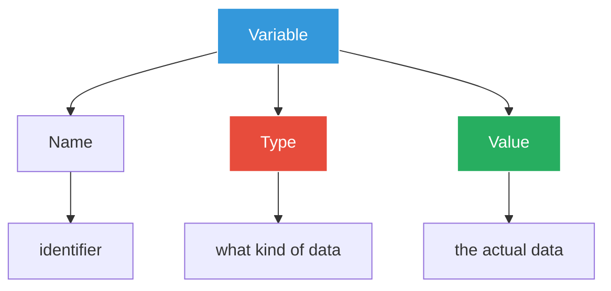

# Variables - Storing Coffee Data ☕

## The Inventory Crisis

Marcus finds Sarah in the storage room, surrounded by coffee bags and looking frustrated.

"We have a problem," Sarah says. "Our inventory system can't keep track of what we have. Look at this mess!"

She shows Marcus a handwritten list:
- "Brazilian beans - some bags"
- "Milk - a lot"
- "Sugar - running low?"

"We need to digitize this properly," Sarah continues. "Let's start by learning how to store data in Go."

## Understanding Variables



## Your First Variables

Let's create our first inventory tracking program:

### Example 1: Basic Variables

Create a file `01_basic_variables.go`:

```go
package main

import "fmt"

func main() {
    // Declaring variables with var keyword
    var coffeeBags int = 50
    var milkLiters float64 = 25.5
    var beanType string = "Brazilian Dark Roast"
    
    fmt.Println("=== GoCoffee Inventory ===")
    fmt.Println("Coffee bags:", coffeeBags)
    fmt.Println("Milk (liters):", milkLiters)
    fmt.Println("Bean type:", beanType)
}
```

Run it:
```bash
go run 01_basic_variables.go
```

## Variable Declaration Methods

Sarah shows Marcus different ways to declare variables:

### Example 2: Declaration Styles

Create `02_declaration_styles.go`:

```go
package main

import "fmt"

func main() {
    // Method 1: var with type
    var espressoShots int = 2
    
    // Method 2: var with type inference
    var milkFoam = true
    
    // Method 3: short declaration (inside functions only)
    sugarPackets := 3
    
    // Method 4: multiple variables
    var (
        customerName   = "Marcus"
        orderNumber    = 1001
        isPriority     = false
    )
    
    // Method 5: multiple variables same line
    temp, size := 165, "large"
    
    fmt.Println("=== Order Details ===")
    fmt.Printf("Customer: %s (Order #%d)\n", customerName, orderNumber)
    fmt.Printf("Espresso shots: %d\n", espressoShots)
    fmt.Printf("Milk foam: %v\n", milkFoam)
    fmt.Printf("Sugar packets: %d\n", sugarPackets)
    fmt.Printf("Temperature: %d°F, Size: %s\n", temp, size)
    fmt.Printf("Priority order: %v\n", isPriority)
}
```

## Zero Values

"What happens if we don't assign a value?" Marcus asks.

### Example 3: Zero Values

Create `03_zero_values.go`:

```go
package main

import "fmt"

func main() {
    // Variables without initial values get "zero values"
    var (
        coffeeBags   int     // 0
        price        float64 // 0.0
        customerName string  // ""
        isOpen       bool    // false
    )
    
    fmt.Println("=== Zero Values Demo ===")
    fmt.Printf("Coffee bags: %d (zero value for int)\n", coffeeBags)
    fmt.Printf("Price: $%.2f (zero value for float64)\n", price)
    fmt.Printf("Customer name: '%s' (zero value for string)\n", customerName)
    fmt.Printf("Is open: %v (zero value for bool)\n", isOpen)
    
    // This prevents accidental null/nil errors!
    fmt.Println("\nThis is why Go is safer than many languages!")
}
```

## Variable Scope

Sarah explains scope with a practical example:

### Example 4: Understanding Scope

Create `04_scope.go`:

```go
package main

import "fmt"

// Package-level variable
var storeName = "GoCoffee Downtown"

func main() {
    // Function-level variable
    dailySales := 0.0
    
    fmt.Println("Store:", storeName)
    
    // Block scope
    {
        morningShift := 8
        dailySales = 1250.50
        fmt.Printf("Morning shift starts at: %d AM\n", morningShift)
    }
    
    // morningShift is not accessible here
    // fmt.Println(morningShift) // This would cause an error
    
    fmt.Printf("Daily sales: $%.2f\n", dailySales)
    
    // Call function that uses package variable
    printStoreInfo()
}

func printStoreInfo() {
    // Can access package-level variable
    fmt.Println("Info for:", storeName)
    
    // Cannot access main's variables
    // fmt.Println(dailySales) // This would cause an error
}
```

## Practical Exercise: Coffee Order System

### Example 5: Real Order System

Create `05_coffee_order.go`:

```go
package main

import (
    "fmt"
    "time"
)

func main() {
    // Customer information
    customerName := "Sarah"
    membershipLevel := "Gold"
    
    // Order details
    coffeeType := "Cappuccino"
    size := "Large"
    quantity := 2
    
    // Pricing
    basePrice := 4.50
    sizeMultiplier := 1.5  // Large = 1.5x price
    memberDiscount := 0.10 // Gold members get 10% off
    
    // Calculate total
    subtotal := basePrice * sizeMultiplier * float64(quantity)
    discount := subtotal * memberDiscount
    total := subtotal - discount
    
    // Order metadata
    orderID := 1001
    orderTime := time.Now()
    
    // Print receipt
    fmt.Println("=================================")
    fmt.Println("        GoCoffee Receipt         ")
    fmt.Println("=================================")
    fmt.Printf("Order #%d\n", orderID)
    fmt.Printf("Time: %s\n", orderTime.Format("2006-01-02 15:04:05"))
    fmt.Println("---------------------------------")
    fmt.Printf("Customer: %s (%s Member)\n", customerName, membershipLevel)
    fmt.Printf("Item: %s %s x%d\n", size, coffeeType, quantity)
    fmt.Println("---------------------------------")
    fmt.Printf("Subtotal:  $%.2f\n", subtotal)
    fmt.Printf("Discount:  -$%.2f\n", discount)
    fmt.Printf("Total:     $%.2f\n", total)
    fmt.Println("=================================")
    fmt.Println("    Thank you for your order!    ")
    fmt.Println("=================================")
}
```

## Variable Naming Best Practices

### Example 6: Good vs Bad Names

Create `06_naming_conventions.go`:

```go
package main

import "fmt"

func main() {
    // BAD: Unclear variable names
    var x = 4.50
    var y = 2
    var z = x * float64(y)
    
    // GOOD: Clear, descriptive names
    var coffeePrice = 4.50
    var quantity = 2
    var totalPrice = coffeePrice * float64(quantity)
    
    // Go naming conventions
    var (
        // Use camelCase for multi-word names
        customerFirstName = "Marcus"
        orderStatus       = "pending"
        
        // Acronyms should be all caps
        apiURL  = "https://api.gocoffee.com"
        httpPort = 8080
        
        // Boolean names should be clear
        isReady        = true
        hasDiscount    = false
        canRefund      = true
    )
    
    fmt.Println("=== Naming Conventions Demo ===")
    fmt.Printf("Bad example: x=%.2f, y=%d, z=%.2f\n", x, y, z)
    fmt.Printf("Good example: price=%.2f, qty=%d, total=%.2f\n", 
        coffeePrice, quantity, totalPrice)
    fmt.Println("\nOther examples:")
    fmt.Printf("Customer: %s\n", customerFirstName)
    fmt.Printf("API URL: %s\n", apiURL)
    fmt.Printf("Order ready: %v\n", isReady)
}
```

## Interactive Exercise

### Example 7: Variable Challenge

Create `07_exercise.go`:

```go
package main

import (
    "bufio"
    "fmt"
    "os"
    "strconv"
    "strings"
)

func main() {
    reader := bufio.NewReader(os.Stdin)
    
    fmt.Println("=== GoCoffee Order System ===")
    
    // Get customer name
    fmt.Print("Enter customer name: ")
    customerName, _ := reader.ReadString('\n')
    customerName = strings.TrimSpace(customerName)
    
    // Get coffee type
    fmt.Print("Enter coffee type (Latte/Cappuccino/Americano): ")
    coffeeType, _ := reader.ReadString('\n')
    coffeeType = strings.TrimSpace(coffeeType)
    
    // Get quantity
    fmt.Print("Enter quantity: ")
    quantityStr, _ := reader.ReadString('\n')
    quantityStr = strings.TrimSpace(quantityStr)
    quantity, err := strconv.Atoi(quantityStr)
    if err != nil {
        quantity = 1
    }
    
    // Set prices based on coffee type
    var price float64
    switch coffeeType {
    case "Latte":
        price = 4.50
    case "Cappuccino":
        price = 4.00
    case "Americano":
        price = 3.00
    default:
        price = 4.00
    }
    
    // Calculate total
    total := price * float64(quantity)
    
    // Display order
    fmt.Println("\n=== Order Summary ===")
    fmt.Printf("Customer: %s\n", customerName)
    fmt.Printf("Order: %d x %s\n", quantity, coffeeType)
    fmt.Printf("Unit price: $%.2f\n", price)
    fmt.Printf("Total: $%.2f\n", total)
}
```

## Common Mistakes to Avoid

### Example 8: Variable Pitfalls

Create `08_common_mistakes.go`:

```go
package main

import "fmt"

func main() {
    fmt.Println("=== Common Variable Mistakes ===")
    
    // Mistake 1: Unused variables
    // var unused = "This will cause a compile error"
    // Solution: Use _ for variables you must declare but don't use
    data, _ := getData()
    fmt.Printf("Data: %s\n", data)
    
    // Mistake 2: Shadowing
    price := 4.50
    fmt.Printf("Original price: $%.2f\n", price)
    {
        price := 3.00 // This shadows the outer price
        fmt.Printf("Inner price: $%.2f\n", price)
    }
    fmt.Printf("Price after block: $%.2f\n", price) // Still 4.50
    
    // Mistake 3: Wrong type operations
    quantity := 5
    discount := 0.1
    // total := quantity * discount // Error: mismatched types
    total := float64(quantity) * discount // Correct: explicit conversion
    fmt.Printf("Discount amount: $%.2f\n", total)
    
    // Mistake 4: Modifying strings (strings are immutable)
    coffee := "Latte"
    // coffee[0] = 'M' // Error: cannot assign to coffee[0]
    // Solution: Create new string
    coffee = "Mocha"
    fmt.Printf("New coffee: %s\n", coffee)
}

func getData() (string, error) {
    return "Coffee data", nil
}
```

## Summary Program

### Example 9: Putting It All Together

Create `09_inventory_system.go`:

```go
package main

import (
    "fmt"
    "time"
)

// Package-level constants for our coffee shop
const storeName = "GoCoffee"

func main() {
    // Initialize inventory
    var (
        // Coffee beans (in kg)
        brazilianBeans  = 50.5
        colombianBeans  = 30.0
        ethiopianBeans  = 25.5
        
        // Milk products (in liters)
        wholeMilk    = 100.0
        skimMilk     = 50.0
        oatMilk      = 75.0
        
        // Other supplies
        sugarPackets = 1000
        cupsSmall    = 500
        cupsMedium   = 300
        cupsLarge    = 200
    )
    
    // Daily usage tracking
    var (
        beansUsedToday = 5.5
        milkUsedToday  = 25.0
        cupsUsedToday  = 150
    )
    
    // Calculate remaining supplies
    totalBeans := brazilianBeans + colombianBeans + ethiopianBeans
    totalMilk := wholeMilk + skimMilk + oatMilk
    totalCups := cupsSmall + cupsMedium + cupsLarge
    
    remainingBeans := totalBeans - beansUsedToday
    remainingMilk := totalMilk - milkUsedToday
    remainingCups := totalCups - cupsUsedToday
    
    // Generate report
    reportTime := time.Now()
    
    fmt.Println("=====================================")
    fmt.Printf("     %s Inventory Report\n", storeName)
    fmt.Println("=====================================")
    fmt.Printf("Date: %s\n", reportTime.Format("2006-01-02"))
    fmt.Printf("Time: %s\n", reportTime.Format("15:04:05"))
    fmt.Println("-------------------------------------")
    
    fmt.Println("COFFEE BEANS:")
    fmt.Printf("  Brazilian:  %.1f kg\n", brazilianBeans)
    fmt.Printf("  Colombian:  %.1f kg\n", colombianBeans)
    fmt.Printf("  Ethiopian:  %.1f kg\n", ethiopianBeans)
    fmt.Printf("  Total:      %.1f kg\n", totalBeans)
    
    fmt.Println("\nMILK PRODUCTS:")
    fmt.Printf("  Whole Milk: %.1f L\n", wholeMilk)
    fmt.Printf("  Skim Milk:  %.1f L\n", skimMilk)
    fmt.Printf("  Oat Milk:   %.1f L\n", oatMilk)
    fmt.Printf("  Total:      %.1f L\n", totalMilk)
    
    fmt.Println("\nCUPS:")
    fmt.Printf("  Small:      %d\n", cupsSmall)
    fmt.Printf("  Medium:     %d\n", cupsMedium)
    fmt.Printf("  Large:      %d\n", cupsLarge)
    fmt.Printf("  Total:      %d\n", totalCups)
    
    fmt.Println("\n-------------------------------------")
    fmt.Println("TODAY'S USAGE:")
    fmt.Printf("  Beans used:     %.1f kg\n", beansUsedToday)
    fmt.Printf("  Milk used:      %.1f L\n", milkUsedToday)
    fmt.Printf("  Cups used:      %d\n", cupsUsedToday)
    
    fmt.Println("\nREMAINING AFTER TODAY:")
    fmt.Printf("  Beans:          %.1f kg\n", remainingBeans)
    fmt.Printf("  Milk:           %.1f L\n", remainingMilk)
    fmt.Printf("  Cups:           %d\n", remainingCups)
    
    // Alert if running low
    fmt.Println("\n-------------------------------------")
    fmt.Println("ALERTS:")
    if remainingBeans < 20 {
        fmt.Println("  ⚠️  Low on coffee beans!")
    }
    if remainingMilk < 50 {
        fmt.Println("  ⚠️  Low on milk!")
    }
    if remainingCups < 100 {
        fmt.Println("  ⚠️  Low on cups!")
    }
    if remainingBeans >= 20 && remainingMilk >= 50 && remainingCups >= 100 {
        fmt.Println("  ✅ All supplies adequate")
    }
    
    fmt.Println("=====================================")
}
```

## Try It Yourself!

Run each example:

```bash
# Run each example
go run 01_basic_variables.go
go run 02_declaration_styles.go
go run 03_zero_values.go
go run 04_scope.go
go run 05_coffee_order.go
go run 06_naming_conventions.go
go run 07_exercise.go
go run 08_common_mistakes.go
go run 09_inventory_system.go
```

## Challenge Exercise

Create your own program that:
1. Tracks coffee shop employee shifts
2. Stores employee names, roles, and hours worked
3. Calculates daily labor costs
4. Shows which employees are currently working

## Key Takeaways

Marcus learned:
1. **Variables store data** with a name, type, and value
2. **Multiple declaration styles** - choose based on context
3. **Zero values** prevent null/nil errors
4. **Scope** controls where variables can be accessed
5. **Good naming** makes code self-documenting

## What's Next?

"Great job!" Sarah says. "Now that you can store data, let's learn about Go's different data types. We need to handle prices, quantities, and more complex data!"

Continue to [Data Types - The Right Container for Each Ingredient](../02-data-types/Data_Types_Right_Container.md) →

---

*"Variables are like coffee containers - they hold what we need, and Go makes sure we use the right container for the right ingredient!"*