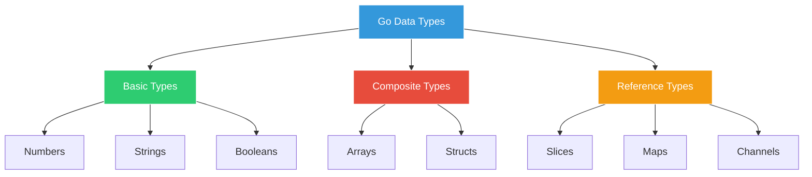
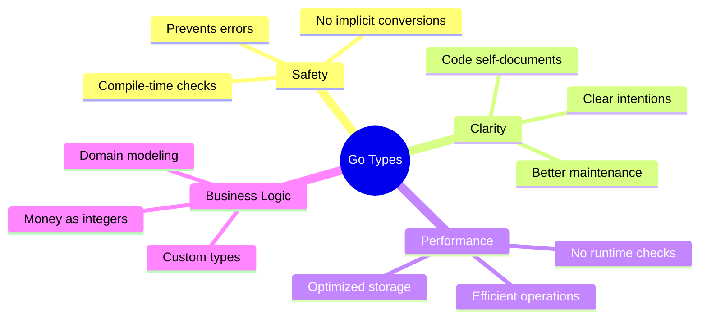

# Data Types - The Right Container for Each Ingredient 📦

## The Coffee Shop Chaos

Marcus arrives to find Sarah surrounded by calculators, notebooks, and a very frustrated expression.

"Marcus! Perfect timing," Sarah exclaims. "We have a major problem. Our old system is causing pricing errors, inventory mistakes, and customer complaints!"

She shows Marcus a recent incident report:
- A customer was charged $450.00 instead of $4.50
- Inventory showed -5 bags of coffee (negative inventory?!)
- A "Large" coffee was served in a small cup

"We need proper data types to prevent these disasters," Sarah explains.

## Go's Type System to the Rescue



## Basic Types in Action

Let's explore each type with real GoCoffee examples:

### Example 1: Number Types

Create `01_number_types.go`:

```go
package main

import (
    "fmt"
    "math"
)

func main() {
    fmt.Println("=== GoCoffee Number Types Demo ===\n")
    
    // Integer types for counting
    var (
        // Unsigned integers (no negative values)
        coffeeBags    uint8  = 255      // 0 to 255
        customers     uint16 = 65535     // 0 to 65,535
        totalSold     uint32 = 4294967295 // 0 to 4,294,967,295
        yearlyRevenue uint64 = 18446744073709551615 // Really big number!
        
        // Signed integers (can be negative)
        temperature   int8   = -10       // -128 to 127
        stockChange   int16  = -1000     // -32,768 to 32,767
        profit        int32  = -2147483648 // About -2 billion to 2 billion
        companyValue  int64  = 9223372036854775807 // Really big number!
        
        // Platform-dependent integers
        dailyOrders   int    = 1500      // 32 or 64 bits depending on system
        queueSize     uint   = 100       // 32 or 64 bits depending on system
    )
    
    fmt.Println("UNSIGNED INTEGERS (no negatives):")
    fmt.Printf("Coffee bags in storage (uint8): %d\n", coffeeBags)
    fmt.Printf("Total customers today (uint16): %d\n", customers)
    fmt.Printf("Coffees sold all-time (uint32): %d\n", totalSold)
    fmt.Printf("Yearly revenue in cents (uint64): %d\n", yearlyRevenue)
    
    fmt.Println("\nSIGNED INTEGERS (can be negative):")
    fmt.Printf("Freezer temperature °C (int8): %d\n", temperature)
    fmt.Printf("Stock change (int16): %d\n", stockChange)
    fmt.Printf("Monthly profit/loss (int32): %d\n", profit)
    fmt.Printf("Company valuation (int64): %d\n", companyValue)
    
    fmt.Println("\nPLATFORM INTEGERS:")
    fmt.Printf("Daily orders (int): %d\n", dailyOrders)
    fmt.Printf("Queue size (uint): %d\n", queueSize)
    
    // Floating point for prices and measurements
    var (
        coffeePrice   float32 = 4.99     // 32-bit floating point
        precisePrice  float64 = 4.99     // 64-bit floating point (more precise)
        
        // Demonstrating precision difference
        piFloat32     float32 = math.Pi
        piFloat64     float64 = math.Pi
    )
    
    fmt.Println("\nFLOATING POINT NUMBERS:")
    fmt.Printf("Coffee price (float32): $%.2f\n", coffeePrice)
    fmt.Printf("Precise price (float64): $%.2f\n", precisePrice)
    fmt.Printf("Pi as float32: %.10f\n", piFloat32)
    fmt.Printf("Pi as float64: %.10f\n", piFloat64)
    
    // Complex numbers (rarely used in business apps)
    var complexOrder complex64 = 3 + 4i
    fmt.Printf("\nComplex order (just for fun): %v\n", complexOrder)
    
    // Byte and rune
    var (
        asciiChar byte = 'A'      // alias for uint8
        unicodeChar rune = '☕'    // alias for int32 (Unicode code point)
    )
    
    fmt.Println("\nCHARACTER TYPES:")
    fmt.Printf("ASCII character (byte): %c (%d)\n", asciiChar, asciiChar)
    fmt.Printf("Unicode character (rune): %c (%d)\n", unicodeChar, unicodeChar)
}
```

### Example 2: Strings and Characters

Create `02_strings_and_runes.go`:

```go
package main

import (
    "fmt"
    "strings"
    "unicode/utf8"
)

func main() {
    fmt.Println("=== GoCoffee String Operations ===\n")
    
    // Basic string operations
    coffeeName := "Cappuccino"
    customerName := "Marcus Chen"
    
    // String concatenation
    greeting := "Hello, " + customerName + "!"
    order := fmt.Sprintf("One %s for %s", coffeeName, customerName)
    
    fmt.Println("STRING BASICS:")
    fmt.Println("Greeting:", greeting)
    fmt.Println("Order:", order)
    
    // String properties
    fmt.Printf("\nSTRING PROPERTIES:")
    fmt.Printf("\nCoffee name length: %d bytes\n", len(coffeeName))
    fmt.Printf("Customer name length: %d bytes\n", len(customerName))
    
    // Working with Unicode
    menuItem := "Café Latté ☕"
    fmt.Printf("\nUNICODE STRING: %s\n", menuItem)
    fmt.Printf("Byte length: %d\n", len(menuItem))
    fmt.Printf("Rune count: %d\n", utf8.RuneCountInString(menuItem))
    
    // Iterating over strings
    fmt.Println("\nITERATING BY BYTES:")
    for i := 0; i < len(menuItem); i++ {
        fmt.Printf("%d: %c (%d)\n", i, menuItem[i], menuItem[i])
    }
    
    fmt.Println("\nITERATING BY RUNES (correct way):")
    for i, r := range menuItem {
        fmt.Printf("%d: %c (%d)\n", i, r, r)
    }
    
    // String manipulation
    fmt.Println("\nSTRING MANIPULATION:")
    
    // Case conversion
    fmt.Printf("Uppercase: %s\n", strings.ToUpper(coffeeName))
    fmt.Printf("Lowercase: %s\n", strings.ToLower(coffeeName))
    fmt.Printf("Title case: %s\n", strings.Title(strings.ToLower("ICED LATTE")))
    
    // Trimming
    messyInput := "  Espresso   "
    fmt.Printf("Before trim: '%s'\n", messyInput)
    fmt.Printf("After trim: '%s'\n", strings.TrimSpace(messyInput))
    
    // Contains and replacements
    description := "Our coffee is the best coffee in the coffee world!"
    fmt.Printf("\nOriginal: %s\n", description)
    fmt.Printf("Contains 'coffee': %v\n", strings.Contains(description, "coffee"))
    fmt.Printf("Coffee count: %d\n", strings.Count(description, "coffee"))
    fmt.Printf("Replace coffee: %s\n", strings.ReplaceAll(description, "coffee", "☕"))
    
    // Splitting and joining
    ingredients := "espresso,milk,foam,chocolate"
    parts := strings.Split(ingredients, ",")
    fmt.Printf("\nSplit ingredients: %v\n", parts)
    fmt.Printf("Joined with ' + ': %s\n", strings.Join(parts, " + "))
    
    // Multi-line strings
    menu := `
    ╔═══════════════════════╗
    ║   GoCoffee Menu       ║
    ╠═══════════════════════╣
    ║ Espresso      $3.00   ║
    ║ Cappuccino    $4.00   ║
    ║ Latte         $4.50   ║
    ╚═══════════════════════╝`
    
    fmt.Println("\nMULTI-LINE STRING:")
    fmt.Println(menu)
}
```

### Example 3: Boolean Logic

Create `03_boolean_logic.go`:

```go
package main

import "fmt"

func main() {
    fmt.Println("=== GoCoffee Boolean Logic ===\n")
    
    // Shop status
    isOpen := true
    isBusy := false
    hasWifi := true
    
    // Inventory status
    hasCoffee := true
    hasMilk := true
    hasDecaf := false
    
    // Customer preferences
    wantsLargeCoffee := true
    wantsSugar := false
    isMember := true
    
    fmt.Println("SHOP STATUS:")
    fmt.Printf("Is open: %v\n", isOpen)
    fmt.Printf("Is busy: %v\n", isBusy)
    fmt.Printf("Has WiFi: %v\n", hasWifi)
    
    // Boolean operations
    fmt.Println("\nBOOLEAN OPERATIONS:")
    
    // AND operation
    canServeCustomer := isOpen && !isBusy
    fmt.Printf("Can serve customer (open AND not busy): %v\n", canServeCustomer)
    
    // OR operation
    needsRestock := !hasCoffee || !hasMilk
    fmt.Printf("Needs restock (no coffee OR no milk): %v\n", needsRestock)
    
    // Complex conditions
    canMakeLatte := hasCoffee && hasMilk && isOpen
    fmt.Printf("Can make latte: %v\n", canMakeLatte)
    
    // Customer eligibility
    getsDiscount := isMember && wantsLargeCoffee
    fmt.Printf("Gets member discount: %v\n", getsDiscount)
    
    // Comparison operations
    price := 4.50
    budget := 5.00
    minimumOrder := 3.00
    
    fmt.Println("\nCOMPARISON OPERATIONS:")
    fmt.Printf("Price ($%.2f) <= Budget ($%.2f): %v\n", 
        price, budget, price <= budget)
    fmt.Printf("Price ($%.2f) >= Minimum ($%.2f): %v\n", 
        price, minimumOrder, price >= minimumOrder)
    
    // Boolean as conditions
    fmt.Println("\nCONDITIONAL LOGIC:")
    if isOpen && canMakeLatte {
        fmt.Println("✓ Ready to serve lattes!")
    }
    
    if needsRestock {
        fmt.Println("⚠ Need to restock supplies!")
    }
    
    // Boolean functions
    fmt.Println("\nBOOLEAN FUNCTIONS:")
    fmt.Printf("Shop ready: %v\n", isShopReady(isOpen, hasCoffee, hasMilk))
    fmt.Printf("VIP customer: %v\n", isVIPCustomer(isMember, 15))
}

// Boolean-returning functions
func isShopReady(open, coffee, milk bool) bool {
    return open && coffee && milk
}

func isVIPCustomer(member bool, ordersThisMonth int) bool {
    return member && ordersThisMonth >= 10
}
```

### Example 4: Type Conversions

Create `04_type_conversions.go`:

```go
package main

import (
    "fmt"
    "strconv"
)

func main() {
    fmt.Println("=== GoCoffee Type Conversions ===\n")
    
    // Number conversions
    var (
        smallCups int8 = 100
        mediumCups int16 = 200
        largeCups int32 = 300
    )
    
    // Calculate total (must convert to same type)
    totalCups := int32(smallCups) + int32(mediumCups) + largeCups
    fmt.Printf("Total cups: %d\n", totalCups)
    
    // Float to int conversion (truncates decimal)
    price := 4.99
    wholePrice := int(price)
    fmt.Printf("Price: $%.2f, Whole price: $%d (lost $.99!)\n", price, wholePrice)
    
    // Int to float for calculations
    items := 3
    itemPrice := 4.50
    total := float64(items) * itemPrice
    fmt.Printf("%d items at $%.2f = $%.2f\n", items, itemPrice, total)
    
    // String conversions
    fmt.Println("\nSTRING CONVERSIONS:")
    
    // Number to string
    orderNumber := 1234
    orderString := strconv.Itoa(orderNumber)
    fmt.Printf("Order #%s (was int: %d)\n", orderString, orderNumber)
    
    // String to number
    inputPrice := "4.75"
    convertedPrice, err := strconv.ParseFloat(inputPrice, 64)
    if err == nil {
        fmt.Printf("Converted price: $%.2f\n", convertedPrice)
    }
    
    // String to int
    quantity := "5"
    convertedQty, err := strconv.Atoi(quantity)
    if err == nil {
        fmt.Printf("Converted quantity: %d\n", convertedQty)
    }
    
    // Boolean conversions
    fmt.Println("\nBOOLEAN CONVERSIONS:")
    
    isOpenString := "true"
    isOpen, err := strconv.ParseBool(isOpenString)
    if err == nil {
        fmt.Printf("Shop open: %v\n", isOpen)
    }
    
    // Format conversions for display
    fmt.Println("\nFORMATTING FOR DISPLAY:")
    
    revenue := 12345.67
    fmt.Printf("Revenue: $%.2f\n", revenue)
    fmt.Printf("Revenue (no decimals): $%.0f\n", revenue)
    fmt.Printf("Revenue (with commas): $%,.2f\n", revenue)
    
    // Type assertions (preview - we'll cover interfaces later)
    var anyValue interface{} = "Cappuccino"
    
    // Safe type assertion
    if coffeeType, ok := anyValue.(string); ok {
        fmt.Printf("\nCoffee type: %s\n", coffeeType)
    }
    
    // Dangerous conversions to avoid
    fmt.Println("\n⚠️  CONVERSION PITFALLS:")
    
    // Overflow example
    bigNumber := int16(32767)
    // smallNumber := int8(bigNumber) // This would overflow!
    fmt.Printf("Big number: %d (too big for int8!)\n", bigNumber)
    
    // Precision loss
    preciseMoney := 10.99
    cents := int(preciseMoney * 100) // Better way to handle money
    fmt.Printf("Money: $%.2f = %d cents\n", preciseMoney, cents)
}
```

### Example 5: Zero Values and Initialization

Create `05_zero_values.go`:

```go
package main

import "fmt"

func main() {
    fmt.Println("=== GoCoffee Zero Values ===\n")
    
    // Numeric zero values
    var (
        ordersToday int
        temperature float64
        stockLevel uint32
        revenue float32
    )
    
    fmt.Println("NUMERIC ZERO VALUES:")
    fmt.Printf("Orders today: %d (zero value for int)\n", ordersToday)
    fmt.Printf("Temperature: %.1f°C (zero value for float64)\n", temperature)
    fmt.Printf("Stock level: %d (zero value for uint32)\n", stockLevel)
    fmt.Printf("Revenue: $%.2f (zero value for float32)\n", revenue)
    
    // String zero value
    var (
        customerName string
        orderNotes string
    )
    
    fmt.Println("\nSTRING ZERO VALUES:")
    fmt.Printf("Customer name: '%s' (empty string)\n", customerName)
    fmt.Printf("Order notes: '%s' (empty string)\n", orderNotes)
    
    // Boolean zero value
    var (
        isReady bool
        isPaid bool
    )
    
    fmt.Println("\nBOOLEAN ZERO VALUES:")
    fmt.Printf("Is ready: %v (always false)\n", isReady)
    fmt.Printf("Is paid: %v (always false)\n", isPaid)
    
    // Proper initialization
    fmt.Println("\nPROPER INITIALIZATION:")
    
    // Explicit initialization
    coffeeStock := 100
    milkLiters := 50.5
    shopName := "GoCoffee Downtown"
    isOpen := true
    
    fmt.Printf("Coffee stock: %d bags\n", coffeeStock)
    fmt.Printf("Milk: %.1f liters\n", milkLiters)
    fmt.Printf("Shop: %s\n", shopName)
    fmt.Printf("Open: %v\n", isOpen)
    
    // Multiple variable initialization
    var (
        espressoPrice = 3.00
        lattePrice    = 4.50
        cappuccinoPrice = 4.00
    )
    
    fmt.Printf("\nPrices: Espresso $%.2f, Latte $%.2f, Cappuccino $%.2f\n",
        espressoPrice, lattePrice, cappuccinoPrice)
    
    // Checking for zero values
    fmt.Println("\nCHECKING ZERO VALUES:")
    
    if customerName == "" {
        fmt.Println("⚠️  No customer name provided!")
    }
    
    if ordersToday == 0 {
        fmt.Println("📊 No orders yet today")
    }
    
    if !isPaid {
        fmt.Println("💳 Payment pending")
    }
}
```

### Example 6: Working with Money

Create `06_money_handling.go`:

```go
package main

import (
    "fmt"
    "math"
)

func main() {
    fmt.Println("=== GoCoffee Money Handling ===\n")
    
    // DON'T: Using float for money (precision issues)
    fmt.Println("❌ WRONG WAY (float problems):")
    
    price1 := 0.1
    price2 := 0.2
    total := price1 + price2
    fmt.Printf("$0.10 + $0.20 = $%.20f (not exactly 0.30!)\n", total)
    
    // Compound the error
    wrongTotal := 0.0
    for i := 0; i < 100; i++ {
        wrongTotal += 0.01
    }
    fmt.Printf("100 × $0.01 = $%.20f (not exactly 1.00!)\n", wrongTotal)
    
    // DO: Use integers for cents
    fmt.Println("\n✅ CORRECT WAY (using cents):")
    
    // Prices in cents
    espressoPriceCents := 300      // $3.00
    lattePriceCents := 450         // $4.50
    cappuccinoPriceCents := 400    // $4.00
    
    // Order calculation
    orderItems := []struct {
        name string
        priceCents int
        quantity int
    }{
        {"Espresso", espressoPriceCents, 2},
        {"Latte", lattePriceCents, 1},
        {"Cappuccino", cappuccinoPriceCents, 3},
    }
    
    subtotalCents := 0
    fmt.Println("\nORDER DETAILS:")
    for _, item := range orderItems {
        itemTotal := item.priceCents * item.quantity
        subtotalCents += itemTotal
        fmt.Printf("%d × %s @ $%.2f = $%.2f\n", 
            item.quantity, 
            item.name, 
            float64(item.priceCents)/100,
            float64(itemTotal)/100)
    }
    
    // Tax calculation (8.5%)
    taxRate := 0.085
    taxCents := int(math.Round(float64(subtotalCents) * taxRate))
    totalCents := subtotalCents + taxCents
    
    fmt.Printf("\nSubtotal: $%.2f\n", float64(subtotalCents)/100)
    fmt.Printf("Tax (8.5%%): $%.2f\n", float64(taxCents)/100)
    fmt.Printf("Total: $%.2f\n", float64(totalCents)/100)
    
    // Tip calculation
    fmt.Println("\nTIP CALCULATION:")
    tipPercentages := []float64{0.15, 0.18, 0.20}
    for _, pct := range tipPercentages {
        tipCents := int(math.Round(float64(totalCents) * pct))
        finalCents := totalCents + tipCents
        fmt.Printf("%.0f%% tip: $%.2f (Total: $%.2f)\n", 
            pct*100, 
            float64(tipCents)/100,
            float64(finalCents)/100)
    }
    
    // Currency formatting helper
    fmt.Println("\nCURRENCY FORMATTING:")
    amounts := []int{100, 1000, 10000, 100000} // cents
    for _, cents := range amounts {
        fmt.Printf("%d cents = %s\n", cents, formatMoney(cents))
    }
}

// formatMoney converts cents to a formatted dollar string
func formatMoney(cents int) string {
    dollars := float64(cents) / 100
    return fmt.Sprintf("$%.2f", dollars)
}
```

### Example 7: Type Safety Demo

Create `07_type_safety.go`:

```go
package main

import "fmt"

func main() {
    fmt.Println("=== GoCoffee Type Safety Demo ===\n")
    
    // Go prevents type mixing errors
    fmt.Println("TYPE SAFETY EXAMPLES:")
    
    // Correct: Same types
    espressoShots := 2
    extraShots := 1
    totalShots := espressoShots + extraShots
    fmt.Printf("Total shots: %d\n", totalShots)
    
    // Would cause compile error:
    // cups := "5"
    // total := cups + 3  // Error: mismatched types string and int
    
    // Must explicitly convert
    cupsString := "5"
    cupsInt := 5 // Simulating conversion
    totalCups := cupsInt + 3
    fmt.Printf("String '%s' converted to int: %d, total: %d\n", 
        cupsString, cupsInt, totalCups)
    
    // Function type safety
    fmt.Println("\nFUNCTION TYPE SAFETY:")
    
    // Functions enforce parameter types
    makeCoffee("Latte", 2, true)
    // makeCoffee(2, "Latte", true)  // Error: wrong parameter order
    
    // Return type safety
    price := calculatePrice(4.50, 3)
    fmt.Printf("Total price: $%.2f\n", price)
    
    // Custom type safety
    type CoffeeSize string
    type Temperature int
    
    const (
        Small  CoffeeSize = "small"
        Medium CoffeeSize = "medium"
        Large  CoffeeSize = "large"
    )
    
    // Using custom types
    orderSize := Large
    brewTemp := Temperature(195)
    
    fmt.Printf("\nCustom types: Size=%s, Temp=%d°F\n", orderSize, brewTemp)
    
    // Type aliases for clarity
    type Cents int
    type Quantity int
    
    itemPrice := Cents(450)
    itemCount := Quantity(2)
    
    // Still need conversion between custom types
    total := int(itemPrice) * int(itemCount)
    fmt.Printf("Price: %d cents × Quantity: %d = %d cents\n", 
        itemPrice, itemCount, total)
}

func makeCoffee(coffeeType string, shots int, addMilk bool) {
    fmt.Printf("Making %s with %d shots", coffeeType, shots)
    if addMilk {
        fmt.Print(" and milk")
    }
    fmt.Println()
}

func calculatePrice(basePrice float64, quantity int) float64 {
    return basePrice * float64(quantity)
}
```

### Example 8: Practical Type Usage

Create `08_real_world_types.go`:

```go
package main

import (
    "fmt"
    "time"
)

// Define custom types for our coffee shop
type (
    // Money in cents to avoid float issues
    Money int
    
    // Coffee sizes
    Size string
    
    // Temperature in Fahrenheit
    Temperature int
    
    // Percentage as int (e.g., 15 = 15%)
    Percentage int
)

// Size constants
const (
    SizeSmall  Size = "small"
    SizeMedium Size = "medium"
    SizeLarge  Size = "large"
)

// Coffee order structure
type Order struct {
    ID           int
    CustomerName string
    Items        []OrderItem
    CreatedAt    time.Time
    IsPaid       bool
    TipPercent   Percentage
}

type OrderItem struct {
    Name     string
    Size     Size
    Price    Money
    Quantity int
    Options  []string
}

func main() {
    fmt.Println("=== GoCoffee Real-World Type Usage ===\n")
    
    // Create an order
    order := Order{
        ID:           1001,
        CustomerName: "Marcus",
        CreatedAt:    time.Now(),
        IsPaid:       false,
        TipPercent:   18,
        Items: []OrderItem{
            {
                Name:     "Latte",
                Size:     SizeLarge,
                Price:    Money(550), // $5.50
                Quantity: 1,
                Options:  []string{"extra shot", "oat milk"},
            },
            {
                Name:     "Croissant",
                Size:     "", // Not applicable
                Price:    Money(350), // $3.50
                Quantity: 2,
                Options:  []string{"warmed"},
            },
        },
    }
    
    // Display order
    displayOrder(order)
    
    // Calculate totals
    subtotal := calculateSubtotal(order)
    tax := calculateTax(subtotal, 8.5)
    tip := calculateTip(subtotal+tax, order.TipPercent)
    total := subtotal + tax + tip
    
    fmt.Println("\nPAYMENT SUMMARY:")
    fmt.Printf("Subtotal:  %s\n", formatMoney(subtotal))
    fmt.Printf("Tax:       %s\n", formatMoney(tax))
    fmt.Printf("Tip (%d%%): %s\n", order.TipPercent, formatMoney(tip))
    fmt.Printf("Total:     %s\n", formatMoney(total))
    
    // Update order status
    order.IsPaid = true
    fmt.Printf("\nPayment status: %v\n", order.IsPaid)
    
    // Type validation example
    fmt.Println("\nTYPE VALIDATION:")
    validateSize(SizeLarge)
    validateSize("extra-large") // Invalid size
}

func displayOrder(order Order) {
    fmt.Printf("Order #%d for %s\n", order.ID, order.CustomerName)
    fmt.Printf("Time: %s\n", order.CreatedAt.Format("3:04 PM"))
    fmt.Println("\nITEMS:")
    
    for _, item := range order.Items {
        fmt.Printf("- %d × %s", item.Quantity, item.Name)
        if item.Size != "" {
            fmt.Printf(" (%s)", item.Size)
        }
        fmt.Printf(" @ %s", formatMoney(item.Price))
        if len(item.Options) > 0 {
            fmt.Printf(" [%v]", item.Options)
        }
        fmt.Println()
    }
}

func calculateSubtotal(order Order) Money {
    var total Money
    for _, item := range order.Items {
        total += item.Price * Money(item.Quantity)
    }
    return total
}

func calculateTax(amount Money, rate float64) Money {
    return Money(float64(amount) * rate / 100)
}

func calculateTip(amount Money, percent Percentage) Money {
    return Money(float64(amount) * float64(percent) / 100)
}

func formatMoney(cents Money) string {
    return fmt.Sprintf("$%.2f", float64(cents)/100)
}

func validateSize(size Size) {
    switch size {
    case SizeSmall, SizeMedium, SizeLarge:
        fmt.Printf("✓ Valid size: %s\n", size)
    default:
        fmt.Printf("✗ Invalid size: %s\n", size)
    }
}
```

## Summary Exercise

Create `09_type_challenge.go`:

```go
package main

import (
    "fmt"
    "strings"
)

// Challenge: Create a type-safe menu system
// TODO: Define appropriate types for:
// 1. Menu categories (drinks, food, etc.)
// 2. Dietary restrictions (vegan, gluten-free, etc.)
// 3. Availability status

func main() {
    fmt.Println("=== GoCoffee Type Challenge ===\n")
    fmt.Println("TODO: Implement a type-safe menu system")
    fmt.Println("Requirements:")
    fmt.Println("- Use custom types for categories")
    fmt.Println("- Handle dietary restrictions")
    fmt.Println("- Track item availability")
    fmt.Println("- Calculate prices correctly")
    
    // Starter code
    type Category string
    const (
        CategoryDrinks   Category = "drinks"
        CategoryFood     Category = "food"
        CategoryDesserts Category = "desserts"
    )
    
    // Your implementation here...
}

// Hint: Consider using bit flags for dietary restrictions
// This allows items to have multiple restrictions
```

## Key Takeaways

Marcus learned that Go's type system:



## Common Pitfalls

1. **Never use float64 for money** - Use integers (cents)
2. **Always check string conversions** - They can fail
3. **Be explicit with conversions** - No magic
4. **Use custom types** - Make invalid states impossible

## Sarah's Advice

"See how proper types prevent those disasters?" Sarah says. "No more $450 coffee or negative inventory! Tomorrow we'll look at constants - values that never change, like our coffee sizes and tax rates."

## What's Next?

"Great work today!" Sarah concludes. "You've learned how to:
- Choose the right type for each kind of data
- Convert between types safely
- Handle money without precision errors
- Create custom types for business logic"

Continue to [Constants - Fixed Menu Prices](../03-constants/Constants_Fixed_Prices.md) →

---

*"In Go, types are like coffee cup sizes - each has its purpose, and using the wrong one makes a mess!"*