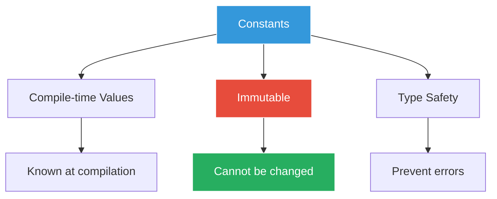
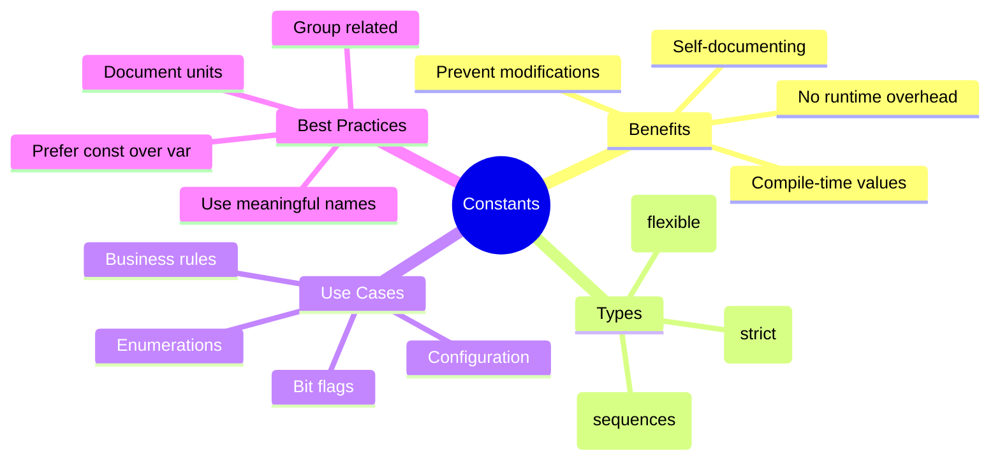

# Constants - Fixed Menu Prices 📋

## The Pricing Disaster

Marcus walks into GoCoffee to find chaos. Customers are arguing with baristas, receipts are being questioned, and Sarah looks exhausted.

"What happened?" Marcus asks.

"Someone accidentally changed the coffee prices in the code," Sarah explains. "A junior developer modified `lattePrice = 4.50` to `lattePrice = 45.00`. We charged someone $45 for a latte!"

"We need values that CAN'T be changed," Sarah declares. "Enter Go constants!"

## Understanding Constants



## Basic Constants

Create `01_basic_constants.go`:

```go
package main

import "fmt"

// Package-level constants
const (
    // Company information
    CompanyName = "GoCoffee"
    FoundedYear = 2020
    TaxRate     = 0.085 // 8.5%
    
    // Store hours
    OpeningHour = 6  // 6 AM
    ClosingHour = 22 // 10 PM
)

func main() {
    fmt.Println("=== GoCoffee Constants ===\n")
    
    // Single constant declaration
    const maxOrderItems = 10
    
    // Multiple constants
    const (
        minOrderAmount = 3.00
        maxOrderAmount = 500.00
        deliveryFee    = 2.50
    )
    
    // Typed constants
    const (
        storeName    string  = "GoCoffee Downtown"
        storeZipCode int     = 98101
        isOpen24Hours bool   = false
        latitude     float64 = 47.6062
    )
    
    fmt.Printf("Welcome to %s!\n", CompanyName)
    fmt.Printf("Founded: %d\n", FoundedYear)
    fmt.Printf("Tax Rate: %.1f%%\n", TaxRate*100)
    fmt.Printf("Hours: %d:00 - %d:00\n", OpeningHour, ClosingHour)
    
    fmt.Printf("\nOrder Limits:\n")
    fmt.Printf("Min order: $%.2f\n", minOrderAmount)
    fmt.Printf("Max order: $%.2f\n", maxOrderAmount)
    fmt.Printf("Max items per order: %d\n", maxOrderItems)
    
    fmt.Printf("\nStore Info:\n")
    fmt.Printf("Location: %s (ZIP: %d)\n", storeName, storeZipCode)
    fmt.Printf("24 hours: %v\n", isOpen24Hours)
    
    // Constants are immutable
    // maxOrderItems = 20 // Error: cannot assign to maxOrderItems
}
```

## Constants for Sizes and Prices

Create `02_coffee_constants.go`:

```go
package main

import "fmt"

// Coffee sizes
const (
    SizeSmall  = "small"
    SizeMedium = "medium"
    SizeLarge  = "large"
)

// Size multipliers for pricing
const (
    SmallMultiplier  = 1.0
    MediumMultiplier = 1.3
    LargeMultiplier  = 1.6
)

// Base prices (in dollars)
const (
    EspressoBase   = 3.00
    AmericanoBase  = 3.50
    LatteBase      = 4.50
    CappuccinoBase = 4.00
    MochaBase      = 5.00
)

// Add-on prices
const (
    ExtraShotPrice   = 0.75
    DecafPrice       = 0.00
    SyrupPrice       = 0.50
    WhippedCreamPrice = 0.50
    OatMilkPrice     = 0.65
    SoyMilkPrice     = 0.60
)

func main() {
    fmt.Println("=== GoCoffee Price Calculator ===\n")
    
    // Calculate prices for different sizes
    coffeeTypes := []struct {
        name      string
        basePrice float64
    }{
        {"Espresso", EspressoBase},
        {"Americano", AmericanoBase},
        {"Latte", LatteBase},
        {"Cappuccino", CappuccinoBase},
        {"Mocha", MochaBase},
    }
    
    fmt.Println("MENU PRICES:")
    fmt.Printf("%-12s %8s %8s %8s\n", "Coffee", "Small", "Medium", "Large")
    fmt.Println(strings.Repeat("-", 40))
    
    for _, coffee := range coffeeTypes {
        smallPrice := coffee.basePrice * SmallMultiplier
        mediumPrice := coffee.basePrice * MediumMultiplier
        largePrice := coffee.basePrice * LargeMultiplier
        
        fmt.Printf("%-12s $%6.2f $%6.2f $%6.2f\n",
            coffee.name, smallPrice, mediumPrice, largePrice)
    }
    
    fmt.Println("\nADD-ONS:")
    fmt.Printf("Extra Shot:    $%.2f\n", ExtraShotPrice)
    fmt.Printf("Syrup:         $%.2f\n", SyrupPrice)
    fmt.Printf("Whipped Cream: $%.2f\n", WhippedCreamPrice)
    fmt.Printf("Oat Milk:      $%.2f\n", OatMilkPrice)
    fmt.Printf("Soy Milk:      $%.2f\n", SoyMilkPrice)
    
    // Example order calculation
    fmt.Println("\nSAMPLE ORDER:")
    orderTotal := LatteBase * LargeMultiplier + ExtraShotPrice + OatMilkPrice
    fmt.Printf("Large Latte + Extra Shot + Oat Milk = $%.2f\n", orderTotal)
}
```

## Iota - The Constant Generator

Create `03_iota_constants.go`:

```go
package main

import "fmt"

// Days of the week using iota
const (
    Sunday = iota // 0
    Monday        // 1
    Tuesday       // 2
    Wednesday     // 3
    Thursday      // 4
    Friday        // 5
    Saturday      // 6
)

// Order status with iota
const (
    OrderPending = iota
    OrderConfirmed
    OrderPreparing
    OrderReady
    OrderDelivered
    OrderCancelled
)

// Bit flags for features
const (
    FeatureNone     = 0
    FeatureWifi     = 1 << iota // 1 << 0 = 1
    FeatureParking              // 1 << 1 = 2
    FeatureDriveThru            // 1 << 2 = 4
    FeatureOutdoor              // 1 << 3 = 8
    FeaturePetFriendly          // 1 << 4 = 16
)

// Custom iota patterns
const (
    _          = iota // Skip 0
    KB float64 = 1 << (10 * iota) // 1 << 10 = 1024
    MB                             // 1 << 20
    GB                             // 1 << 30
    TB                             // 1 << 40
)

func main() {
    fmt.Println("=== GoCoffee Iota Examples ===\n")
    
    // Days of week
    fmt.Println("BUSINESS DAYS:")
    businessDays := []int{Monday, Tuesday, Wednesday, Thursday, Friday}
    for _, day := range businessDays {
        fmt.Printf("Day %d is a business day\n", day)
    }
    
    // Order status
    fmt.Println("\nORDER STATUS VALUES:")
    fmt.Printf("Pending:   %d\n", OrderPending)
    fmt.Printf("Confirmed: %d\n", OrderConfirmed)
    fmt.Printf("Preparing: %d\n", OrderPreparing)
    fmt.Printf("Ready:     %d\n", OrderReady)
    fmt.Printf("Delivered: %d\n", OrderDelivered)
    fmt.Printf("Cancelled: %d\n", OrderCancelled)
    
    // Store features using bit flags
    fmt.Println("\nSTORE FEATURES:")
    downtownStore := FeatureWifi | FeatureParking | FeatureOutdoor
    airportStore := FeatureWifi | FeatureDriveThru
    
    fmt.Printf("Downtown store features: %b\n", downtownStore)
    checkFeatures("Downtown", downtownStore)
    
    fmt.Printf("\nAirport store features: %b\n", airportStore)
    checkFeatures("Airport", airportStore)
    
    // File sizes
    fmt.Println("\nFILE SIZE CONSTANTS:")
    fmt.Printf("1 KB = %.0f bytes\n", KB)
    fmt.Printf("1 MB = %.0f bytes\n", MB)
    fmt.Printf("1 GB = %.0f bytes\n", GB)
    
    imageSize := 2.5 * MB
    fmt.Printf("\nMenu image size: %.0f bytes (%.1f MB)\n", imageSize, imageSize/MB)
}

func checkFeatures(storeName string, features int) {
    fmt.Printf("%s store has:\n", storeName)
    if features&FeatureWifi != 0 {
        fmt.Println("  ✓ WiFi")
    }
    if features&FeatureParking != 0 {
        fmt.Println("  ✓ Parking")
    }
    if features&FeatureDriveThru != 0 {
        fmt.Println("  ✓ Drive-Thru")
    }
    if features&FeatureOutdoor != 0 {
        fmt.Println("  ✓ Outdoor Seating")
    }
    if features&FeaturePetFriendly != 0 {
        fmt.Println("  ✓ Pet Friendly")
    }
}
```

## Typed vs Untyped Constants

Create `04_typed_constants.go`:

```go
package main

import (
    "fmt"
    "reflect"
)

func main() {
    fmt.Println("=== Typed vs Untyped Constants ===\n")
    
    // Untyped constants (flexible)
    const (
        untypedInt   = 100
        untypedFloat = 3.14
        untypedString = "GoCoffee"
    )
    
    // Typed constants (strict)
    const (
        typedInt    int     = 100
        typedFloat  float64 = 3.14
        typedString string  = "GoCoffee"
    )
    
    // Untyped constants are flexible
    var myInt32 int32 = untypedInt
    var myInt64 int64 = untypedInt
    var myFloat float64 = untypedInt
    
    fmt.Println("UNTYPED CONSTANT FLEXIBILITY:")
    fmt.Printf("untypedInt as int32: %d\n", myInt32)
    fmt.Printf("untypedInt as int64: %d\n", myInt64)
    fmt.Printf("untypedInt as float64: %.1f\n", myFloat)
    
    // Typed constants are strict
    // var wrongType int32 = typedInt // Error: cannot use typedInt (type int)
    var rightType int = typedInt
    fmt.Printf("\nTyped constant must match: %d\n", rightType)
    
    // Constants in expressions
    const coffeePrice = 4.50
    const taxRate = 0.085
    
    // These work with any numeric type
    var totalFloat32 float32 = coffeePrice * (1 + taxRate)
    var totalFloat64 float64 = coffeePrice * (1 + taxRate)
    
    fmt.Printf("\nPrice calculations:")
    fmt.Printf("\nAs float32: $%.2f", totalFloat32)
    fmt.Printf("\nAs float64: $%.2f\n", totalFloat64)
    
    // Constant expressions
    const (
        secondsPerMinute = 60
        minutesPerHour   = 60
        hoursPerDay      = 24
        
        secondsPerHour = secondsPerMinute * minutesPerHour
        secondsPerDay  = secondsPerHour * hoursPerDay
    )
    
    fmt.Printf("\nTime constants:")
    fmt.Printf("\nSeconds per hour: %d", secondsPerHour)
    fmt.Printf("\nSeconds per day: %d\n", secondsPerDay)
    
    // Using reflection to check types
    fmt.Println("\nTYPE CHECKING:")
    checkType("untypedInt used as int32", myInt32)
    checkType("untypedInt used as float64", myFloat)
    checkType("typedFloat", typedFloat)
}

func checkType(name string, v interface{}) {
    fmt.Printf("%s: %v (type: %v)\n", name, v, reflect.TypeOf(v))
}
```

## Real-World Constants

Create `05_business_constants.go`:

```go
package main

import (
    "fmt"
    "time"
)

// Business rules as constants
const (
    // Minimum values
    MinimumOrderAmount   = 3.00
    MinimumDeliveryAmount = 15.00
    MinimumTipPercentage = 0
    
    // Maximum values
    MaximumOrderItems    = 25
    MaximumDeliveryRadius = 5.0 // miles
    MaximumTipPercentage = 100
    
    // Business percentages
    TaxRate            = 0.085  // 8.5%
    MemberDiscount     = 0.10   // 10%
    BulkDiscount       = 0.15   // 15% for orders over $50
    EmployeeDiscount   = 0.25   // 25%
    
    // Time limits
    OrderTimeout       = 30 * time.Minute
    DeliveryTimeout    = 45 * time.Minute
    PaymentTimeout     = 5 * time.Minute
    
    // Loyalty points
    PointsPerDollar    = 10
    PointsForFreeDrink = 1000
)

// Store locations
const (
    HeadquartersZip = "98101"
    HeadquartersLat = 47.6062
    HeadquartersLng = -122.3321
)

// API endpoints
const (
    APIVersion      = "v1"
    APIBaseURL      = "https://api.gocoffee.com/"
    APITimeout      = 30 * time.Second
)

// Error messages
const (
    ErrInsufficientFunds = "insufficient funds"
    ErrItemOutOfStock    = "item out of stock"
    ErrStoreCloseed      = "store is closed"
    ErrInvalidCoupon     = "invalid coupon code"
)

func main() {
    fmt.Println("=== GoCoffee Business Constants ===\n")
    
    // Order validation
    orderAmount := 45.00
    orderItems := 3
    
    fmt.Println("ORDER VALIDATION:")
    if orderAmount < MinimumOrderAmount {
        fmt.Printf("❌ Order too small. Minimum: $%.2f\n", MinimumOrderAmount)
    } else {
        fmt.Printf("✓ Order amount OK: $%.2f\n", orderAmount)
    }
    
    if orderItems > MaximumOrderItems {
        fmt.Printf("❌ Too many items. Maximum: %d\n", MaximumOrderItems)
    } else {
        fmt.Printf("✓ Item count OK: %d\n", orderItems)
    }
    
    // Calculate discounts
    fmt.Println("\nDISCOUNT CALCULATION:")
    
    subtotal := orderAmount
    tax := subtotal * TaxRate
    
    // Check for bulk discount
    var discount float64
    var discountType string
    
    if subtotal >= 50 {
        discount = subtotal * BulkDiscount
        discountType = "Bulk"
    }
    
    total := subtotal - discount + tax
    
    fmt.Printf("Subtotal:     $%.2f\n", subtotal)
    if discount > 0 {
        fmt.Printf("%s Discount: -$%.2f\n", discountType, discount)
    }
    fmt.Printf("Tax (%.1f%%):   $%.2f\n", TaxRate*100, tax)
    fmt.Printf("Total:        $%.2f\n", total)
    
    // Loyalty points
    pointsEarned := int(total) * PointsPerDollar
    fmt.Printf("\nPoints earned: %d\n", pointsEarned)
    fmt.Printf("Points needed for free drink: %d\n", PointsForFreeDrink)
    
    // Delivery check
    fmt.Println("\nDELIVERY CHECK:")
    deliveryDistance := 3.5
    
    if total < MinimumDeliveryAmount {
        fmt.Printf("❌ Minimum for delivery: $%.2f\n", MinimumDeliveryAmount)
    } else if deliveryDistance > MaximumDeliveryRadius {
        fmt.Printf("❌ Too far for delivery. Max: %.1f miles\n", MaximumDeliveryRadius)
    } else {
        fmt.Printf("✓ Delivery available (%.1f miles)\n", deliveryDistance)
    }
    
    // API usage
    fmt.Printf("\nAPI ENDPOINT: %s%s/orders\n", APIBaseURL, APIVersion)
    fmt.Printf("API Timeout: %v\n", APITimeout)
}
```

## Common Constant Patterns

Create `06_constant_patterns.go`:

```go
package main

import (
    "fmt"
    "strings"
)

// Environment constants
const (
    EnvDevelopment = "development"
    EnvStaging     = "staging"
    EnvProduction  = "production"
)

// HTTP status codes we use
const (
    StatusOK                  = 200
    StatusCreated             = 201
    StatusBadRequest          = 400
    StatusUnauthorized        = 401
    StatusNotFound            = 404
    StatusInternalServerError = 500
)

// Database table names
const (
    TableUsers      = "users"
    TableOrders     = "orders"
    TableProducts   = "products"
    TableInventory  = "inventory"
)

// Regular expressions
const (
    EmailRegex = `^[a-zA-Z0-9._%+-]+@[a-zA-Z0-9.-]+\.[a-zA-Z]{2,}$`
    PhoneRegex = `^\+?1?\d{10,14}$`
    ZipRegex   = `^\d{5}(-\d{4})?$`
)

// Configuration keys
const (
    ConfigDBHost     = "DB_HOST"
    ConfigDBPort     = "DB_PORT"
    ConfigDBName     = "DB_NAME"
    ConfigAPIKey     = "API_KEY"
    ConfigLogLevel   = "LOG_LEVEL"
)

// Create enum-like behavior
type OrderStatus int

const (
    StatusPending OrderStatus = iota + 1 // Start from 1
    StatusConfirmed
    StatusPreparing
    StatusReady
    StatusDelivered
    StatusCancelled
)

// String representation for OrderStatus
func (s OrderStatus) String() string {
    statuses := []string{
        "Unknown",
        "Pending",
        "Confirmed",
        "Preparing",
        "Ready",
        "Delivered",
        "Cancelled",
    }
    if s < 1 || int(s) >= len(statuses) {
        return statuses[0]
    }
    return statuses[s]
}

func main() {
    fmt.Println("=== GoCoffee Constant Patterns ===\n")
    
    // Environment detection
    currentEnv := EnvDevelopment
    fmt.Printf("Current environment: %s\n", currentEnv)
    
    switch currentEnv {
    case EnvDevelopment:
        fmt.Println("- Debug logging enabled")
        fmt.Println("- Using local database")
    case EnvProduction:
        fmt.Println("- Optimized performance")
        fmt.Println("- Using production database")
    }
    
    // HTTP responses
    fmt.Println("\nHTTP RESPONSE SIMULATION:")
    simulateResponse("/api/orders", StatusOK)
    simulateResponse("/api/orders/999", StatusNotFound)
    
    // Database queries
    fmt.Println("\nDATABASE QUERIES:")
    fmt.Printf("SELECT * FROM %s WHERE status = 'active'\n", TableUsers)
    fmt.Printf("SELECT * FROM %s WHERE created_at > NOW() - INTERVAL '1 day'\n", TableOrders)
    
    // Validation examples
    fmt.Println("\nVALIDATION EXAMPLES:")
    testEmail := "marcus@gocoffee.com"
    testPhone := "+1234567890"
    testZip := "98101"
    
    fmt.Printf("Email '%s' valid: %v\n", testEmail, strings.Contains(testEmail, "@"))
    fmt.Printf("Phone '%s' valid: %v\n", testPhone, len(testPhone) >= 10)
    fmt.Printf("ZIP '%s' valid: %v\n", testZip, len(testZip) == 5)
    
    // Order status enum
    fmt.Println("\nORDER STATUS ENUM:")
    order := struct {
        ID     int
        Status OrderStatus
    }{
        ID:     1001,
        Status: StatusPreparing,
    }
    
    fmt.Printf("Order #%d: %s\n", order.ID, order.Status)
    
    // Progress through statuses
    fmt.Println("\nOrder progression:")
    statuses := []OrderStatus{
        StatusPending,
        StatusConfirmed,
        StatusPreparing,
        StatusReady,
        StatusDelivered,
    }
    
    for _, status := range statuses {
        fmt.Printf("  → %s\n", status)
    }
}

func simulateResponse(endpoint string, status int) {
    fmt.Printf("GET %s → %d", endpoint, status)
    switch status {
    case StatusOK:
        fmt.Println(" (Success)")
    case StatusNotFound:
        fmt.Println(" (Not Found)")
    case StatusInternalServerError:
        fmt.Println(" (Server Error)")
    default:
        fmt.Println()
    }
}
```

## Constants vs Variables Performance

Create `07_constants_performance.go`:

```go
package main

import (
    "fmt"
    "time"
)

// Constants are replaced at compile time
const (
    ConstantPrice    = 4.50
    ConstantTaxRate  = 0.085
    ConstantDiscount = 0.10
)

// Variables exist in memory
var (
    variablePrice    = 4.50
    variableTaxRate  = 0.085
    variableDiscount = 0.10
)

func main() {
    fmt.Println("=== Constants vs Variables Performance ===\n")
    
    iterations := 100_000_000
    
    // Test with constants
    start := time.Now()
    var totalConst float64
    for i := 0; i < iterations; i++ {
        totalConst = ConstantPrice * (1 + ConstantTaxRate) * (1 - ConstantDiscount)
    }
    constTime := time.Since(start)
    
    // Test with variables
    start = time.Now()
    var totalVar float64
    for i := 0; i < iterations; i++ {
        totalVar = variablePrice * (1 + variableTaxRate) * (1 - variableDiscount)
    }
    varTime := time.Since(start)
    
    fmt.Printf("Iterations: %d\n\n", iterations)
    fmt.Printf("Constants time: %v\n", constTime)
    fmt.Printf("Variables time: %v\n", varTime)
    fmt.Printf("Difference: %v\n\n", varTime-constTime)
    
    // Show that results are the same
    fmt.Printf("Constant result: %.2f\n", totalConst)
    fmt.Printf("Variable result: %.2f\n", totalVar)
    
    // Constants in conditionals
    const debugMode = false
    
    // This code might be eliminated by compiler
    if debugMode {
        fmt.Println("Debug: This won't be included in binary")
    }
    
    // Memory comparison
    fmt.Println("\nMEMORY USAGE:")
    fmt.Println("Constants: No runtime memory (compile-time replacement)")
    fmt.Println("Variables: Stored in memory at runtime")
    
    // Best practices
    fmt.Println("\nBEST PRACTICES:")
    fmt.Println("✓ Use constants for values that never change")
    fmt.Println("✓ Constants improve performance")
    fmt.Println("✓ Constants prevent accidental modifications")
    fmt.Println("✓ Constants make code more maintainable")
}
```

## Challenge Exercise

Create `08_constants_challenge.go`:

```go
package main

import "fmt"

// TODO: Create a comprehensive pricing system using constants
// Requirements:
// 1. Define coffee types with base prices
// 2. Define size modifiers
// 3. Define temperature options
// 4. Define milk options with prices
// 5. Calculate final prices

func main() {
    fmt.Println("=== GoCoffee Constants Challenge ===\n")
    fmt.Println("Create a pricing system with these requirements:")
    fmt.Println("1. Coffee types: Espresso, Latte, Cappuccino, Mocha")
    fmt.Println("2. Sizes: Small (12oz), Medium (16oz), Large (20oz)")
    fmt.Println("3. Temperatures: Hot, Iced, Blended")
    fmt.Println("4. Milk options: Regular, Skim, Soy, Almond, Oat")
    fmt.Println("5. Extra options: Extra shot, Decaf, Sugar-free")
    
    // Your implementation here...
    
    // Hint: Use iota for enumerations
    // Hint: Use typed constants for type safety
    // Hint: Group related constants together
}

// Example solution structure:
/*
type CoffeeType int
const (
    Espresso CoffeeType = iota
    Latte
    Cappuccino
    Mocha
)

type Size int
const (
    Small Size = iota
    Medium
    Large
)

// ... continue implementation
*/
```

## Summary Program

Create `09_constants_summary.go`:

```go
package main

import (
    "fmt"
    "time"
)

// GoCoffee configuration constants
const (
    // Company
    CompanyName  = "GoCoffee"
    CompanySlogan = "Code & Coffee"
    
    // Locations
    NumLocations = 5
    Headquarters = "Seattle"
    
    // Operating hours
    WeekdayOpen  = 6  // 6 AM
    WeekdayClose = 22 // 10 PM
    WeekendOpen  = 7  // 7 AM
    WeekendClose = 23 // 11 PM
    
    // Pricing
    BaseEspressoPrice = 3.00
    TaxRate          = 0.085
    
    // Limits
    MaxItemsPerOrder = 20
    MinOrderAmount   = 3.00
    
    // Discounts
    MemberDiscount    = 0.10
    StudentDiscount   = 0.15
    EmployeeDiscount  = 0.25
)

// Menu categories using iota
const (
    CategoryHotDrinks = iota
    CategoryColdDrinks
    CategoryFood
    CategoryDesserts
)

// Store features as bit flags
const (
    FeatureWifi        = 1 << iota // 1
    FeatureDriveThru               // 2
    FeatureOutdoorSeating          // 4
    FeatureMobileOrder             // 8
    FeatureLiveMusic               // 16
)

func main() {
    fmt.Printf("Welcome to %s - %s\n", CompanyName, CompanySlogan)
    fmt.Printf("Serving great coffee at %d locations!\n\n", NumLocations)
    
    // Check if store is open
    currentHour := time.Now().Hour()
    isWeekend := time.Now().Weekday() == time.Saturday || 
                 time.Now().Weekday() == time.Sunday
    
    var openHour, closeHour int
    if isWeekend {
        openHour, closeHour = WeekendOpen, WeekendClose
    } else {
        openHour, closeHour = WeekdayOpen, WeekdayClose
    }
    
    if currentHour >= openHour && currentHour < closeHour {
        fmt.Println("🟢 We're OPEN!")
    } else {
        fmt.Println("🔴 We're CLOSED")
    }
    fmt.Printf("Hours today: %d:00 - %d:00\n\n", openHour, closeHour)
    
    // Calculate a sample order
    fmt.Println("SAMPLE ORDER CALCULATION:")
    
    // 2 Large Lattes
    quantity := 2
    sizeMultiplier := 1.5 // Large
    latteBase := BaseEspressoPrice + 1.50 // Espresso + milk
    
    subtotal := float64(quantity) * latteBase * sizeMultiplier
    memberDiscountAmount := subtotal * MemberDiscount
    afterDiscount := subtotal - memberDiscountAmount
    tax := afterDiscount * TaxRate
    total := afterDiscount + tax
    
    fmt.Printf("2 Large Lattes @ $%.2f\n", latteBase*sizeMultiplier)
    fmt.Printf("Subtotal:        $%.2f\n", subtotal)
    fmt.Printf("Member Discount: -$%.2f\n", memberDiscountAmount)
    fmt.Printf("After Discount:  $%.2f\n", afterDiscount)
    fmt.Printf("Tax (%.1f%%):     $%.2f\n", TaxRate*100, tax)
    fmt.Printf("Total:           $%.2f\n", total)
    
    // Store features
    fmt.Println("\nDOWNTOWN STORE FEATURES:")
    downtownFeatures := FeatureWifi | FeatureMobileOrder | FeatureOutdoorSeating
    
    checkFeature := func(name string, flag int) {
        if downtownFeatures&flag != 0 {
            fmt.Printf("✓ %s\n", name)
        } else {
            fmt.Printf("✗ %s\n", name)
        }
    }
    
    checkFeature("WiFi Available", FeatureWifi)
    checkFeature("Drive-Thru", FeatureDriveThru)
    checkFeature("Outdoor Seating", FeatureOutdoorSeating)
    checkFeature("Mobile Ordering", FeatureMobileOrder)
    checkFeature("Live Music Events", FeatureLiveMusic)
    
    fmt.Println("\n" + strings.Repeat("=", 40))
    fmt.Println("Constants make our system reliable!")
    fmt.Println("Prices, hours, and rules never change accidentally.")
}
```

## Key Takeaways

Sarah summarizes what Marcus learned:



## Common Mistakes to Avoid

1. **Don't use variables for fixed values** - Use constants
2. **Don't hardcode magic numbers** - Define named constants
3. **Don't forget units** - Document what numbers represent
4. **Don't modify constants** - They're immutable by design

## Sarah's Wisdom

"See how constants prevented another pricing disaster?" Sarah smiles. "No more $45 lattes! Constants are our safety net."

"Tomorrow," she continues, "we'll learn about operators - how to calculate totals, apply discounts, and handle all the math our coffee shop needs!"

## What's Next?

Continue to [Operators - Coffee Shop Calculations](../04-operators/Operators_Coffee_Calculations.md) →

---

*"Constants are like coffee recipes - once perfected, they shouldn't change!"*