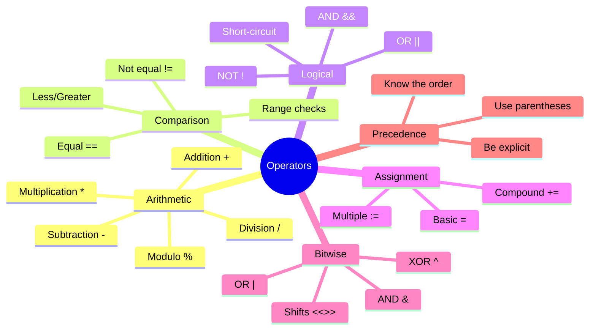

# Operators - Coffee Shop Calculations ➕➖✖️➗

## The Calculation Catastrophe

Marcus arrives to find the coffee shop in complete chaos. Orders are wrong, totals don't add up, and customers are confused about their bills.

"What's happening?" Marcus asks Sarah.

"Our calculation system is broken!" Sarah shows him a receipt:
```
2 Lattes: $9.00
3 Muffins: $7.50
Total: $1650.00 (?!)
```

"Someone doesn't understand operators," Sarah sighs. "We need to fix our calculations NOW!"

## Understanding Go Operators

```mermaid
graph TD
    A[Go Operators] --> B[Arithmetic]
    A --> C[Comparison]
    A --> D[Logical]
    A --> E[Bitwise]
    A --> F[Assignment]
    
    B --> G[+ - * / %]
    C --> H[== != < > <= >=]
    D --> I[&& || !]
    E --> J[& | ^ << >>]
    F --> K[= += -= *= /=]
    
    style A fill:#3498db,stroke:#fff,color:#fff
    style B fill:#2ecc71,stroke:#fff,color:#fff
    style C fill:#e74c3c,stroke:#fff,color:#fff
    style D fill:#f39c12,stroke:#fff,color:#fff
```

## Arithmetic Operators

Create `01_arithmetic_operators.go`:

```go
package main

import (
    "fmt"
    "math"
)

func main() {
    fmt.Println("=== GoCoffee Arithmetic Operations ===\n")
    
    // Basic arithmetic
    lattePrice := 4.50
    muffinPrice := 2.50
    
    // Addition
    subtotal := lattePrice + muffinPrice
    fmt.Printf("Latte ($%.2f) + Muffin ($%.2f) = $%.2f\n", 
        lattePrice, muffinPrice, subtotal)
    
    // Multiplication
    quantity := 3
    totalMuffins := muffinPrice * float64(quantity)
    fmt.Printf("%d Muffins × $%.2f = $%.2f\n", 
        quantity, muffinPrice, totalMuffins)
    
    // Division
    totalBill := 45.00
    numPeople := 3
    perPerson := totalBill / float64(numPeople)
    fmt.Printf("$%.2f ÷ %d people = $%.2f each\n", 
        totalBill, numPeople, perPerson)
    
    // Modulo (remainder)
    totalCents := 1234
    dollars := totalCents / 100
    cents := totalCents % 100
    fmt.Printf("%d cents = $%d.%02d\n", totalCents, dollars, cents)
    
    // Order of operations
    fmt.Println("\nORDER OF OPERATIONS:")
    
    // Wrong way (no parentheses)
    wrong := 10.00 + 5.00 * 0.08  // Tax calculated on $5 only
    fmt.Printf("Wrong: $10 + $5 × 8%% tax = $%.2f\n", wrong)
    
    // Right way (with parentheses)
    right := (10.00 + 5.00) * 0.08  // Tax on total
    fmt.Printf("Right: ($10 + $5) × 8%% tax = $%.2f\n", right)
    
    // Integer division pitfalls
    fmt.Println("\nINTEGER DIVISION:")
    
    // Integer division truncates
    items := 10
    groups := 3
    perGroup := items / groups
    leftover := items % groups
    fmt.Printf("%d items ÷ %d groups = %d per group, %d leftover\n", 
        items, groups, perGroup, leftover)
    
    // Float division for accuracy
    accuratePerGroup := float64(items) / float64(groups)
    fmt.Printf("Accurate division: %.2f items per group\n", accuratePerGroup)
    
    // Increment and decrement
    fmt.Println("\nCOUNTER OPERATIONS:")
    
    orderNumber := 1000
    fmt.Printf("Current order: #%d\n", orderNumber)
    
    orderNumber++ // Increment
    fmt.Printf("Next order: #%d\n", orderNumber)
    
    orderNumber-- // Decrement
    fmt.Printf("Previous order: #%d\n", orderNumber)
    
    // Compound calculations
    fmt.Println("\nCOMPLEX ORDER CALCULATION:")
    
    // Customer order
    espressos := 2
    lattes := 1
    croissants := 3
    
    espressoPrice := 3.00
    lattePrice = 4.50
    croissantPrice := 3.50
    
    // Calculate subtotal
    orderSubtotal := float64(espressos)*espressoPrice + 
                    float64(lattes)*lattePrice + 
                    float64(croissants)*croissantPrice
    
    // Apply discount
    memberDiscount := 0.10
    discountAmount := orderSubtotal * memberDiscount
    afterDiscount := orderSubtotal - discountAmount
    
    // Add tax
    taxRate := 0.085
    tax := afterDiscount * taxRate
    finalTotal := afterDiscount + tax
    
    // Add tip
    tipPercent := 0.18
    tip := finalTotal * tipPercent
    withTip := finalTotal + tip
    
    fmt.Printf("\nOrder Summary:\n")
    fmt.Printf("Subtotal:      $%.2f\n", orderSubtotal)
    fmt.Printf("Member (10%%): -$%.2f\n", discountAmount)
    fmt.Printf("After discount: $%.2f\n", afterDiscount)
    fmt.Printf("Tax (8.5%%):    $%.2f\n", tax)
    fmt.Printf("Total:         $%.2f\n", finalTotal)
    fmt.Printf("Tip (18%%):     $%.2f\n", tip)
    fmt.Printf("Final:         $%.2f\n", withTip)
    
    // Math package functions
    fmt.Println("\nMATH FUNCTIONS:")
    
    // Rounding
    precise := 4.567
    fmt.Printf("Original: $%.3f\n", precise)
    fmt.Printf("Round: $%.2f\n", math.Round(precise*100)/100)
    fmt.Printf("Ceil:  $%.2f\n", math.Ceil(precise*100)/100)
    fmt.Printf("Floor: $%.2f\n", math.Floor(precise*100)/100)
    
    // Power operations
    dailyGrowth := 1.05 // 5% daily growth
    days := 7
    weeklyGrowth := math.Pow(dailyGrowth, float64(days))
    fmt.Printf("\n5%% daily growth for %d days = %.2f%% total\n", 
        days, (weeklyGrowth-1)*100)
}
```

## Comparison Operators

Create `02_comparison_operators.go`:

```go
package main

import "fmt"

func main() {
    fmt.Println("=== GoCoffee Comparison Operations ===\n")
    
    // Price comparisons
    lattePrice := 4.50
    cappuccinoPrice := 4.00
    mochaPrice := 5.00
    budget := 5.00
    
    fmt.Println("PRICE COMPARISONS:")
    fmt.Printf("Latte ($%.2f) == Cappuccino ($%.2f): %v\n", 
        lattePrice, cappuccinoPrice, lattePrice == cappuccinoPrice)
    fmt.Printf("Latte ($%.2f) != Mocha ($%.2f): %v\n", 
        lattePrice, mochaPrice, lattePrice != mochaPrice)
    fmt.Printf("Latte ($%.2f) < Budget ($%.2f): %v\n", 
        lattePrice, budget, lattePrice < budget)
    fmt.Printf("Mocha ($%.2f) <= Budget ($%.2f): %v\n", 
        mochaPrice, budget, mochaPrice <= budget)
    
    // Inventory checks
    fmt.Println("\nINVENTORY CHECKS:")
    
    coffeeBags := 25
    milkGallons := 10
    
    minimumCoffee := 20
    minimumMilk := 15
    
    fmt.Printf("Coffee (%d) >= Minimum (%d): %v\n", 
        coffeeBags, minimumCoffee, coffeeBags >= minimumCoffee)
    fmt.Printf("Milk (%d) > Minimum (%d): %v\n", 
        milkGallons, minimumMilk, milkGallons > minimumMilk)
    
    // String comparisons
    fmt.Println("\nSTRING COMPARISONS:")
    
    customer1 := "Alice"
    customer2 := "Bob"
    vipCustomer := "Alice"
    
    fmt.Printf("'%s' == '%s': %v\n", customer1, vipCustomer, customer1 == vipCustomer)
    fmt.Printf("'%s' < '%s' (alphabetically): %v\n", customer1, customer2, customer1 < customer2)
    
    // Time-based comparisons
    fmt.Println("\nTIME COMPARISONS:")
    
    currentHour := 14 // 2 PM
    openingHour := 6
    closingHour := 22
    happyHourStart := 15
    happyHourEnd := 17
    
    isOpen := currentHour >= openingHour && currentHour < closingHour
    isHappyHour := currentHour >= happyHourStart && currentHour < happyHourEnd
    
    fmt.Printf("Current hour: %d:00\n", currentHour)
    fmt.Printf("Is open (6-22): %v\n", isOpen)
    fmt.Printf("Is happy hour (15-17): %v\n", isHappyHour)
    
    // Order validation
    fmt.Println("\nORDER VALIDATION:")
    
    orderTotal := 12.50
    minimumOrder := 5.00
    maximumOrder := 100.00
    
    validOrder := orderTotal >= minimumOrder && orderTotal <= maximumOrder
    fmt.Printf("Order $%.2f valid ($%.2f-$%.2f): %v\n", 
        orderTotal, minimumOrder, maximumOrder, validOrder)
    
    // Loyalty program
    fmt.Println("\nLOYALTY PROGRAM:")
    
    customerOrders := 15
    customerSpending := 250.00
    
    // Different tier requirements
    bronzeOrders := 5
    silverOrders := 10
    goldOrders := 20
    
    bronzeSpending := 100.00
    silverSpending := 200.00
    goldSpending := 500.00
    
    isBronze := customerOrders >= bronzeOrders || customerSpending >= bronzeSpending
    isSilver := customerOrders >= silverOrders || customerSpending >= silverSpending
    isGold := customerOrders >= goldOrders || customerSpending >= goldSpending
    
    fmt.Printf("Customer: %d orders, $%.2f spent\n", customerOrders, customerSpending)
    fmt.Printf("Bronze status: %v\n", isBronze)
    fmt.Printf("Silver status: %v\n", isSilver)
    fmt.Printf("Gold status: %v\n", isGold)
    
    // Practical example: Discount eligibility
    fmt.Println("\nDISCOUNT ELIGIBILITY:")
    
    type Order struct {
        total    float64
        items    int
        isMember bool
    }
    
    orders := []Order{
        {total: 25.00, items: 3, isMember: true},
        {total: 15.00, items: 2, isMember: false},
        {total: 50.00, items: 5, isMember: true},
    }
    
    for i, order := range orders {
        // 10% off for members OR orders over $30 OR 4+ items
        eligible := order.isMember || order.total > 30 || order.items >= 4
        
        fmt.Printf("Order %d: $%.2f, %d items, member:%v → Discount:%v\n", 
            i+1, order.total, order.items, order.isMember, eligible)
    }
}
```

## Logical Operators

Create `03_logical_operators.go`:

```go
package main

import (
    "fmt"
    "time"
)

func main() {
    fmt.Println("=== GoCoffee Logical Operations ===\n")
    
    // Store status
    currentHour := time.Now().Hour()
    dayOfWeek := time.Now().Weekday()
    
    isWeekday := dayOfWeek >= time.Monday && dayOfWeek <= time.Friday
    isWeekend := dayOfWeek == time.Saturday || dayOfWeek == time.Sunday
    
    // Store hours logic
    weekdayOpen := 6
    weekdayClose := 22
    weekendOpen := 7
    weekendClose := 23
    
    var isOpen bool
    if isWeekday {
        isOpen = currentHour >= weekdayOpen && currentHour < weekdayClose
    } else {
        isOpen = currentHour >= weekendOpen && currentHour < weekendClose
    }
    
    fmt.Printf("Current time: %d:00 on %s\n", currentHour, dayOfWeek)
    fmt.Printf("Is weekday: %v\n", isWeekday)
    fmt.Printf("Is weekend: %v\n", isWeekend)
    fmt.Printf("Store is open: %v\n", isOpen)
    
    // Complex order eligibility
    fmt.Println("\nFREE DELIVERY ELIGIBILITY:")
    
    type Customer struct {
        name      string
        isPremium bool
        orderTotal float64
        distance  float64 // miles
    }
    
    customers := []Customer{
        {"Alice", true, 25.00, 2.5},
        {"Bob", false, 35.00, 1.5},
        {"Charlie", false, 15.00, 3.0},
        {"Diana", true, 10.00, 4.0},
    }
    
    const (
        freeDeliveryMinimum = 30.00
        maxDeliveryDistance = 5.0
        premiumMinimum      = 15.00
    )
    
    for _, customer := range customers {
        // Free delivery if:
        // - Premium AND order >= $15 OR
        // - Non-premium AND order >= $30
        // AND always: distance <= 5 miles
        
        qualifiesForFree := (customer.isPremium && customer.orderTotal >= premiumMinimum) ||
                           (!customer.isPremium && customer.orderTotal >= freeDeliveryMinimum)
        
        withinRange := customer.distance <= maxDeliveryDistance
        
        getsFreeDelivery := qualifiesForFree && withinRange
        
        fmt.Printf("\n%s: Premium=%v, $%.2f order, %.1f miles\n", 
            customer.name, customer.isPremium, customer.orderTotal, customer.distance)
        fmt.Printf("  Qualifies by amount: %v\n", qualifiesForFree)
        fmt.Printf("  Within range: %v\n", withinRange)
        fmt.Printf("  → Free delivery: %v\n", getsFreeDelivery)
    }
    
    // Short-circuit evaluation
    fmt.Println("\nSHORT-CIRCUIT EVALUATION:")
    
    // This demonstrates how Go stops evaluating when result is known
    inventory := map[string]int{
        "coffee": 50,
        "milk": 20,
        "sugar": 100,
    }
    
    // Check if we can make a latte
    canMakeLatte := checkInventory("coffee", 1, inventory) &&
                    checkInventory("milk", 8, inventory) &&
                    checkInventory("sugar", 2, inventory)
    
    fmt.Printf("Can make latte: %v\n", canMakeLatte)
    
    // Negation operator
    fmt.Println("\nNEGATION EXAMPLES:")
    
    isClosingSoon := currentHour >= 21
    stayOpen := !isClosingSoon
    
    fmt.Printf("Closing soon (after 9 PM): %v\n", isClosingSoon)
    fmt.Printf("Stay open: %v\n", stayOpen)
    
    // Complex business rules
    fmt.Println("\nHAPPY HOUR LOGIC:")
    
    isHappyHour := (isWeekday && currentHour >= 15 && currentHour < 17) ||
                   (isWeekend && currentHour >= 14 && currentHour < 16)
    
    fmt.Printf("Happy hour active: %v\n", isHappyHour)
    
    // Conditional assignments
    fmt.Println("\nCONDITIONAL PRICING:")
    
    basePrice := 4.50
    var finalPrice float64
    
    if isHappyHour && isOpen {
        finalPrice = basePrice * 0.8 // 20% off
        fmt.Printf("Happy hour price: $%.2f (20%% off)\n", finalPrice)
    } else if isWeekend && isOpen {
        finalPrice = basePrice * 1.1 // 10% weekend surcharge
        fmt.Printf("Weekend price: $%.2f (10%% surcharge)\n", finalPrice)
    } else if isOpen {
        finalPrice = basePrice
        fmt.Printf("Regular price: $%.2f\n", finalPrice)
    } else {
        finalPrice = 0
        fmt.Println("Store is closed")
    }
}

func checkInventory(item string, needed int, inventory map[string]int) bool {
    available, exists := inventory[item]
    result := exists && available >= needed
    
    if result {
        fmt.Printf("  ✓ %s: need %d, have %d\n", item, needed, available)
    } else {
        fmt.Printf("  ✗ %s: need %d, have %d\n", item, needed, available)
    }
    
    return result
}
```

## Assignment Operators

Create `04_assignment_operators.go`:

```go
package main

import "fmt"

func main() {
    fmt.Println("=== GoCoffee Assignment Operators ===\n")
    
    // Basic assignment
    total := 0.0
    fmt.Printf("Starting total: $%.2f\n", total)
    
    // Addition assignment
    fmt.Println("\nADDING ITEMS TO ORDER:")
    
    lattePrice := 4.50
    total += lattePrice
    fmt.Printf("Added latte ($%.2f): Total = $%.2f\n", lattePrice, total)
    
    muffinPrice := 3.00
    total += muffinPrice
    fmt.Printf("Added muffin ($%.2f): Total = $%.2f\n", muffinPrice, total)
    
    // Subtraction assignment
    discount := 1.00
    total -= discount
    fmt.Printf("Applied discount (-$%.2f): Total = $%.2f\n", discount, total)
    
    // Multiplication assignment
    fmt.Println("\nAPPLYING MULTIPLIERS:")
    
    // Apply tax (8.5%)
    taxRate := 1.085
    total *= taxRate
    fmt.Printf("After tax (×%.3f): Total = $%.2f\n", taxRate, total)
    
    // Division assignment
    fmt.Println("\nSPLITTING THE BILL:")
    
    people := 2
    perPerson := total
    perPerson /= float64(people)
    fmt.Printf("Split %d ways: $%.2f per person\n", people, perPerson)
    
    // Integer operations
    fmt.Println("\nINVENTORY MANAGEMENT:")
    
    coffeeBags := 100
    fmt.Printf("Starting inventory: %d bags\n", coffeeBags)
    
    // Daily usage
    morningUse := 15
    coffeeBags -= morningUse
    fmt.Printf("After morning (-15): %d bags\n", coffeeBags)
    
    afternoonUse := 20
    coffeeBags -= afternoonUse
    fmt.Printf("After afternoon (-20): %d bags\n", coffeeBags)
    
    // Delivery arrived
    delivery := 50
    coffeeBags += delivery
    fmt.Printf("After delivery (+50): %d bags\n", coffeeBags)
    
    // Modulo assignment
    fmt.Println("\nPOINTS CALCULATION:")
    
    loyaltyPoints := 1247
    fmt.Printf("Total points: %d\n", loyaltyPoints)
    
    pointsPerReward := 100
    rewards := loyaltyPoints / pointsPerReward
    loyaltyPoints %= pointsPerReward // Remaining points
    
    fmt.Printf("Rewards earned: %d\n", rewards)
    fmt.Printf("Points remaining: %d\n", loyaltyPoints)
    
    // Multiple assignments
    fmt.Println("\nMULTIPLE ASSIGNMENTS:")
    
    // Swap values
    hot, cold := "Latte", "Iced Coffee"
    fmt.Printf("Before swap: hot=%s, cold=%s\n", hot, cold)
    
    hot, cold = cold, hot
    fmt.Printf("After swap: hot=%s, cold=%s\n", hot, cold)
    
    // Parallel assignment
    name, price, available := "Mocha", 5.00, true
    fmt.Printf("\nProduct: %s, Price: $%.2f, Available: %v\n", 
        name, price, available)
    
    // Practical example: Running totals
    fmt.Println("\nDAILY SALES TRACKER:")
    
    type Sale struct {
        time   string
        amount float64
    }
    
    sales := []Sale{
        {"9:00 AM", 45.50},
        {"10:30 AM", 23.75},
        {"12:00 PM", 67.25},
        {"2:15 PM", 34.00},
        {"4:30 PM", 89.50},
    }
    
    dailyTotal := 0.0
    transactionCount := 0
    
    fmt.Println("Time      Amount    Running Total")
    fmt.Println("------------------------------------")
    
    for _, sale := range sales {
        dailyTotal += sale.amount
        transactionCount++
        
        fmt.Printf("%-9s $%6.2f   $%7.2f\n", 
            sale.time, sale.amount, dailyTotal)
    }
    
    averageSale := dailyTotal / float64(transactionCount)
    fmt.Printf("\nTotal sales: $%.2f\n", dailyTotal)
    fmt.Printf("Transactions: %d\n", transactionCount)
    fmt.Printf("Average sale: $%.2f\n", averageSale)
}
```

## Bitwise Operators

Create `05_bitwise_operators.go`:

```go
package main

import "fmt"

// Store features as bit flags
const (
    FeatureNone       = 0
    FeatureWifi       = 1 << 0  // 1
    FeatureParking    = 1 << 1  // 2
    FeatureDriveThru  = 1 << 2  // 4
    FeatureOutdoor    = 1 << 3  // 8
    FeaturePetFriendly = 1 << 4 // 16
    FeatureDelivery   = 1 << 5  // 32
)

// Day flags for special offers
const (
    Monday    = 1 << 0 // 1
    Tuesday   = 1 << 1 // 2
    Wednesday = 1 << 2 // 4
    Thursday  = 1 << 3 // 8
    Friday    = 1 << 4 // 16
    Saturday  = 1 << 5 // 32
    Sunday    = 1 << 6 // 64
)

func main() {
    fmt.Println("=== GoCoffee Bitwise Operations ===\n")
    
    // Store features using bitwise OR
    downtownStore := FeatureWifi | FeatureParking | FeatureOutdoor
    airportStore := FeatureWifi | FeatureDriveThru | FeatureDelivery
    suburbStore := FeatureWifi | FeatureParking | FeatureDriveThru | FeaturePetFriendly
    
    fmt.Println("STORE FEATURES:")
    fmt.Printf("Downtown: %b (%d)\n", downtownStore, downtownStore)
    displayFeatures("Downtown", downtownStore)
    
    fmt.Printf("\nAirport: %b (%d)\n", airportStore, airportStore)
    displayFeatures("Airport", airportStore)
    
    fmt.Printf("\nSuburb: %b (%d)\n", suburbStore, suburbStore)
    displayFeatures("Suburb", suburbStore)
    
    // Check for specific features using AND
    fmt.Println("\nFEATURE QUERIES:")
    
    stores := map[string]int{
        "Downtown": downtownStore,
        "Airport":  airportStore,
        "Suburb":   suburbStore,
    }
    
    // Which stores have parking?
    fmt.Println("Stores with parking:")
    for name, features := range stores {
        if features&FeatureParking != 0 {
            fmt.Printf("  ✓ %s\n", name)
        }
    }
    
    // Which stores have both WiFi AND Drive-thru?
    fmt.Println("\nStores with WiFi AND Drive-thru:")
    requiredFeatures := FeatureWifi | FeatureDriveThru
    for name, features := range stores {
        if features&requiredFeatures == requiredFeatures {
            fmt.Printf("  ✓ %s\n", name)
        }
    }
    
    // Toggle features using XOR
    fmt.Println("\nTOGGLING FEATURES:")
    
    testStore := FeatureWifi | FeatureParking
    fmt.Printf("Original: %b\n", testStore)
    displayFeatures("Test Store", testStore)
    
    // Toggle outdoor seating
    testStore ^= FeatureOutdoor
    fmt.Printf("\nAfter adding outdoor: %b\n", testStore)
    displayFeatures("Test Store", testStore)
    
    // Toggle outdoor again (removes it)
    testStore ^= FeatureOutdoor
    fmt.Printf("\nAfter toggling outdoor again: %b\n", testStore)
    displayFeatures("Test Store", testStore)
    
    // Clear features using AND NOT
    fmt.Println("\nREMOVING FEATURES:")
    
    // Remove parking from suburb store
    modifiedSuburb := suburbStore &^ FeatureParking
    fmt.Printf("Suburb without parking: %b\n", modifiedSuburb)
    displayFeatures("Modified Suburb", modifiedSuburb)
    
    // Shift operations for time slots
    fmt.Println("\nTIME SLOT RESERVATIONS:")
    
    // Each bit represents a 30-minute slot (9 AM - 5 PM = 16 slots)
    var reservations uint16 = 0
    
    // Book slot 3 (10:30-11:00)
    reservations |= 1 << 3
    
    // Book slot 7 (12:30-1:00)
    reservations |= 1 << 7
    
    // Book slots 10-11 (2:00-3:00)
    reservations |= 1 << 10
    reservations |= 1 << 11
    
    fmt.Printf("Reservations: %016b\n", reservations)
    fmt.Println("Time slots:")
    displayTimeSlots(reservations)
    
    // Special offer days
    fmt.Println("\nSPECIAL OFFER DAYS:")
    
    happyHourDays := Monday | Tuesday | Wednesday | Thursday | Friday
    weekendBrunch := Saturday | Sunday
    seniorDiscount := Tuesday | Thursday
    
    fmt.Printf("Happy Hour (weekdays): %07b\n", happyHourDays)
    fmt.Printf("Weekend Brunch: %07b\n", weekendBrunch)
    fmt.Printf("Senior Discount: %07b\n", seniorDiscount)
    
    // Check what offers are available on Tuesday
    checkOffers("Tuesday", Tuesday, happyHourDays, weekendBrunch, seniorDiscount)
    checkOffers("Saturday", Saturday, happyHourDays, weekendBrunch, seniorDiscount)
}

func displayFeatures(storeName string, features int) {
    fmt.Printf("%s features:\n", storeName)
    
    featureMap := map[int]string{
        FeatureWifi:       "WiFi",
        FeatureParking:    "Parking",
        FeatureDriveThru:  "Drive-Thru",
        FeatureOutdoor:    "Outdoor Seating",
        FeaturePetFriendly: "Pet Friendly",
        FeatureDelivery:   "Delivery",
    }
    
    for flag, name := range featureMap {
        if features&flag != 0 {
            fmt.Printf("  ✓ %s\n", name)
        }
    }
}

func displayTimeSlots(reservations uint16) {
    startHour := 9
    for slot := 0; slot < 16; slot++ {
        if reservations&(1<<slot) != 0 {
            hour := startHour + slot/2
            minute := 0
            if slot%2 == 1 {
                minute = 30
            }
            fmt.Printf("  Slot %2d: %2d:%02d - %2d:%02d ✓\n", 
                slot, hour, minute, hour, minute+30)
        }
    }
}

func checkOffers(day string, dayFlag, happy, brunch, senior int) {
    fmt.Printf("\n%s offers:\n", day)
    if dayFlag&happy != 0 {
        fmt.Println("  ✓ Happy Hour (3-5 PM)")
    }
    if dayFlag&brunch != 0 {
        fmt.Println("  ✓ Weekend Brunch Special")
    }
    if dayFlag&senior != 0 {
        fmt.Println("  ✓ Senior Discount (10%)")
    }
}
```

## Operator Precedence

Create `06_operator_precedence.go`:

```go
package main

import "fmt"

func main() {
    fmt.Println("=== GoCoffee Operator Precedence ===\n")
    
    // Common precedence mistakes
    fmt.Println("PRECEDENCE MISTAKES:")
    
    // Multiplication before addition
    price1 := 10.00
    price2 := 5.00
    taxRate := 0.08
    
    // Wrong: tax only on second item
    wrong := price1 + price2 * taxRate
    fmt.Printf("Wrong: $%.2f + $%.2f × %.0f%% = $%.2f\n", 
        price1, price2, taxRate*100, wrong)
    
    // Right: tax on total
    right := (price1 + price2) * taxRate
    fmt.Printf("Right: ($%.2f + $%.2f) × %.0f%% = $%.2f\n", 
        price1, price2, taxRate*100, right)
    
    // Comparison vs arithmetic
    fmt.Println("\nCOMPARISON PRECEDENCE:")
    
    minOrder := 10.00
    discount := 2.00
    total := 15.00
    
    // This works as expected (> has lower precedence than -)
    qualifies := total - discount > minOrder
    fmt.Printf("$%.2f - $%.2f > $%.2f = %v\n", 
        total, discount, minOrder, qualifies)
    
    // Logical operator precedence
    fmt.Println("\nLOGICAL PRECEDENCE:")
    
    isMember := true
    orderAmount := 25.00
    itemCount := 3
    
    // AND has higher precedence than OR
    // This is interpreted as: isMember || (orderAmount > 30 && itemCount > 5)
    eligible1 := isMember || orderAmount > 30 && itemCount > 5
    fmt.Printf("member || amount > 30 && items > 5 = %v\n", eligible1)
    
    // Use parentheses for clarity
    eligible2 := (isMember || orderAmount > 30) && itemCount > 5
    fmt.Printf("(member || amount > 30) && items > 5 = %v\n", eligible2)
    
    // Complex calculation
    fmt.Println("\nCOMPLEX CALCULATION:")
    
    basePrice := 20.00
    memberDiscount := 0.10
    bulkDiscount := 0.05
    quantity := 3
    tax := 0.085
    
    // Step by step
    step1 := basePrice * float64(quantity)
    fmt.Printf("Step 1: $%.2f × %d = $%.2f\n", basePrice, quantity, step1)
    
    step2 := step1 * (1 - memberDiscount)
    fmt.Printf("Step 2: $%.2f × (1 - %.0f%%) = $%.2f\n", 
        step1, memberDiscount*100, step2)
    
    step3 := step2 * (1 - bulkDiscount)
    fmt.Printf("Step 3: $%.2f × (1 - %.0f%%) = $%.2f\n", 
        step2, bulkDiscount*100, step3)
    
    step4 := step3 * (1 + tax)
    fmt.Printf("Step 4: $%.2f × (1 + %.1f%%) = $%.2f\n", 
        step3, tax*100, step4)
    
    // All in one (hard to read!)
    allInOne := basePrice * float64(quantity) * (1 - memberDiscount) * 
                (1 - bulkDiscount) * (1 + tax)
    fmt.Printf("\nAll in one: $%.2f\n", allInOne)
    
    // Better with intermediate variables
    subtotal := basePrice * float64(quantity)
    afterMember := subtotal * (1 - memberDiscount)
    afterBulk := afterMember * (1 - bulkDiscount)
    finalTotal := afterBulk * (1 + tax)
    
    fmt.Printf("With variables: $%.2f\n", finalTotal)
    
    // Precedence table
    fmt.Println("\nOPERATOR PRECEDENCE (highest to lowest):")
    fmt.Println("1. () [] . ->")
    fmt.Println("2. ! ++ -- + - * & (unary)")
    fmt.Println("3. * / %")
    fmt.Println("4. + -")
    fmt.Println("5. << >>")
    fmt.Println("6. < <= > >=")
    fmt.Println("7. == !=")
    fmt.Println("8. &")
    fmt.Println("9. ^")
    fmt.Println("10. |")
    fmt.Println("11. &&")
    fmt.Println("12. ||")
    fmt.Println("13. = += -= *= /= %= etc.")
}
```

## Practical Examples

Create `07_practical_examples.go`:

```go
package main

import (
    "fmt"
    "math"
    "time"
)

// Order represents a coffee order
type Order struct {
    items    []OrderItem
    isMember bool
    tipPercent float64
}

type OrderItem struct {
    name     string
    price    float64
    quantity int
    size     string
}

func main() {
    fmt.Println("=== GoCoffee Practical Calculations ===\n")
    
    // Create an order
    order := Order{
        items: []OrderItem{
            {"Latte", 4.50, 2, "large"},
            {"Cappuccino", 4.00, 1, "medium"},
            {"Croissant", 3.50, 3, ""},
            {"Blueberry Muffin", 2.75, 2, ""},
        },
        isMember: true,
        tipPercent: 18,
    }
    
    // Calculate order
    calculateOrder(order)
    
    // Loyalty points calculation
    fmt.Println("\nLOYALTY POINTS CALCULATION:")
    calculateLoyaltyPoints(45.67)
    
    // Split bill calculation
    fmt.Println("\nSPLIT BILL CALCULATION:")
    splitBill(125.80, 4, 20)
    
    // Inventory calculations
    fmt.Println("\nINVENTORY CALCULATIONS:")
    calculateInventoryNeeds()
    
    // Time-based pricing
    fmt.Println("\nDYNAMIC PRICING:")
    calculateDynamicPrice("Latte", 4.50)
}

func calculateOrder(order Order) {
    fmt.Println("ORDER CALCULATION:")
    fmt.Println("==================")
    
    subtotal := 0.0
    
    // Calculate subtotal
    for _, item := range order.items {
        itemTotal := item.price * float64(item.quantity)
        subtotal += itemTotal
        
        fmt.Printf("%d × %s", item.quantity, item.name)
        if item.size != "" {
            fmt.Printf(" (%s)", item.size)
        }
        fmt.Printf(" @ $%.2f = $%.2f\n", item.price, itemTotal)
    }
    
    fmt.Printf("\nSubtotal: $%.2f\n", subtotal)
    
    // Apply discounts
    discount := 0.0
    if order.isMember {
        discount = subtotal * 0.10 // 10% member discount
        fmt.Printf("Member discount (10%%): -$%.2f\n", discount)
    }
    
    // Bulk discount (additional 5% if over $30)
    if subtotal > 30 {
        bulkDiscount := subtotal * 0.05
        discount += bulkDiscount
        fmt.Printf("Bulk discount (5%%): -$%.2f\n", bulkDiscount)
    }
    
    afterDiscount := subtotal - discount
    fmt.Printf("After discounts: $%.2f\n", afterDiscount)
    
    // Calculate tax
    tax := afterDiscount * 0.085
    fmt.Printf("Tax (8.5%%): $%.2f\n", tax)
    
    beforeTip := afterDiscount + tax
    fmt.Printf("Total before tip: $%.2f\n", beforeTip)
    
    // Calculate tip
    tip := beforeTip * (order.tipPercent / 100)
    fmt.Printf("Tip (%.0f%%): $%.2f\n", order.tipPercent, tip)
    
    finalTotal := beforeTip + tip
    fmt.Printf("\nFINAL TOTAL: $%.2f\n", finalTotal)
}

func calculateLoyaltyPoints(amount float64) {
    // 1 point per dollar spent
    basePoints := int(amount)
    
    // Bonus points
    bonusPoints := 0
    
    // Double points on weekends
    if time.Now().Weekday() == time.Saturday || 
       time.Now().Weekday() == time.Sunday {
        bonusPoints += basePoints
        fmt.Printf("Weekend bonus: +%d points\n", basePoints)
    }
    
    // Extra 50 points for orders over $50
    if amount > 50 {
        bonusPoints += 50
        fmt.Println("Large order bonus: +50 points")
    }
    
    totalPoints := basePoints + bonusPoints
    fmt.Printf("Order amount: $%.2f\n", amount)
    fmt.Printf("Base points: %d\n", basePoints)
    fmt.Printf("Bonus points: %d\n", bonusPoints)
    fmt.Printf("Total points earned: %d\n", totalPoints)
    
    // Check rewards
    pointsNeeded := 500
    if totalPoints >= pointsNeeded {
        rewards := totalPoints / pointsNeeded
        remaining := totalPoints % pointsNeeded
        fmt.Printf("Rewards earned: %d free drinks!\n", rewards)
        fmt.Printf("Points remaining: %d\n", remaining)
    } else {
        fmt.Printf("Points until next reward: %d\n", pointsNeeded-totalPoints)
    }
}

func splitBill(total float64, people int, tipPercent float64) {
    // Add tip to total
    tipAmount := total * (tipPercent / 100)
    grandTotal := total + tipAmount
    
    // Calculate per person
    perPerson := grandTotal / float64(people)
    
    // Round up to nearest cent
    perPersonRounded := math.Ceil(perPerson*100) / 100
    
    // Calculate actual total
    actualTotal := perPersonRounded * float64(people)
    overage := actualTotal - grandTotal
    
    fmt.Printf("Bill: $%.2f\n", total)
    fmt.Printf("Tip (%.0f%%): $%.2f\n", tipPercent, tipAmount)
    fmt.Printf("Grand total: $%.2f\n", grandTotal)
    fmt.Printf("Split %d ways: $%.2f per person\n", people, perPersonRounded)
    
    if overage > 0 {
        fmt.Printf("Total collected: $%.2f (%.2f extra)\n", actualTotal, overage)
    }
}

func calculateInventoryNeeds() {
    // Daily usage rates
    coffeeBagsPerDay := 5.5
    milkGallonsPerDay := 12.3
    cupsPerDay := 450
    
    // Current inventory
    currentCoffeeBags := 25.0
    currentMilkGallons := 45.0
    currentCups := 2500
    
    // Calculate days until out
    daysOfCoffee := currentCoffeeBags / coffeeBagsPerDay
    daysOfMilk := currentMilkGallons / milkGallonsPerDay
    daysOfCups := float64(currentCups) / float64(cupsPerDay)
    
    fmt.Println("Current inventory will last:")
    fmt.Printf("Coffee: %.1f days\n", daysOfCoffee)
    fmt.Printf("Milk: %.1f days\n", daysOfMilk)
    fmt.Printf("Cups: %.1f days\n", daysOfCups)
    
    // Calculate order quantities (order when 3 days left)
    reorderDays := 3.0
    deliveryDays := 2.0
    safetyStock := 1.5
    
    targetDays := reorderDays + deliveryDays + safetyStock
    
    if daysOfCoffee < targetDays {
        needed := (targetDays - daysOfCoffee) * coffeeBagsPerDay
        fmt.Printf("\n⚠️  Order %.0f coffee bags NOW!\n", math.Ceil(needed))
    }
    
    if daysOfMilk < targetDays {
        needed := (targetDays - daysOfMilk) * milkGallonsPerDay
        fmt.Printf("⚠️  Order %.0f gallons of milk NOW!\n", math.Ceil(needed))
    }
}

func calculateDynamicPrice(item string, basePrice float64) {
    hour := time.Now().Hour()
    dayOfWeek := time.Now().Weekday()
    
    price := basePrice
    reason := "regular price"
    
    // Happy hour: 3-5 PM weekdays
    if hour >= 15 && hour < 17 && dayOfWeek >= time.Monday && dayOfWeek <= time.Friday {
        price *= 0.8 // 20% off
        reason = "happy hour (-20%)"
    } else if hour >= 6 && hour < 9 {
        // Morning rush: 6-9 AM
        price *= 1.1 // 10% surge
        reason = "morning rush (+10%)"
    } else if dayOfWeek == time.Saturday || dayOfWeek == time.Sunday {
        // Weekend pricing
        if hour >= 10 && hour < 14 {
            price *= 1.15 // 15% brunch surge
            reason = "weekend brunch (+15%)"
        }
    }
    
    fmt.Printf("%s: $%.2f (%s)\n", item, price, reason)
    fmt.Printf("Base price: $%.2f\n", basePrice)
    
    if price != basePrice {
        difference := price - basePrice
        percent := (difference / basePrice) * 100
        fmt.Printf("Difference: $%.2f (%.0f%%)\n", difference, percent)
    }
}
```

## Common Pitfalls

Create `08_operator_pitfalls.go`:

```go
package main

import (
    "fmt"
    "math"
)

func main() {
    fmt.Println("=== GoCoffee Operator Pitfalls ===\n")
    
    // Pitfall 1: Integer division
    fmt.Println("PITFALL 1: Integer Division")
    
    totalBill := 100
    people := 3
    
    // Wrong: integer division truncates
    wrongSplit := totalBill / people
    fmt.Printf("Wrong: $%d ÷ %d = $%d per person\n", totalBill, people, wrongSplit)
    fmt.Printf("Total collected: $%d (Lost $%d!)\n", wrongSplit*people, totalBill-wrongSplit*people)
    
    // Right: convert to float
    rightSplit := float64(totalBill) / float64(people)
    fmt.Printf("Right: $%d ÷ %d = $%.2f per person\n", totalBill, people, rightSplit)
    
    // Pitfall 2: Floating point comparison
    fmt.Println("\nPITFALL 2: Float Comparison")
    
    price := 0.1 + 0.2
    expected := 0.3
    
    fmt.Printf("0.1 + 0.2 = %.17f\n", price)
    fmt.Printf("Expected:   %.17f\n", expected)
    fmt.Printf("Are they equal? %v\n", price == expected)
    
    // Solution: use epsilon comparison
    epsilon := 0.0001
    equal := math.Abs(price-expected) < epsilon
    fmt.Printf("Within epsilon? %v\n", equal)
    
    // Pitfall 3: Operator precedence
    fmt.Println("\nPITFALL 3: Operator Precedence")
    
    items := 5
    discount := 0.1
    price1 := 10.0
    
    // Wrong: multiplication before addition
    wrong := price1 + price1 * float64(items) * discount
    fmt.Printf("Wrong: %.2f + %.2f × %d × %.1f = %.2f\n", 
        price1, price1, items, discount, wrong)
    
    // Right: use parentheses
    right := (price1 + price1 * float64(items)) * discount
    fmt.Printf("Right: (%.2f + %.2f × %d) × %.1f = %.2f\n", 
        price1, price1, items, discount, right)
    
    // Pitfall 4: Assignment vs comparison
    fmt.Println("\nPITFALL 4: Assignment in Conditions")
    
    isOpen := true
    
    // This is valid Go (unlike C/C++)
    if isOpen {
        fmt.Println("Store is open")
    }
    
    // Go prevents accidental assignment
    // if isOpen = false { } // This won't compile!
    
    // Pitfall 5: Negative modulo
    fmt.Println("\nPITFALL 5: Negative Modulo")
    
    balance := -17
    adjustment := 5
    
    remainder := balance % adjustment
    fmt.Printf("%d %% %d = %d\n", balance, adjustment, remainder)
    
    // For always-positive result:
    positiveRem := ((balance % adjustment) + adjustment) % adjustment
    fmt.Printf("Positive remainder: %d\n", positiveRem)
    
    // Pitfall 6: Type mixing
    fmt.Println("\nPITFALL 6: Type Mixing")
    
    var count int32 = 10
    var multiplier int64 = 100
    
    // Wrong: can't mix types
    // result := count * multiplier // Error!
    
    // Right: explicit conversion
    result := int64(count) * multiplier
    fmt.Printf("%d × %d = %d\n", count, multiplier, result)
    
    // Pitfall 7: Short-circuit evaluation
    fmt.Println("\nPITFALL 7: Short-Circuit Side Effects")
    
    processed := 0
    
    // This function has side effects
    processOrder := func() bool {
        processed++
        return true
    }
    
    // Second function might not be called!
    if false && processOrder() {
        fmt.Println("This won't print")
    }
    fmt.Printf("Orders processed: %d (not 1!)\n", processed)
    
    // Better: evaluate separately if side effects matter
    shouldProcess := processOrder()
    if false && shouldProcess {
        fmt.Println("This won't print")
    }
    fmt.Printf("Orders processed: %d\n", processed)
}
```

## Summary Exercise

Create `09_operators_challenge.go`:

```go
package main

import (
    "fmt"
    "math"
)

// Challenge: Implement a complete coffee shop pricing system
// Requirements:
// 1. Calculate subtotal for multiple items
// 2. Apply time-based discounts
// 3. Apply customer status discounts
// 4. Calculate tax
// 5. Calculate tip options
// 6. Handle split bills

func main() {
    fmt.Println("=== GoCoffee Operators Challenge ===\n")
    fmt.Println("TODO: Implement a complete pricing system")
    fmt.Println("\nRequirements:")
    fmt.Println("- Support multiple items with quantities")
    fmt.Println("- Time-based pricing (happy hour, etc)")
    fmt.Println("- Member and bulk discounts")
    fmt.Println("- Tax calculation")
    fmt.Println("- Tip suggestions (15%, 18%, 20%)")
    fmt.Println("- Split bill evenly or by items")
    
    // Your implementation here...
    
    // Starter structure:
    type MenuItem struct {
        name  string
        price float64
    }
    
    type OrderItem struct {
        item     MenuItem
        quantity int
        mods     []string // size, milk type, etc
    }
    
    type Order struct {
        items      []OrderItem
        customerID string
        isMember   bool
        timestamp  string
    }
    
    // Example usage:
    _ = Order{} // Remove this when implementing
    
    fmt.Println("\nImplement your solution above!")
}

// Hint: Consider these helper functions
func calculateSubtotal(items []OrderItem) float64 {
    // TODO: Implement
    return 0
}

func applyDiscounts(subtotal float64, isMember bool) float64 {
    // TODO: Implement time and status based discounts
    return subtotal
}

func calculateTax(amount float64, rate float64) float64 {
    // TODO: Implement
    return amount * rate
}

func suggestTips(amount float64) map[string]float64 {
    // TODO: Return tip amounts for 15%, 18%, 20%
    return nil
}

func splitBill(total float64, ways int) float64 {
    // TODO: Implement fair splitting (round up cents)
    return math.Ceil(total*100/float64(ways)) / 100
}
```

## Key Takeaways

Marcus now understands Go's operators:



## Sarah's Summary

"Great job fixing our calculations!" Sarah says. "No more $1650 lattes! Remember:
- Always consider types when doing math
- Use parentheses to be explicit
- Test edge cases (negative numbers, zero division)
- Money calculations need special care"

## What's Next?

"Tomorrow," Sarah continues, "we'll learn about the fmt package - how to display our data beautifully on receipts, menus, and reports!"

Continue to [Formatting - Beautiful Menu Displays](../05-fmt-package/Formatting_Beautiful_Displays.md) →

---

*"Operators are the gears that make calculations work - use them wisely!"*