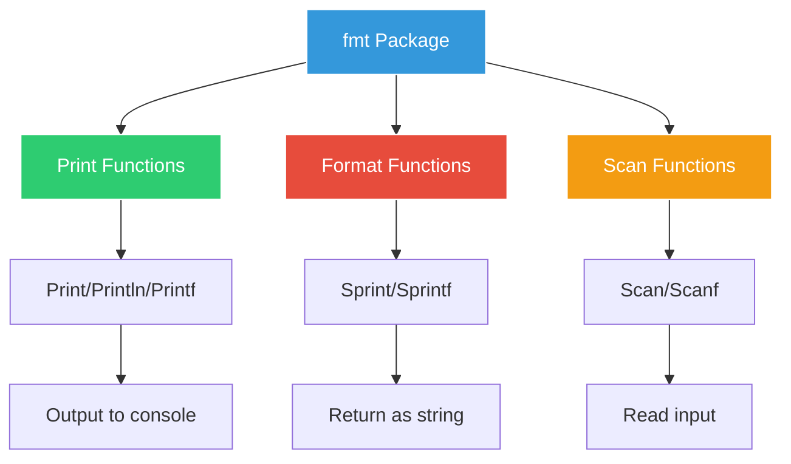
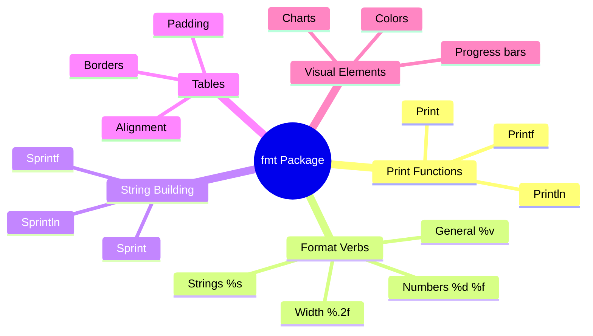

# Formatting - Beautiful Menu Displays 🎨

## The Ugly Receipt Problem

Marcus walks in to find Sarah staring at a receipt printer, looking frustrated.

"Look at this mess!" she shows Marcus a receipt:

```
ORDER1001LATTE4.5MUFFIN2.5TOTAL7.0THANKYOU
```

"Our receipts are unreadable! Customers can't tell what they ordered or what they paid. We need proper formatting!"

## The fmt Package - Go's Formatting Swiss Army Knife



## Basic Printing

Create `01_basic_printing.go`:

```go
package main

import "fmt"

func main() {
    fmt.Println("=== GoCoffee Basic Printing ===\n")
    
    // Print vs Println vs Printf
    fmt.Print("Welcome ")
    fmt.Print("to ")
    fmt.Print("GoCoffee")
    fmt.Print("\n\n") // Need manual newline
    
    // Println adds newline automatically
    fmt.Println("Welcome")
    fmt.Println("to")
    fmt.Println("GoCoffee")
    fmt.Println() // Empty line
    
    // Printf allows formatting
    storeName := "GoCoffee Downtown"
    year := 2024
    rating := 4.8
    
    fmt.Printf("Welcome to %s!\n", storeName)
    fmt.Printf("Established: %d\n", year)
    fmt.Printf("Rating: %.1f stars\n", rating)
    
    // Multiple values
    fmt.Printf("\n%s (est. %d) - %.1f★\n", storeName, year, rating)
    
    // Common mistakes
    fmt.Println("\nCOMMON MISTAKES:")
    
    // Forgetting newline in Printf
    fmt.Printf("This needs a newline")
    fmt.Printf("This will be on same line\n")
    
    // Using wrong verb
    price := 4.50
    fmt.Printf("\nPrice: %d\n", price) // Wrong! %d for integers
    fmt.Printf("Price: %.2f\n", price) // Correct! %f for floats
    
    // Building strings
    fmt.Println("\nBUILDING STRINGS:")
    
    // Using + operator (inefficient for many strings)
    greeting1 := "Hello, " + "Marcus" + "!"
    fmt.Println(greeting1)
    
    // Using fmt.Sprintf (better)
    customerName := "Sarah"
    greeting2 := fmt.Sprintf("Hello, %s!", customerName)
    fmt.Println(greeting2)
    
    // Sprint variations
    coffee := "Latte"
    size := "Large"
    
    // Sprint concatenates with spaces
    order1 := fmt.Sprint(coffee, size)
    fmt.Printf("Sprint: '%s'\n", order1)
    
    // Sprintln adds spaces and newline
    order2 := fmt.Sprintln(coffee, size)
    fmt.Printf("Sprintln: '%s'", order2) // Already has newline
    
    // Sprintf with format
    order3 := fmt.Sprintf("%s (%s)", coffee, size)
    fmt.Printf("Sprintf: '%s'\n", order3)
}
```

## Format Verbs

Create `02_format_verbs.go`:

```go
package main

import "fmt"

type Coffee struct {
    Name  string
    Size  string
    Price float64
}

func main() {
    fmt.Println("=== GoCoffee Format Verbs ===\n")
    
    // General verbs
    fmt.Println("GENERAL VERBS:")
    
    coffee := Coffee{"Latte", "Large", 5.50}
    
    fmt.Printf("%%v  (value):        %v\n", coffee)
    fmt.Printf("%%+v (with fields):  %+v\n", coffee)
    fmt.Printf("%%#v (Go syntax):    %#v\n", coffee)
    fmt.Printf("%%T  (type):         %T\n", coffee)
    fmt.Printf("%%%%  (literal %%):    %%\n")
    
    // Boolean
    fmt.Println("\nBOOLEAN:")
    isOpen := true
    fmt.Printf("%%t: %t\n", isOpen)
    
    // Integers
    fmt.Println("\nINTEGERS:")
    orderNum := 1234
    
    fmt.Printf("%%d (decimal):     %d\n", orderNum)
    fmt.Printf("%%b (binary):      %b\n", orderNum)
    fmt.Printf("%%o (octal):       %o\n", orderNum)
    fmt.Printf("%%x (hex lower):   %x\n", orderNum)
    fmt.Printf("%%X (hex upper):   %X\n", orderNum)
    fmt.Printf("%%c (character):   %c\n", 65) // 'A'
    fmt.Printf("%%U (Unicode):     %U\n", '☕')
    
    // Floating-point
    fmt.Println("\nFLOATING-POINT:")
    price := 12.3456789
    
    fmt.Printf("%%f (decimal):     %f\n", price)
    fmt.Printf("%%.2f (2 decimal): %.2f\n", price)
    fmt.Printf("%%e (scientific):  %e\n", price)
    fmt.Printf("%%E (scientific):  %E\n", price)
    fmt.Printf("%%g (compact):     %g\n", price)
    
    // Strings and slices
    fmt.Println("\nSTRINGS:")
    name := "GoCoffee"
    
    fmt.Printf("%%s (string):      %s\n", name)
    fmt.Printf("%%q (quoted):      %q\n", name)
    fmt.Printf("%%x (hex):         %x\n", name)
    fmt.Printf("%%X (HEX):         %X\n", name)
    
    // Pointers
    fmt.Println("\nPOINTERS:")
    fmt.Printf("%%p (pointer):     %p\n", &coffee)
    
    // Width and precision
    fmt.Println("\nWIDTH AND PRECISION:")
    
    // Width
    fmt.Printf("|%5d|\n", 42)      // Right-aligned
    fmt.Printf("|%-5d|\n", 42)     // Left-aligned
    fmt.Printf("|%05d|\n", 42)     // Zero-padded
    
    // Precision for floats
    pi := 3.14159265359
    fmt.Printf("Default:    %f\n", pi)
    fmt.Printf("%.2f\n", pi)
    fmt.Printf("%.4f\n", pi)
    fmt.Printf("%8.2f\n", pi)   // Width 8, precision 2
    fmt.Printf("%08.2f\n", pi)  // Zero-padded
    
    // Precision for strings
    longName := "Venti Iced Caramel Macchiato"
    fmt.Printf("Full:       %s\n", longName)
    fmt.Printf("Max 10:     %.10s\n", longName)
    fmt.Printf("Width 15:   %15s\n", "Latte")
    fmt.Printf("Left align: %-15s|\n", "Latte")
    
    // Complex formatting
    fmt.Println("\nCOMPLEX FORMATTING:")
    
    items := []struct {
        name  string
        price float64
        qty   int
    }{
        {"Espresso", 3.00, 2},
        {"Cappuccino", 4.50, 1},
        {"Blueberry Muffin", 3.75, 3},
    }
    
    fmt.Printf("%-20s %8s %5s %10s\n", "Item", "Price", "Qty", "Total")
    fmt.Println(fmt.Sprintf("%s", "—" * 45))
    
    total := 0.0
    for _, item := range items {
        itemTotal := item.price * float64(item.qty)
        total += itemTotal
        fmt.Printf("%-20s $%7.2f %5d $%9.2f\n", 
            item.name, item.price, item.qty, itemTotal)
    }
    fmt.Println(fmt.Sprintf("%s", "—" * 45))
    fmt.Printf("%-20s %8s %5s $%9.2f\n", "TOTAL", "", "", total)
}
```

## Creating Beautiful Receipts

Create `03_receipt_formatting.go`:

```go
package main

import (
    "fmt"
    "strings"
    "time"
)

type OrderItem struct {
    Name     string
    Size     string
    Price    float64
    Quantity int
    Mods     []string
}

type Receipt struct {
    OrderNumber int
    Items       []OrderItem
    Subtotal    float64
    Tax         float64
    Tip         float64
    Total       float64
    PaymentType string
    Cashier     string
}

func main() {
    fmt.Println("=== GoCoffee Receipt Formatting ===\n")
    
    // Create sample order
    receipt := Receipt{
        OrderNumber: 1047,
        Items: []OrderItem{
            {
                Name:     "Cappuccino",
                Size:     "Large",
                Price:    5.50,
                Quantity: 2,
                Mods:     []string{"Oat Milk", "Extra Shot"},
            },
            {
                Name:     "Vanilla Latte",
                Size:     "Medium",
                Price:    4.75,
                Quantity: 1,
                Mods:     []string{"Decaf", "2 Pumps Vanilla"},
            },
            {
                Name:     "Chocolate Croissant",
                Price:    3.50,
                Quantity: 2,
            },
        },
        PaymentType: "Credit Card",
        Cashier:     "Sarah M.",
    }
    
    // Calculate totals
    calculateTotals(&receipt)
    
    // Print different receipt styles
    printBasicReceipt(receipt)
    fmt.Println()
    printFancyReceipt(receipt)
    fmt.Println()
    printMinimalReceipt(receipt)
}

func calculateTotals(r *Receipt) {
    r.Subtotal = 0
    for _, item := range r.Items {
        r.Subtotal += item.Price * float64(item.Quantity)
    }
    r.Tax = r.Subtotal * 0.085
    r.Tip = r.Subtotal * 0.18
    r.Total = r.Subtotal + r.Tax + r.Tip
}

func printBasicReceipt(r Receipt) {
    width := 40
    
    fmt.Println(strings.Repeat("=", width))
    fmt.Printf("%s\n", center("GOCOFFEE", width))
    fmt.Printf("%s\n", center("Downtown Location", width))
    fmt.Printf("%s\n", center("123 Coffee St, Seattle WA", width))
    fmt.Println(strings.Repeat("=", width))
    
    fmt.Printf("Order #%d\n", r.OrderNumber)
    fmt.Printf("Date: %s\n", time.Now().Format("Jan 2, 2006 3:04 PM"))
    fmt.Printf("Cashier: %s\n", r.Cashier)
    fmt.Println(strings.Repeat("-", width))
    
    // Items
    for _, item := range r.Items {
        // Item line
        if item.Size != "" {
            fmt.Printf("%d %s %s\n", item.Quantity, item.Size, item.Name)
        } else {
            fmt.Printf("%d %s\n", item.Quantity, item.Name)
        }
        
        // Modifications
        for _, mod := range item.Mods {
            fmt.Printf("  + %s\n", mod)
        }
        
        // Price
        itemTotal := item.Price * float64(item.Quantity)
        fmt.Printf("%s$%.2f\n", strings.Repeat(" ", width-7), itemTotal)
    }
    
    fmt.Println(strings.Repeat("-", width))
    
    // Totals
    fmt.Printf("%-*s $%6.2f\n", width-9, "Subtotal:", r.Subtotal)
    fmt.Printf("%-*s $%6.2f\n", width-9, "Tax:", r.Tax)
    fmt.Printf("%-*s $%6.2f\n", width-9, "Tip (18%):", r.Tip)
    fmt.Println(strings.Repeat("=", width))
    fmt.Printf("%-*s $%6.2f\n", width-9, "TOTAL:", r.Total)
    fmt.Println(strings.Repeat("=", width))
    
    fmt.Printf("\nPayment: %s\n", r.PaymentType)
    fmt.Printf("\n%s\n", center("Thank You!", width))
    fmt.Printf("%s\n", center("Visit us at gocoffee.com", width))
}

func printFancyReceipt(r Receipt) {
    width := 48
    
    // Header
    fmt.Println("╔" + strings.Repeat("═", width-2) + "╗")
    fmt.Printf("║%s║\n", center("☕ GOCOFFEE ☕", width-2))
    fmt.Printf("║%s║\n", center("Premium Coffee Experience", width-2))
    fmt.Println("╠" + strings.Repeat("═", width-2) + "╣")
    
    // Order info
    fmt.Printf("║ Order #%-*d║\n", width-10, r.OrderNumber)
    fmt.Printf("║ %s%*s║\n", time.Now().Format("Jan 2, 15:04"), width-15, "")
    fmt.Println("╟" + strings.Repeat("─", width-2) + "╢")
    
    // Items
    for _, item := range r.Items {
        name := fmt.Sprintf("%d× %s", item.Quantity, item.Name)
        if item.Size != "" {
            name = fmt.Sprintf("%d× %s %s", item.Quantity, item.Size, item.Name)
        }
        
        price := fmt.Sprintf("$%.2f", item.Price*float64(item.Quantity))
        spacing := width - len(name) - len(price) - 4
        fmt.Printf("║ %s%*s%s ║\n", name, spacing, "", price)
        
        for _, mod := range item.Mods {
            modText := "  ⤷ " + mod
            fmt.Printf("║ %-*s ║\n", width-4, modText)
        }
    }
    
    // Footer
    fmt.Println("╟" + strings.Repeat("─", width-2) + "╢")
    printReceiptLine("Subtotal", fmt.Sprintf("$%.2f", r.Subtotal), width)
    printReceiptLine("Tax", fmt.Sprintf("$%.2f", r.Tax), width)
    printReceiptLine("Tip", fmt.Sprintf("$%.2f", r.Tip), width)
    fmt.Println("╟" + strings.Repeat("─", width-2) + "╢")
    printReceiptLine("TOTAL", fmt.Sprintf("$%.2f", r.Total), width)
    fmt.Println("╚" + strings.Repeat("═", width-2) + "╝")
}

func printMinimalReceipt(r Receipt) {
    fmt.Printf("GoCoffee #%d\n\n", r.OrderNumber)
    
    for _, item := range r.Items {
        fmt.Printf("%dx %s", item.Quantity, item.Name)
        if len(item.Mods) > 0 {
            fmt.Printf(" [%s]", strings.Join(item.Mods, ", "))
        }
        fmt.Printf(" ... $%.2f\n", item.Price*float64(item.Quantity))
    }
    
    fmt.Printf("\nTotal: $%.2f (incl. tax & tip)\n", r.Total)
    fmt.Println("Thank you!")
}

func center(s string, width int) string {
    if len(s) >= width {
        return s
    }
    padding := (width - len(s)) / 2
    return fmt.Sprintf("%*s%s%*s", padding, "", s, width-len(s)-padding, "")
}

func printReceiptLine(label, value string, width int) {
    spacing := width - len(label) - len(value) - 4
    fmt.Printf("║ %s%*s%s ║\n", label, spacing, "", value)
}
```

## Menu Display Formatting

Create `04_menu_display.go`:

```go
package main

import (
    "fmt"
    "strings"
)

type MenuItem struct {
    Category    string
    Name        string
    Description string
    Prices      map[string]float64 // size -> price
    Available   bool
    Popular     bool
    New         bool
}

func main() {
    fmt.Println("=== GoCoffee Menu Display ===\n")
    
    menu := []MenuItem{
        {
            Category:    "Hot Drinks",
            Name:        "Signature Espresso",
            Description: "Rich, bold espresso with hints of chocolate",
            Prices:      map[string]float64{"Solo": 2.50, "Doppio": 3.50},
            Available:   true,
            Popular:     true,
        },
        {
            Category:    "Hot Drinks",
            Name:        "Vanilla Latte",
            Description: "Smooth espresso with steamed milk and vanilla",
            Prices:      map[string]float64{"Small": 4.00, "Medium": 4.75, "Large": 5.50},
            Available:   true,
            New:         true,
        },
        {
            Category:    "Cold Drinks",
            Name:        "Iced Americano",
            Description: "Espresso over ice with cold water",
            Prices:      map[string]float64{"Small": 3.50, "Medium": 4.25, "Large": 5.00},
            Available:   true,
        },
        {
            Category:    "Cold Drinks",
            Name:        "Cold Brew",
            Description: "Smooth, less acidic coffee steeped for 20 hours",
            Prices:      map[string]float64{"Medium": 4.50, "Large": 5.25},
            Available:   false,
        },
        {
            Category:    "Food",
            Name:        "Avocado Toast",
            Description: "Multigrain bread with fresh avocado, tomatoes, and herbs",
            Prices:      map[string]float64{"Regular": 8.50},
            Available:   true,
            Popular:     true,
        },
    }
    
    // Display different menu styles
    printClassicMenu(menu)
    fmt.Println()
    printCompactMenu(menu)
    fmt.Println()
    printDigitalMenu(menu)
}

func printClassicMenu(menu []MenuItem) {
    fmt.Println("╔════════════════════════════════════════════════════════════╗")
    fmt.Printf("║%s║\n", center("☕ GOCOFFEE MENU ☕", 60))
    fmt.Println("╚════════════════════════════════════════════════════════════╝")
    
    // Group by category
    categories := make(map[string][]MenuItem)
    for _, item := range menu {
        categories[item.Category] = append(categories[item.Category], item)
    }
    
    // Print each category
    for _, category := range []string{"Hot Drinks", "Cold Drinks", "Food"} {
        items, exists := categories[category]
        if !exists {
            continue
        }
        
        fmt.Printf("\n【 %s 】\n", strings.ToUpper(category))
        fmt.Println(strings.Repeat("─", 60))
        
        for _, item := range items {
            // Name with badges
            nameLine := item.Name
            if item.Popular {
                nameLine += " ⭐"
            }
            if item.New {
                nameLine += " 🆕"
            }
            if !item.Available {
                nameLine += " (Sold Out)"
            }
            
            fmt.Printf("\n%-40s\n", nameLine)
            
            // Description
            fmt.Printf("  %s\n", item.Description)
            
            // Prices
            fmt.Print("  ")
            first := true
            for size, price := range item.Prices {
                if !first {
                    fmt.Print(" | ")
                }
                fmt.Printf("%s: $%.2f", size, price)
                first = false
            }
            fmt.Println()
        }
    }
    
    fmt.Println("\n" + strings.Repeat("─", 60))
    fmt.Println("⭐ Popular  🆕 New Item")
}

func printCompactMenu(menu []MenuItem) {
    fmt.Println("GOCOFFEE EXPRESS MENU")
    fmt.Println("====================")
    
    lastCategory := ""
    for _, item := range menu {
        if item.Category != lastCategory {
            fmt.Printf("\n%s:\n", item.Category)
            lastCategory = item.Category
        }
        
        // Skip unavailable items in compact view
        if !item.Available {
            continue
        }
        
        // Find min and max prices
        minPrice, maxPrice := 999.99, 0.0
        for _, price := range item.Prices {
            if price < minPrice {
                minPrice = price
            }
            if price > maxPrice {
                maxPrice = price
            }
        }
        
        priceStr := fmt.Sprintf("$%.2f", minPrice)
        if minPrice != maxPrice {
            priceStr = fmt.Sprintf("$%.2f-%.2f", minPrice, maxPrice)
        }
        
        fmt.Printf("  %-25s %10s", item.Name, priceStr)
        
        if item.Popular {
            fmt.Print(" ★")
        }
        if item.New {
            fmt.Print(" NEW")
        }
        fmt.Println()
    }
}

func printDigitalMenu(menu []MenuItem) {
    // Digital board style with columns
    fmt.Println("┌─────────────────────────┬─────────┬─────────┬─────────┐")
    fmt.Println("│      GOCOFFEE MENU      │  SMALL  │ MEDIUM  │  LARGE  │")
    fmt.Println("├─────────────────────────┼─────────┼─────────┼─────────┤")
    
    for i, item := range menu {
        if !item.Available {
            continue
        }
        
        name := item.Name
        if item.New {
            name = "» " + name
        }
        
        // Get prices for standard sizes
        small := getPriceForSize(item.Prices, "Small", "Solo", "")
        medium := getPriceForSize(item.Prices, "Medium", "Doppio", "Regular")
        large := getPriceForSize(item.Prices, "Large", "", "")
        
        fmt.Printf("│ %-23s │", name)
        printPriceCell(small)
        fmt.Print(" │")
        printPriceCell(medium)
        fmt.Print(" │")
        printPriceCell(large)
        fmt.Println(" │")
        
        if i < len(menu)-1 {
            fmt.Println("├─────────────────────────┼─────────┼─────────┼─────────┤")
        }
    }
    
    fmt.Println("└─────────────────────────┴─────────┴─────────┴─────────┘")
}

func getPriceForSize(prices map[string]float64, sizes ...string) float64 {
    for _, size := range sizes {
        if price, exists := prices[size]; exists {
            return price
        }
    }
    return 0
}

func printPriceCell(price float64) {
    if price > 0 {
        fmt.Printf(" %7.2f", price)
    } else {
        fmt.Print("    -   ")
    }
}

func center(text string, width int) string {
    padding := (width - len(text)) / 2
    return fmt.Sprintf("%*s%s%*s", padding, "", text, width-len(text)-padding, "")
}
```

## Table Formatting

Create `05_table_formatting.go`:

```go
package main

import (
    "fmt"
    "strings"
    "time"
)

type SalesData struct {
    Date     time.Time
    Product  string
    Quantity int
    Revenue  float64
    Cost     float64
}

func main() {
    fmt.Println("=== GoCoffee Table Formatting ===\n")
    
    // Sample sales data
    sales := []SalesData{
        {time.Now().AddDate(0, 0, -6), "Espresso", 45, 135.00, 67.50},
        {time.Now().AddDate(0, 0, -5), "Latte", 62, 279.00, 124.00},
        {time.Now().AddDate(0, 0, -4), "Cappuccino", 38, 152.00, 76.00},
        {time.Now().AddDate(0, 0, -3), "Americano", 29, 101.50, 43.50},
        {time.Now().AddDate(0, 0, -2), "Mocha", 18, 90.00, 54.00},
        {time.Now().AddDate(0, 0, -1), "Macchiato", 25, 125.00, 62.50},
        {time.Now(), "Cold Brew", 41, 184.50, 82.00},
    }
    
    // Different table styles
    printBasicTable(sales)
    fmt.Println()
    printAlignedTable(sales)
    fmt.Println()
    printSummaryReport(sales)
    fmt.Println()
    printASCIIArtTable(sales)
}

func printBasicTable(sales []SalesData) {
    fmt.Println("BASIC TABLE")
    fmt.Println("-----------")
    
    fmt.Println("Date       Product     Qty  Revenue  Cost    Profit")
    for _, s := range sales {
        profit := s.Revenue - s.Cost
        fmt.Printf("%s %-11s %3d  $%6.2f  $%6.2f  $%6.2f\n",
            s.Date.Format("01/02"),
            s.Product,
            s.Quantity,
            s.Revenue,
            s.Cost,
            profit)
    }
}

func printAlignedTable(sales []SalesData) {
    fmt.Println("ALIGNED TABLE WITH FORMATTING")
    fmt.Println("=============================")
    
    // Define column widths
    const (
        dateWidth    = 10
        productWidth = 12
        qtyWidth     = 5
        moneyWidth   = 9
    )
    
    // Header
    fmt.Printf("%-*s %-*s %*s %*s %*s %*s %*s\n",
        dateWidth, "Date",
        productWidth, "Product",
        qtyWidth, "Qty",
        moneyWidth, "Revenue",
        moneyWidth, "Cost",
        moneyWidth, "Profit",
        moneyWidth, "Margin")
    
    // Separator
    fmt.Println(strings.Repeat("-", 
        dateWidth+productWidth+qtyWidth+moneyWidth*4+7))
    
    // Data rows
    totalRevenue, totalCost := 0.0, 0.0
    
    for _, s := range sales {
        profit := s.Revenue - s.Cost
        margin := (profit / s.Revenue) * 100
        
        totalRevenue += s.Revenue
        totalCost += s.Cost
        
        fmt.Printf("%-*s %-*s %*d %*s %*s %*s %*.1f%%\n",
            dateWidth, s.Date.Format("2006-01-02"),
            productWidth, truncate(s.Product, productWidth),
            qtyWidth, s.Quantity,
            moneyWidth, formatMoney(s.Revenue),
            moneyWidth, formatMoney(s.Cost),
            moneyWidth, formatMoney(profit),
            moneyWidth-1, margin)
    }
    
    // Total row
    fmt.Println(strings.Repeat("=", 
        dateWidth+productWidth+qtyWidth+moneyWidth*4+7))
    
    totalProfit := totalRevenue - totalCost
    totalMargin := (totalProfit / totalRevenue) * 100
    
    fmt.Printf("%-*s %*s %*s %*s %*s %*.1f%%\n",
        dateWidth+productWidth+1, "TOTAL",
        qtyWidth, "",
        moneyWidth, formatMoney(totalRevenue),
        moneyWidth, formatMoney(totalCost),
        moneyWidth, formatMoney(totalProfit),
        moneyWidth-1, totalMargin)
}

func printSummaryReport(sales []SalesData) {
    fmt.Println("╔═══════════════════════════════════════╗")
    fmt.Printf("║%s║\n", center("WEEKLY SALES SUMMARY", 39))
    fmt.Println("╠═══════════════════════════════════════╣")
    
    // Calculate totals by product
    productTotals := make(map[string]struct {
        qty     int
        revenue float64
    })
    
    totalQty := 0
    totalRevenue := 0.0
    
    for _, s := range sales {
        total := productTotals[s.Product]
        total.qty += s.Quantity
        total.revenue += s.Revenue
        productTotals[s.Product] = total
        
        totalQty += s.Quantity
        totalRevenue += s.Revenue
    }
    
    // Find best seller
    bestProduct := ""
    bestRevenue := 0.0
    
    for product, total := range productTotals {
        fmt.Printf("║ %-15s %4d units  $%7.2f ║\n",
            product, total.qty, total.revenue)
        
        if total.revenue > bestRevenue {
            bestRevenue = total.revenue
            bestProduct = product
        }
    }
    
    fmt.Println("╟───────────────────────────────────────╢")
    fmt.Printf("║ %-15s %4d units  $%7.2f ║\n",
        "TOTAL", totalQty, totalRevenue)
    fmt.Println("╠═══════════════════════════════════════╣")
    
    avgSale := totalRevenue / float64(totalQty)
    fmt.Printf("║ Average sale:     $%-18.2f ║\n", avgSale)
    fmt.Printf("║ Best seller:      %-19s ║\n", bestProduct)
    fmt.Printf("║ Daily average:    $%-18.2f ║\n", totalRevenue/7)
    
    fmt.Println("╚═══════════════════════════════════════╝")
}

func printASCIIArtTable(sales []SalesData) {
    fmt.Println("VISUAL SALES CHART")
    fmt.Println("==================")
    
    // Find max revenue for scaling
    maxRevenue := 0.0
    for _, s := range sales {
        if s.Revenue > maxRevenue {
            maxRevenue = s.Revenue
        }
    }
    
    // Print bars
    barWidth := 40
    
    for _, s := range sales {
        barLength := int((s.Revenue / maxRevenue) * float64(barWidth))
        
        fmt.Printf("%s %-11s [%s%s] $%.2f\n",
            s.Date.Format("01/02"),
            s.Product,
            strings.Repeat("█", barLength),
            strings.Repeat("░", barWidth-barLength),
            s.Revenue)
    }
    
    fmt.Printf("\n%s %s\n", strings.Repeat(" ", 19),
        "└─ Revenue Scale: $0 to $%.2f", maxRevenue)
}

func formatMoney(amount float64) string {
    return fmt.Sprintf("$%.2f", amount)
}

func truncate(s string, maxLen int) string {
    if len(s) <= maxLen {
        return s
    }
    return s[:maxLen-3] + "..."
}

func center(s string, width int) string {
    padding := (width - len(s)) / 2
    return fmt.Sprintf("%*s%s%*s", padding, "", s, width-len(s)-padding, "")
}
```

## Input Formatting

Create `06_input_formatting.go`:

```go
package main

import (
    "bufio"
    "fmt"
    "os"
    "strconv"
    "strings"
)

func main() {
    fmt.Println("=== GoCoffee Input Formatting ===\n")
    
    reader := bufio.NewReader(os.Stdin)
    
    // Get customer name
    fmt.Print("Enter customer name: ")
    name, _ := reader.ReadString('\n')
    name = strings.TrimSpace(name)
    
    // Get coffee choice with validation
    fmt.Println("\nCoffee Menu:")
    fmt.Println("1. Espresso   ($3.00)")
    fmt.Println("2. Latte      ($4.50)")
    fmt.Println("3. Cappuccino ($4.00)")
    fmt.Println("4. Americano  ($3.50)")
    
    var choice int
    var coffee string
    var price float64
    
    for {
        fmt.Print("\nEnter choice (1-4): ")
        input, _ := reader.ReadString('\n')
        input = strings.TrimSpace(input)
        
        var err error
        choice, err = strconv.Atoi(input)
        
        if err != nil || choice < 1 || choice > 4 {
            fmt.Printf("❌ Invalid choice: %s. Please enter 1-4.\n", input)
            continue
        }
        
        break
    }
    
    // Set coffee and price based on choice
    switch choice {
    case 1:
        coffee, price = "Espresso", 3.00
    case 2:
        coffee, price = "Latte", 4.50
    case 3:
        coffee, price = "Cappuccino", 4.00
    case 4:
        coffee, price = "Americano", 3.50
    }
    
    // Get quantity
    var quantity int
    for {
        fmt.Print("Enter quantity: ")
        input, _ := reader.ReadString('\n')
        input = strings.TrimSpace(input)
        
        var err error
        quantity, err = strconv.Atoi(input)
        
        if err != nil || quantity < 1 {
            fmt.Printf("❌ Invalid quantity: %s. Please enter a positive number.\n", input)
            continue
        }
        
        break
    }
    
    // Confirm order
    total := price * float64(quantity)
    
    fmt.Println("\n" + strings.Repeat("=", 40))
    fmt.Println("ORDER CONFIRMATION")
    fmt.Println(strings.Repeat("=", 40))
    fmt.Printf("Customer: %s\n", name)
    fmt.Printf("Item:     %d × %s @ $%.2f\n", quantity, coffee, price)
    fmt.Printf("Total:    $%.2f\n", total)
    fmt.Println(strings.Repeat("=", 40))
    
    // Get confirmation
    fmt.Print("\nConfirm order? (y/n): ")
    confirm, _ := reader.ReadString('\n')
    confirm = strings.ToLower(strings.TrimSpace(confirm))
    
    if confirm == "y" || confirm == "yes" {
        fmt.Println("\n✅ Order placed successfully!")
        fmt.Printf("Thank you, %s! Your %s will be ready soon.\n", name, coffee)
    } else {
        fmt.Println("\n❌ Order cancelled.")
    }
    
    // Formatted input example
    fmt.Println("\n" + strings.Repeat("-", 40))
    fmt.Println("FORMATTED INPUT EXAMPLES:")
    
    // Phone number formatting
    fmt.Print("\nEnter phone (10 digits): ")
    phone, _ := reader.ReadString('\n')
    phone = strings.TrimSpace(phone)
    
    // Remove non-digits
    digitsOnly := ""
    for _, ch := range phone {
        if ch >= '0' && ch <= '9' {
            digitsOnly += string(ch)
        }
    }
    
    if len(digitsOnly) == 10 {
        formatted := fmt.Sprintf("(%s) %s-%s",
            digitsOnly[:3], digitsOnly[3:6], digitsOnly[6:])
        fmt.Printf("Formatted: %s\n", formatted)
    } else {
        fmt.Println("❌ Invalid phone number")
    }
    
    // Credit card formatting (demo only - last 4 digits)
    fmt.Print("\nEnter last 4 digits of card: ")
    card, _ := reader.ReadString('\n')
    card = strings.TrimSpace(card)
    
    if len(card) == 4 {
        fmt.Printf("Card: •••• •••• •••• %s\n", card)
    }
}
```

## Color and Style

Create `07_color_output.go`:

```go
package main

import (
    "fmt"
    "strings"
)

// ANSI color codes
const (
    Reset  = "\033[0m"
    Red    = "\033[31m"
    Green  = "\033[32m"
    Yellow = "\033[33m"
    Blue   = "\033[34m"
    Purple = "\033[35m"
    Cyan   = "\033[36m"
    White  = "\033[37m"
    
    BgRed    = "\033[41m"
    BgGreen  = "\033[42m"
    BgYellow = "\033[43m"
    BgBlue   = "\033[44m"
    
    Bold      = "\033[1m"
    Underline = "\033[4m"
    Blink     = "\033[5m"
)

func main() {
    fmt.Println("=== GoCoffee Colored Output ===\n")
    
    // Basic colors
    fmt.Println("BASIC COLORS:")
    fmt.Printf("%sRed text%s\n", Red, Reset)
    fmt.Printf("%sGreen text%s\n", Green, Reset)
    fmt.Printf("%sYellow text%s\n", Yellow, Reset)
    fmt.Printf("%sBlue text%s\n", Blue, Reset)
    fmt.Printf("%sPurple text%s\n", Purple, Reset)
    fmt.Printf("%sCyan text%s\n", Cyan, Reset)
    
    // Styled text
    fmt.Println("\nSTYLED TEXT:")
    fmt.Printf("%sBold text%s\n", Bold, Reset)
    fmt.Printf("%sUnderlined text%s\n", Underline, Reset)
    fmt.Printf("%s%sBold and Red%s\n", Bold+Red, Reset)
    
    // Status messages
    fmt.Println("\nSTATUS MESSAGES:")
    printSuccess("✓ Order completed successfully!")
    printError("✗ Payment failed - please try again")
    printWarning("⚠ Low inventory on Espresso beans")
    printInfo("ℹ Store closes at 10 PM today")
    
    // Colored menu
    fmt.Println("\nCOLORED MENU:")
    printColoredMenu()
    
    // Progress bar
    fmt.Println("\nPROGRESS BAR:")
    for i := 0; i <= 100; i += 10 {
        printProgress("Brewing coffee", i, 100)
        // Simulate work
        for j := 0; j < 50000000; j++ {}
    }
    fmt.Println()
    
    // Colored receipt
    fmt.Println("\nCOLORED RECEIPT:")
    printColoredReceipt()
}

func printSuccess(msg string) {
    fmt.Printf("%s%s%s\n", Green, msg, Reset)
}

func printError(msg string) {
    fmt.Printf("%s%s%s\n", Red, msg, Reset)
}

func printWarning(msg string) {
    fmt.Printf("%s%s%s\n", Yellow, msg, Reset)
}

func printInfo(msg string) {
    fmt.Printf("%s%s%s\n", Cyan, msg, Reset)
}

func printColoredMenu() {
    fmt.Printf("\n%s%s╔════════════════════════════════╗%s\n", Bold, Blue, Reset)
    fmt.Printf("%s%s║      ☕ GOCOFFEE MENU ☕       ║%s\n", Bold, Blue, Reset)
    fmt.Printf("%s%s╚════════════════════════════════╝%s\n", Bold, Blue, Reset)
    
    // Hot drinks
    fmt.Printf("\n%s%sHOT DRINKS:%s\n", Bold, Red, Reset)
    fmt.Printf("  %sEspresso%s .............. $3.00\n", Yellow, Reset)
    fmt.Printf("  %sLatte%s ................. $4.50\n", Yellow, Reset)
    fmt.Printf("  %sCappuccino%s ............ $4.00\n", Yellow, Reset)
    
    // Cold drinks
    fmt.Printf("\n%s%sCOLD DRINKS:%s\n", Bold, Cyan, Reset)
    fmt.Printf("  %sIced Coffee%s ........... $3.50\n", Cyan, Reset)
    fmt.Printf("  %sCold Brew%s ............. $4.00\n", Cyan, Reset)
    
    // Special
    fmt.Printf("\n%s%s⭐ TODAY'S SPECIAL:%s\n", Bold+Blink, Green, Reset)
    fmt.Printf("  %s%sCaramel Macchiato%s ..... %s$3.99%s %s(Save $1!)%s\n", 
        Bold, Yellow, Reset, Green, Reset, Red, Reset)
}

func printProgress(task string, current, total int) {
    percent := int(float64(current) / float64(total) * 100)
    barWidth := 30
    filled := int(float64(barWidth) * float64(current) / float64(total))
    
    // Clear line
    fmt.Printf("\r%s", strings.Repeat(" ", 60))
    
    // Print progress
    fmt.Printf("\r%s: [", task)
    
    // Filled part
    if percent < 50 {
        fmt.Printf("%s%s%s", Red, strings.Repeat("█", filled), Reset)
    } else if percent < 80 {
        fmt.Printf("%s%s%s", Yellow, strings.Repeat("█", filled), Reset)
    } else {
        fmt.Printf("%s%s%s", Green, strings.Repeat("█", filled), Reset)
    }
    
    // Empty part
    fmt.Printf("%s] %d%%", strings.Repeat("░", barWidth-filled), percent)
}

func printColoredReceipt() {
    width := 35
    
    // Header
    fmt.Printf("%s%s%s\n", BgBlue+White+Bold, 
        center("GOCOFFEE", width), Reset)
    
    fmt.Println(strings.Repeat("─", width))
    
    // Items
    fmt.Printf("2 × %sLatte%s ............ %s$9.00%s\n", 
        Yellow, Reset, Green, Reset)
    fmt.Printf("1 × %sCroissant%s ........ %s$3.50%s\n", 
        Yellow, Reset, Green, Reset)
    
    fmt.Println(strings.Repeat("─", width))
    
    // Totals
    fmt.Printf("Subtotal: ............ %s$12.50%s\n", Green, Reset)
    fmt.Printf("Tax: ................. %s$1.06%s\n", Red, Reset)
    
    fmt.Printf("%s%s%s\n", Bold, strings.Repeat("═", width), Reset)
    
    fmt.Printf("%s%sTOTAL: ............... $13.56%s\n", 
        Bold+Green, Reset)
    
    fmt.Printf("\n%s%sThank you for your visit!%s\n", 
        Bold+Cyan, Reset)
}

func center(s string, width int) string {
    padding := (width - len(s)) / 2
    return fmt.Sprintf("%*s%s%*s", padding, "", s, width-len(s)-padding, "")
}
```

## Real-World Formatting

Create `08_real_world_examples.go`:

```go
package main

import (
    "fmt"
    "strings"
    "time"
)

func main() {
    fmt.Println("=== GoCoffee Real-World Formatting ===\n")
    
    // Order tracking display
    printOrderTracking()
    
    // Daily report
    printDailyReport()
    
    // Employee schedule
    printEmployeeSchedule()
    
    // Inventory alert
    printInventoryAlert()
}

func printOrderTracking() {
    fmt.Println("ORDER TRACKING SYSTEM")
    fmt.Println("====================\n")
    
    orders := []struct {
        id       int
        customer string
        items    int
        status   string
        time     int // minutes ago
    }{
        {1051, "Sarah M.", 2, "Ready", 0},
        {1050, "John D.", 1, "Preparing", 2},
        {1049, "Lisa K.", 3, "Preparing", 5},
        {1048, "Mike R.", 1, "Completed", 10},
        {1047, "Emma S.", 4, "Completed", 15},
    }
    
    // Status colors
    statusColor := map[string]string{
        "Ready":     Green,
        "Preparing": Yellow,
        "Completed": Blue,
    }
    
    fmt.Printf("%-6s %-15s %-6s %-12s %-10s\n", 
        "Order", "Customer", "Items", "Status", "Time")
    fmt.Println(strings.Repeat("-", 50))
    
    for _, order := range orders {
        timeStr := "Just now"
        if order.time > 0 {
            timeStr = fmt.Sprintf("%d min ago", order.time)
        }
        
        color := statusColor[order.status]
        fmt.Printf("#%-5d %-15s %-6d %s%-12s%s %-10s\n",
            order.id,
            truncate(order.customer, 15),
            order.items,
            color, order.status, Reset,
            timeStr)
    }
    
    fmt.Printf("\n%s● Ready%s  %s● Preparing%s  %s● Completed%s\n\n",
        Green, Reset, Yellow, Reset, Blue, Reset)
}

func printDailyReport() {
    fmt.Println("DAILY SALES REPORT")
    fmt.Println("==================")
    fmt.Printf("Date: %s\n\n", time.Now().Format("Monday, January 2, 2006"))
    
    // Hourly sales
    hours := []string{
        "6-7 AM", "7-8 AM", "8-9 AM", "9-10 AM", "10-11 AM",
        "11-12 PM", "12-1 PM", "1-2 PM", "2-3 PM", "3-4 PM",
    }
    
    sales := []float64{
        45.50, 125.75, 285.25, 195.50, 145.00,
        165.25, 225.75, 189.00, 125.50, 95.25,
    }
    
    maxSale := 0.0
    for _, sale := range sales {
        if sale > maxSale {
            maxSale = sale
        }
    }
    
    fmt.Println("Hourly Sales:")
    for i, hour := range hours {
        sale := sales[i]
        barLen := int(sale / maxSale * 30)
        
        fmt.Printf("%-9s $%6.2f [%s%s]\n",
            hour, sale,
            strings.Repeat("█", barLen),
            strings.Repeat("░", 30-barLen))
    }
    
    // Summary
    total := 0.0
    for _, sale := range sales {
        total += sale
    }
    
    fmt.Printf("\n%-9s $%6.2f\n", "TOTAL:", total)
    fmt.Printf("%-9s $%6.2f\n", "Average:", total/float64(len(sales)))
    fmt.Printf("%-9s $%6.2f (8-9 AM)\n", "Peak:", maxSale)
}

func printEmployeeSchedule() {
    fmt.Println("\nEMPLOYEE SCHEDULE - TODAY")
    fmt.Println("=========================\n")
    
    schedule := []struct {
        name  string
        shift string
        hours string
        role  string
    }{
        {"Sarah M.", "Morning", "6:00 AM - 2:00 PM", "Barista"},
        {"John D.", "Morning", "7:00 AM - 3:00 PM", "Shift Lead"},
        {"Lisa K.", "Afternoon", "12:00 PM - 8:00 PM", "Barista"},
        {"Mike R.", "Afternoon", "2:00 PM - 10:00 PM", "Barista"},
        {"Emma S.", "Closing", "3:00 PM - 11:00 PM", "Shift Lead"},
    }
    
    // Group by shift
    fmt.Printf("%sMORNING SHIFT%s\n", Bold, Reset)
    for _, emp := range schedule {
        if emp.shift == "Morning" {
            fmt.Printf("  %-12s %-20s %s\n", emp.name, emp.hours, emp.role)
        }
    }
    
    fmt.Printf("\n%sAFTERNOON SHIFT%s\n", Bold, Reset)
    for _, emp := range schedule {
        if emp.shift == "Afternoon" {
            fmt.Printf("  %-12s %-20s %s\n", emp.name, emp.hours, emp.role)
        }
    }
    
    fmt.Printf("\n%sCLOSING SHIFT%s\n", Bold, Reset)
    for _, emp := range schedule {
        if emp.shift == "Closing" {
            fmt.Printf("  %-12s %-20s %s\n", emp.name, emp.hours, emp.role)
        }
    }
    
    // Coverage chart
    fmt.Println("\nCOVERAGE:")
    fmt.Println("6AM  8AM  10AM 12PM 2PM  4PM  6PM  8PM  10PM")
    fmt.Println("├────┼────┼────┼────┼────┼────┼────┼────┼────┤")
    
    // Visual representation of shifts
    shifts := []struct {
        name  string
        start int
        end   int
    }{
        {"Sarah", 6, 14},
        {"John", 7, 15},
        {"Lisa", 12, 20},
        {"Mike", 14, 22},
        {"Emma", 15, 23},
    }
    
    for _, shift := range shifts {
        fmt.Printf("%-5s ", shift.name[:5])
        
        for hour := 6; hour < 23; hour++ {
            if hour >= shift.start && hour < shift.end {
                fmt.Print("████")
            } else {
                fmt.Print("    ")
            }
            
            if hour < 22 {
                fmt.Print(" ")
            }
        }
        fmt.Println()
    }
}

func printInventoryAlert() {
    fmt.Println("\n⚠️  INVENTORY ALERTS")
    fmt.Println("===================\n")
    
    inventory := []struct {
        item     string
        current  float64
        unit     string
        minimum  float64
        status   string
    }{
        {"Espresso Beans", 15.5, "kg", 20.0, "Low"},
        {"Whole Milk", 8.0, "gal", 15.0, "Critical"},
        {"Oat Milk", 25.0, "L", 20.0, "OK"},
        {"Sugar", 5.0, "kg", 10.0, "Low"},
        {"Cups (12oz)", 150, "units", 500, "Critical"},
    }
    
    for _, item := range inventory {
        var color string
        var icon string
        
        switch item.status {
        case "OK":
            color = Green
            icon = "✓"
        case "Low":
            color = Yellow
            icon = "⚠"
        case "Critical":
            color = Red
            icon = "✗"
        }
        
        fmt.Printf("%s%s %-20s: %.1f %s (min: %.1f)%s\n",
            color, icon, item.item, item.current, item.unit, 
            item.minimum, Reset)
        
        // Visual bar
        percent := item.current / item.minimum * 100
        barWidth := 20
        filled := int(percent / 100 * float64(barWidth))
        if filled > barWidth {
            filled = barWidth
        }
        
        fmt.Printf("   [%s%s%s%s] %.0f%%\n\n",
            color, strings.Repeat("█", filled), Reset,
            strings.Repeat("░", barWidth-filled),
            percent)
    }
    
    fmt.Printf("%sAction Required:%s Order supplies marked as Critical immediately!\n",
        Bold+Red, Reset)
}

func truncate(s string, max int) string {
    if len(s) <= max {
        return s
    }
    return s[:max-3] + "..."
}

// Color constants
const (
    Reset  = "\033[0m"
    Red    = "\033[31m"
    Green  = "\033[32m"
    Yellow = "\033[33m"
    Blue   = "\033[34m"
    Bold   = "\033[1m"
)
```

## Summary Exercise

Create `09_formatting_challenge.go`:

```go
package main

import (
    "fmt"
    "time"
)

// Challenge: Create a comprehensive daily report system
// Requirements:
// 1. Format a professional daily report
// 2. Include sales data with proper alignment
// 3. Show inventory status with visual indicators
// 4. Display employee performance metrics
// 5. Add color coding for important information

func main() {
    fmt.Println("=== GoCoffee Formatting Challenge ===\n")
    fmt.Println("Create a professional daily report with:")
    fmt.Println("1. Header with date and store info")
    fmt.Println("2. Sales summary table")
    fmt.Println("3. Top products chart")
    fmt.Println("4. Inventory status")
    fmt.Println("5. Employee metrics")
    fmt.Println("6. Color coding and visual elements")
    
    // Sample data structure
    type DailyReport struct {
        Date        time.Time
        StoreName   string
        TotalSales  float64
        Customers   int
        AvgTicket   float64
    }
    
    // Your implementation here...
    _ = DailyReport{} // Remove when implementing
    
    fmt.Println("\nImplement your formatting solution!")
}

// Hint: Consider these helper functions
func formatHeader(title string, width int) string {
    // TODO: Create a centered header with borders
    return ""
}

func formatTable(headers []string, rows [][]string) {
    // TODO: Create an aligned table
}

func createBarChart(data map[string]float64) {
    // TODO: Create a horizontal bar chart
}

func colorByValue(value float64, threshold float64) string {
    // TODO: Return color based on value vs threshold
    return ""
}
```

## Key Takeaways

Sarah reviews what Marcus learned about formatting:



## Sarah's Formatting Tips

"Perfect receipts and reports!" Sarah exclaims. "Remember:
- Use Printf for precise control
- Align columns for readability  
- Add visual elements sparingly
- Test with different data lengths
- Consider color-blind users"

## What's Next?

"Congratulations!" Sarah says. "You've completed the basic syntax module. You now know:
- Variables and types
- Constants  
- Operators
- Formatting

Next, we'll tackle control structures - making decisions and repeating tasks!"

Continue to [Chapter 3: Taking Orders](../../03-control-structures/Chapter3_Taking_Orders.md) →

---

*"Good formatting is like good coffee presentation - it makes everything better!"*