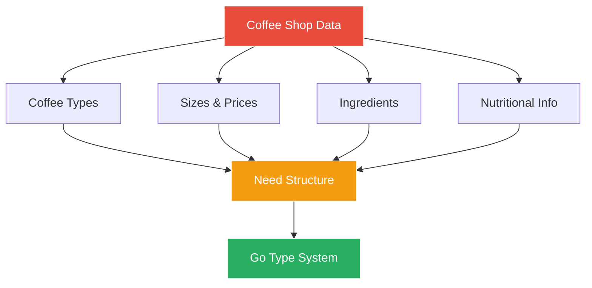
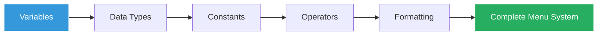

# Chapter 2: Understanding the Menu 📋

## Day 2: The Coffee Data Challenge

Marcus arrives early on his second day, finding Sarah already at her desk with a large coffee and a worried expression.

"Morning Marcus! Ready for a real challenge?" Sarah asks. "Our biggest problem right now is data management. We have coffee types, sizes, prices, ingredients, nutritional info... it's chaos!"

She shows Marcus a spreadsheet with hundreds of coffee variations, each with different properties.

"We need to model all of this in Go. Let's start with understanding how Go handles data."

## The Mission



"By the end of today," Sarah explains, "we'll have a proper data model for our entire menu system."

## Chapter Contents

1. **[Variables - Storing Coffee Data](01-variables/Variables_Storing_Coffee_Data.md)** - Learn to store inventory and order information
2. **[Data Types - The Right Container for Each Ingredient](02-data-types/Data_Types_Right_Container.md)** - Numbers, strings, booleans, and more
3. **[Constants - Fixed Menu Prices](03-constants/Constants_Fixed_Prices.md)** - Define unchanging values like sizes and tax rates
4. **[Operators - Coffee Shop Calculations](04-operators/Operators_Coffee_Calculations.md)** - Calculate totals, apply discounts, and more
5. **[Formatting - Beautiful Menu Displays](05-fmt-package/Formatting_Beautiful_Displays.md)** - Present data professionally with the fmt package

## Today's Learning Path



## The Problem We're Solving

Sarah pulls up the current system on her screen:

```python
# Old Python code - messy and error-prone
coffee_name = "Latte"
coffee_price = "4.50"  # String? Number?
size = "M"  # What does M mean?
temp = 165  # Fahrenheit? Celsius?
```

"See the problems?" Sarah asks. "No type safety, unclear units, easy to make mistakes. Go will fix all of this!"

## What You'll Build Today

By the end of this chapter, Marcus will create:

1. A type-safe menu system
2. Price calculations with proper decimal handling
3. Formatted menu displays
4. Constants for standard values

## Real-World Application

"Everything we learn today," Sarah emphasizes, "will be used in production code:
- **Variables** for storing orders
- **Types** for ensuring data integrity  
- **Constants** for business rules
- **Operators** for calculations
- **Formatting** for receipts and displays"

## Success Criteria

Sarah lists what Marcus needs to accomplish:

- [ ] Model coffee data with appropriate types
- [ ] Handle prices without floating-point errors
- [ ] Create reusable constants for sizes
- [ ] Format menu items for display
- [ ] Calculate order totals accurately

## Let's Begin!

"Ready to tame our data chaos?" Sarah asks with a smile. "Let's start with variables - the foundation of everything!"

Continue to [Variables - Storing Coffee Data](01-variables/Variables_Storing_Coffee_Data.md) →

---

*"In programming, as in coffee making, using the right ingredients in the right amounts makes all the difference."*