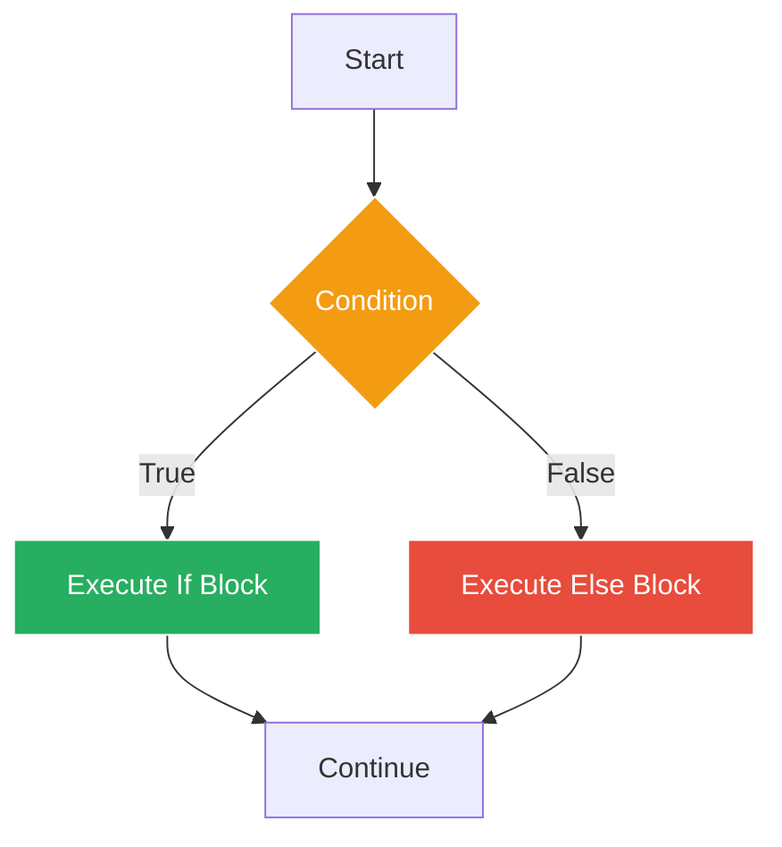
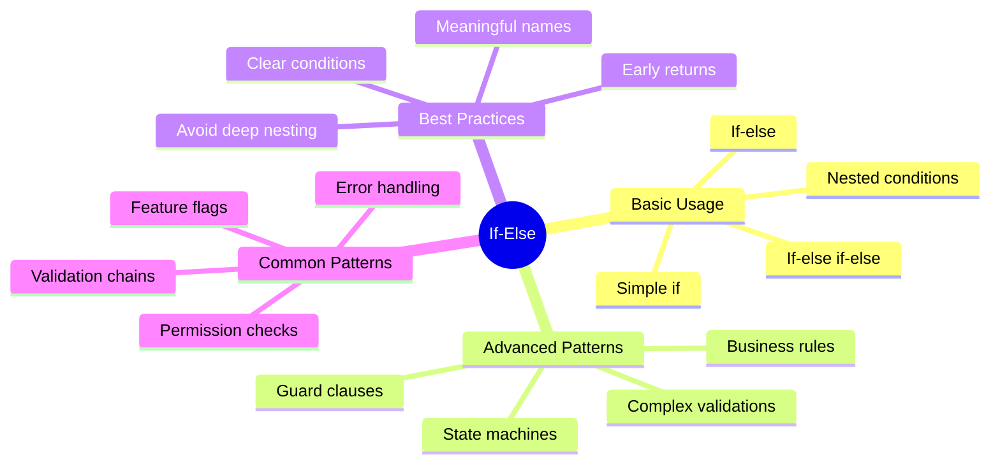

# If-Else Decisions - Making Smart Choices ☕️

## The Decision Dilemma

Sarah shows Marcus a flowchart covered in coffee stains. "This is how orders should work, but our current system processes everything blindly!"

She points to various decision points:
- Is the item available?
- Does the customer have enough money?
- Are they eligible for discounts?
- Is it happy hour?

"We need if-else statements to make these decisions programmatically!"

## Understanding If-Else



## Basic If Statements

Create `01_basic_if.go`:

```go
package main

import (
    "fmt"
    "time"
)

func main() {
    fmt.Println("=== GoCoffee Basic If Statements ===\n")
    
    // Simple if statement
    customerAge := 25
    if customerAge >= 18 {
        fmt.Println("✓ Customer can order coffee")
    }
    
    // If with else
    itemsInStock := 5
    orderQuantity := 3
    
    if itemsInStock >= orderQuantity {
        fmt.Printf("✓ Order confirmed: %d items\n", orderQuantity)
        itemsInStock -= orderQuantity
        fmt.Printf("  Remaining stock: %d\n", itemsInStock)
    } else {
        fmt.Printf("✗ Insufficient stock. Available: %d, Requested: %d\n", 
            itemsInStock, orderQuantity)
    }
    
    // If-else if-else chain
    currentHour := time.Now().Hour()
    
    fmt.Printf("\nCurrent time: %d:00\n", currentHour)
    
    if currentHour < 6 {
        fmt.Println("🌙 Sorry, we're closed (too early)")
    } else if currentHour < 12 {
        fmt.Println("☀️ Good morning! Breakfast menu available")
    } else if currentHour < 17 {
        fmt.Println("🌤️ Good afternoon! Full menu available")
    } else if currentHour < 22 {
        fmt.Println("🌆 Good evening! Dinner menu available")
    } else {
        fmt.Println("🌙 Sorry, we're closed (too late)")
    }
    
    // Multiple conditions
    isMember := true
    orderTotal := 25.50
    
    if isMember && orderTotal > 20 {
        discount := orderTotal * 0.10
        fmt.Printf("\n💳 Member discount applied: $%.2f\n", discount)
        fmt.Printf("Final total: $%.2f\n", orderTotal-discount)
    }
    
    // Nested if statements
    dayOfWeek := time.Now().Weekday()
    
    if dayOfWeek == time.Saturday || dayOfWeek == time.Sunday {
        fmt.Println("\n🎉 It's the weekend!")
        if currentHour >= 10 && currentHour <= 14 {
            fmt.Println("🍳 Brunch special available!")
        }
    } else {
        fmt.Println("\n💼 Weekday")
        if currentHour >= 7 && currentHour <= 9 {
            fmt.Println("☕ Morning rush hour - extra staff needed")
        }
    }
    
    // If with initialization
    if coffeeTemp := 165; coffeeTemp > 160 {
        fmt.Printf("\n🔥 Coffee temperature: %d°F (Perfect!)\n", coffeeTemp)
    } else {
        fmt.Printf("\n❄️ Coffee temperature: %d°F (Too cold!)\n", coffeeTemp)
    }
    // coffeeTemp is not accessible here - scoped to if statement
    
    // Practical example: Order validation
    fmt.Println("\n=== Order Validation Example ===")
    
    order := struct {
        item     string
        size     string
        quantity int
        payment  float64
    }{
        item:     "Latte",
        size:     "Large",
        quantity: 2,
        payment:  15.00,
    }
    
    // Calculate price
    basePrice := 4.50
    sizeMultiplier := 1.0
    
    if order.size == "Small" {
        sizeMultiplier = 0.8
    } else if order.size == "Medium" {
        sizeMultiplier = 1.0
    } else if order.size == "Large" {
        sizeMultiplier = 1.3
    }
    
    totalCost := basePrice * sizeMultiplier * float64(order.quantity)
    
    fmt.Printf("Order: %d %s %s(s)\n", order.quantity, order.size, order.item)
    fmt.Printf("Total cost: $%.2f\n", totalCost)
    fmt.Printf("Payment: $%.2f\n", order.payment)
    
    if order.payment >= totalCost {
        change := order.payment - totalCost
        fmt.Printf("✓ Payment accepted. Change: $%.2f\n", change)
    } else {
        shortfall := totalCost - order.payment
        fmt.Printf("✗ Insufficient payment. Need $%.2f more\n", shortfall)
    }
}
```

## Complex Decision Making

Create `02_complex_decisions.go`:

```go
package main

import (
    "fmt"
    "strings"
    "time"
)

type Customer struct {
    Name         string
    IsMember     bool
    MemberLevel  string // "Bronze", "Silver", "Gold"
    OrderHistory int    // Number of previous orders
    TotalSpent   float64
}

type OrderItem struct {
    Name     string
    Category string
    Price    float64
    Quantity int
    IsHot    bool
}

func main() {
    fmt.Println("=== GoCoffee Complex Decision Making ===\n")
    
    // Create a customer
    customer := Customer{
        Name:         "Marcus",
        IsMember:     true,
        MemberLevel:  "Silver",
        OrderHistory: 45,
        TotalSpent:   567.89,
    }
    
    // Create an order
    items := []OrderItem{
        {"Cappuccino", "Coffee", 4.50, 2, true},
        {"Croissant", "Food", 3.50, 1, false},
        {"Iced Latte", "Coffee", 5.00, 1, false},
    }
    
    // Process the order
    processOrder(customer, items)
    
    // Loyalty program evaluation
    evaluateLoyaltyStatus(customer)
    
    // Special offer eligibility
    checkSpecialOffers(customer, items)
}

func processOrder(customer Customer, items []OrderItem) {
    fmt.Printf("Processing order for: %s\n", customer.Name)
    fmt.Println(strings.Repeat("-", 40))
    
    subtotal := 0.0
    coffeeCount := 0
    
    // Calculate subtotal and count coffee items
    for _, item := range items {
        itemTotal := item.Price * float64(item.Quantity)
        subtotal += itemTotal
        
        fmt.Printf("%d × %s @ $%.2f = $%.2f\n", 
            item.Quantity, item.Name, item.Price, itemTotal)
        
        if item.Category == "Coffee" {
            coffeeCount += item.Quantity
        }
    }
    
    fmt.Printf("\nSubtotal: $%.2f\n", subtotal)
    
    // Apply discounts based on multiple conditions
    discount := 0.0
    discountReasons := []string{}
    
    // Member discount
    if customer.IsMember {
        memberDiscount := 0.0
        
        if customer.MemberLevel == "Bronze" {
            memberDiscount = 0.05
        } else if customer.MemberLevel == "Silver" {
            memberDiscount = 0.10
        } else if customer.MemberLevel == "Gold" {
            memberDiscount = 0.15
        }
        
        if memberDiscount > 0 {
            amount := subtotal * memberDiscount
            discount += amount
            discountReasons = append(discountReasons, 
                fmt.Sprintf("%s member %.0f%%: -$%.2f", 
                    customer.MemberLevel, memberDiscount*100, amount))
        }
    }
    
    // Volume discount
    if coffeeCount >= 5 {
        volumeDiscount := subtotal * 0.05
        discount += volumeDiscount
        discountReasons = append(discountReasons, 
            fmt.Sprintf("5+ coffees: -$%.2f", volumeDiscount))
    }
    
    // Time-based discount
    hour := time.Now().Hour()
    if hour >= 14 && hour <= 16 {
        happyHourDiscount := subtotal * 0.20
        discount += happyHourDiscount
        discountReasons = append(discountReasons, 
            fmt.Sprintf("Happy hour 20%%: -$%.2f", happyHourDiscount))
    }
    
    // Apply discounts
    if discount > 0 {
        fmt.Println("\nDiscounts applied:")
        for _, reason := range discountReasons {
            fmt.Printf("  • %s\n", reason)
        }
        fmt.Printf("Total discount: -$%.2f\n", discount)
    }
    
    // Calculate final total
    finalTotal := subtotal - discount
    tax := finalTotal * 0.085
    totalWithTax := finalTotal + tax
    
    fmt.Printf("\nAfter discount: $%.2f\n", finalTotal)
    fmt.Printf("Tax (8.5%%): $%.2f\n", tax)
    fmt.Printf("Total: $%.2f\n", totalWithTax)
    
    // Payment recommendation
    if totalWithTax > 50 {
        fmt.Println("\n💳 Recommend card payment for large amount")
    } else if totalWithTax < 10 {
        fmt.Println("\n💵 Cash payment OK for small amount")
    }
}

func evaluateLoyaltyStatus(customer Customer) {
    fmt.Println("\n=== Loyalty Status Evaluation ===")
    
    // Determine if eligible for upgrade
    shouldUpgrade := false
    nextLevel := customer.MemberLevel
    reason := ""
    
    if !customer.IsMember {
        if customer.OrderHistory >= 5 || customer.TotalSpent >= 50 {
            shouldUpgrade = true
            nextLevel = "Bronze"
            reason = "Eligible for membership"
        }
    } else if customer.MemberLevel == "Bronze" {
        if customer.OrderHistory >= 25 && customer.TotalSpent >= 250 {
            shouldUpgrade = true
            nextLevel = "Silver"
            reason = "Met Silver requirements"
        }
    } else if customer.MemberLevel == "Silver" {
        if customer.OrderHistory >= 50 && customer.TotalSpent >= 500 {
            shouldUpgrade = true
            nextLevel = "Gold"
            reason = "Met Gold requirements"
        }
    }
    
    // Display status
    fmt.Printf("Customer: %s\n", customer.Name)
    
    if customer.IsMember {
        fmt.Printf("Current level: %s\n", customer.MemberLevel)
    } else {
        fmt.Println("Current level: Non-member")
    }
    
    fmt.Printf("Orders: %d, Total spent: $%.2f\n", 
        customer.OrderHistory, customer.TotalSpent)
    
    if shouldUpgrade {
        fmt.Printf("🎉 %s! Upgrade to %s\n", reason, nextLevel)
    } else {
        // Show progress
        if customer.MemberLevel == "Bronze" {
            ordersNeeded := 25 - customer.OrderHistory
            spentNeeded := 250.0 - customer.TotalSpent
            
            if ordersNeeded > 0 || spentNeeded > 0 {
                fmt.Println("\nProgress to Silver:")
                if ordersNeeded > 0 {
                    fmt.Printf("  Need %d more orders\n", ordersNeeded)
                }
                if spentNeeded > 0 {
                    fmt.Printf("  Need $%.2f more in purchases\n", spentNeeded)
                }
            }
        }
    }
}

func checkSpecialOffers(customer Customer, items []OrderItem) {
    fmt.Println("\n=== Special Offers ===")
    
    hasHotDrink := false
    hasColdDrink := false
    hasFood := false
    
    // Check what categories are in the order
    for _, item := range items {
        if item.Category == "Coffee" {
            if item.IsHot {
                hasHotDrink = true
            } else {
                hasColdDrink = true
            }
        } else if item.Category == "Food" {
            hasFood = true
        }
    }
    
    offersAvailable := false
    
    // Combo offer
    if hasHotDrink && hasFood {
        fmt.Println("☕🥐 Breakfast Combo: Add any pastry for 50% off!")
        offersAvailable = true
    }
    
    // Temperature mix offer
    if hasHotDrink && hasColdDrink {
        fmt.Println("🔥❄️ Temperature Mix: Get 3rd drink free!")
        offersAvailable = true
    }
    
    // Member-only offers
    if customer.IsMember {
        dayOfWeek := time.Now().Weekday()
        
        if dayOfWeek == time.Monday {
            fmt.Println("🎉 Member Monday: Double points on all purchases!")
            offersAvailable = true
        }
        
        if customer.MemberLevel == "Gold" && dayOfWeek == time.Friday {
            fmt.Println("🏆 Gold Friday: Free size upgrade on any drink!")
            offersAvailable = true
        }
    }
    
    // Birthday offer (simulated)
    if customer.Name == "Marcus" { // Pretend it's their birthday
        fmt.Println("🎂 Birthday Special: Free dessert with any purchase!")
        offersAvailable = true
    }
    
    if !offersAvailable {
        fmt.Println("No special offers available today")
    }
}
```

## Order Flow Control

Create `03_order_flow.go`:

```go
package main

import (
    "fmt"
    "strings"
)

type Order struct {
    ID          int
    CustomerID  string
    Items       []string
    TotalAmount float64
    IsPaid      bool
    IsReady     bool
    IsPriority  bool
}

func main() {
    fmt.Println("=== GoCoffee Order Flow Control ===\n")
    
    // Sample orders
    orders := []Order{
        {1001, "C101", []string{"Latte", "Muffin"}, 8.50, true, false, false},
        {1002, "C102", []string{"Espresso"}, 3.00, false, false, true},
        {1003, "C103", []string{"Cappuccino", "Croissant"}, 7.50, true, true, false},
        {1004, "C104", []string{"Mocha", "Sandwich"}, 12.00, true, false, true},
        {1005, "C105", []string{"Americano"}, 3.50, false, false, false},
    }
    
    // Process each order
    for _, order := range orders {
        processOrderFlow(order)
        fmt.Println()
    }
    
    // Summary statistics
    printOrderStats(orders)
}

func processOrderFlow(order Order) {
    fmt.Printf("Processing Order #%d\n", order.ID)
    fmt.Println(strings.Repeat("-", 30))
    
    // Step 1: Check payment
    if !order.IsPaid {
        fmt.Println("⏸️ Status: Awaiting Payment")
        fmt.Printf("  Amount due: $%.2f\n", order.TotalAmount)
        
        // Priority orders get special handling
        if order.IsPriority {
            fmt.Println("  ⚡ Priority order - Sending payment reminder")
        }
        return // Can't proceed without payment
    }
    
    fmt.Println("✓ Payment confirmed")
    
    // Step 2: Check if ready
    if order.IsReady {
        fmt.Println("✅ Status: Ready for Pickup")
        fmt.Printf("  Items: %s\n", strings.Join(order.Items, ", "))
        
        // Send notification based on order value
        if order.TotalAmount > 10 {
            fmt.Println("  📱 SMS notification sent")
        } else {
            fmt.Println("  🔔 Order number called")
        }
        return
    }
    
    // Step 3: Process order
    fmt.Println("🔄 Status: In Preparation")
    
    // Check order complexity
    if len(order.Items) > 3 {
        fmt.Println("  ⚠️ Complex order - Assigned to senior barista")
    } else if order.IsPriority {
        fmt.Println("  ⚡ Priority queue - Expedited preparation")
    } else {
        fmt.Println("  📋 Added to standard queue")
    }
    
    // Estimate preparation time
    prepTime := estimatePrepTime(order)
    fmt.Printf("  ⏱️ Estimated time: %d minutes\n", prepTime)
    
    // Special handling for large orders
    if order.TotalAmount > 20 {
        fmt.Println("  🎁 Complimentary cookie added")
    }
}

func estimatePrepTime(order Order) int {
    baseTime := 3 // Base prep time in minutes
    
    // Add time for each item
    itemTime := len(order.Items) * 2
    
    // Rush hour adjustment
    rushHourPenalty := 0
    // Simulating rush hour (in real app, would check actual time)
    isRushHour := true
    if isRushHour {
        rushHourPenalty = 5
    }
    
    // Priority bonus
    priorityBonus := 0
    if order.IsPriority {
        priorityBonus = -2 // Negative means faster
    }
    
    totalTime := baseTime + itemTime + rushHourPenalty + priorityBonus
    
    // Ensure minimum time
    if totalTime < 1 {
        totalTime = 1
    }
    
    return totalTime
}

func printOrderStats(orders []Order) {
    fmt.Println("=== Order Statistics ===")
    
    totalOrders := len(orders)
    paidOrders := 0
    readyOrders := 0
    priorityOrders := 0
    totalRevenue := 0.0
    
    for _, order := range orders {
        if order.IsPaid {
            paidOrders++
            totalRevenue += order.TotalAmount
        }
        if order.IsReady {
            readyOrders++
        }
        if order.IsPriority {
            priorityOrders++
        }
    }
    
    pendingPayment := totalOrders - paidOrders
    inPreparation := paidOrders - readyOrders
    
    fmt.Printf("Total orders: %d\n", totalOrders)
    fmt.Printf("Paid orders: %d\n", paidOrders)
    fmt.Printf("Ready for pickup: %d\n", readyOrders)
    fmt.Printf("Priority orders: %d\n", priorityOrders)
    fmt.Printf("Pending payment: %d\n", pendingPayment)
    fmt.Printf("In preparation: %d\n", inPreparation)
    fmt.Printf("Total revenue: $%.2f\n", totalRevenue)
    
    if paidOrders > 0 {
        avgOrderValue := totalRevenue / float64(paidOrders)
        fmt.Printf("Average order value: $%.2f\n", avgOrderValue)
    }
    
    // Performance metrics
    fmt.Println("\nPerformance:")
    
    paymentRate := float64(paidOrders) / float64(totalOrders) * 100
    if paymentRate < 80 {
        fmt.Printf("⚠️ Low payment rate: %.1f%%\n", paymentRate)
    } else {
        fmt.Printf("✓ Good payment rate: %.1f%%\n", paymentRate)
    }
    
    if inPreparation > 5 {
        fmt.Println("⚠️ High number of orders in preparation - need more staff!")
    }
}
```

## Guard Clauses Pattern

Create `04_guard_clauses.go`:

```go
package main

import (
    "fmt"
    "strings"
    "time"
)

type MenuItem struct {
    Name      string
    Category  string
    Price     float64
    Available bool
    PrepTime  int // minutes
}

type OrderRequest struct {
    CustomerName string
    Items        []string
    Quantity     map[string]int
    IsDelivery   bool
    Distance     float64 // km
    PaymentType  string
}

var menu = map[string]MenuItem{
    "espresso":    {"Espresso", "coffee", 3.00, true, 2},
    "latte":       {"Latte", "coffee", 4.50, true, 3},
    "cappuccino":  {"Cappuccino", "coffee", 4.00, true, 3},
    "americano":   {"Americano", "coffee", 3.50, true, 2},
    "mocha":       {"Mocha", "coffee", 5.00, false, 4},
    "croissant":   {"Croissant", "food", 3.50, true, 1},
    "sandwich":    {"Sandwich", "food", 6.50, true, 5},
    "muffin":      {"Muffin", "food", 2.50, true, 1},
}

func main() {
    fmt.Println("=== GoCoffee Guard Clauses Pattern ===\n")
    
    // Test various order scenarios
    testOrders := []OrderRequest{
        {
            CustomerName: "Alice",
            Items:        []string{"latte", "croissant"},
            Quantity:     map[string]int{"latte": 1, "croissant": 1},
            IsDelivery:   false,
            PaymentType:  "card",
        },
        {
            CustomerName: "Bob",
            Items:        []string{"mocha", "sandwich"},
            Quantity:     map[string]int{"mocha": 2, "sandwich": 1},
            IsDelivery:   true,
            Distance:     3.5,
            PaymentType:  "cash",
        },
        {
            CustomerName: "",
            Items:        []string{"espresso"},
            Quantity:     map[string]int{"espresso": 1},
            IsDelivery:   false,
            PaymentType:  "card",
        },
        {
            CustomerName: "Charlie",
            Items:        []string{"latte", "unknown_item"},
            Quantity:     map[string]int{"latte": 1, "unknown_item": 1},
            IsDelivery:   true,
            Distance:     15.0,
            PaymentType:  "bitcoin",
        },
    }
    
    for i, order := range testOrders {
        fmt.Printf("=== Order %d ===\n", i+1)
        result, err := validateOrder(order)
        
        if err != nil {
            fmt.Printf("❌ Order rejected: %s\n\n", err)
            continue
        }
        
        fmt.Printf("✅ Order accepted!\n")
        fmt.Printf("Total: $%.2f\n", result.total)
        fmt.Printf("Prep time: %d minutes\n\n", result.prepTime)
    }
}

type OrderResult struct {
    total    float64
    prepTime int
}

// validateOrder uses guard clauses for early returns
func validateOrder(order OrderRequest) (OrderResult, error) {
    // Guard: Check customer name
    if strings.TrimSpace(order.CustomerName) == "" {
        return OrderResult{}, fmt.Errorf("customer name is required")
    }
    
    // Guard: Check if we're open
    hour := time.Now().Hour()
    if hour < 6 || hour >= 22 {
        return OrderResult{}, fmt.Errorf("sorry, we're closed (hours: 6 AM - 10 PM)")
    }
    
    // Guard: Check items exist
    if len(order.Items) == 0 {
        return OrderResult{}, fmt.Errorf("no items in order")
    }
    
    // Guard: Validate payment type
    validPayments := map[string]bool{
        "cash": true,
        "card": true,
        "app":  true,
    }
    
    if !validPayments[order.PaymentType] {
        return OrderResult{}, fmt.Errorf("invalid payment type: %s", order.PaymentType)
    }
    
    // Guard: Check delivery constraints
    if order.IsDelivery {
        if order.Distance > 10 {
            return OrderResult{}, fmt.Errorf("delivery distance too far: %.1f km (max: 10 km)", 
                order.Distance)
        }
        
        if order.PaymentType == "cash" {
            return OrderResult{}, fmt.Errorf("cash payment not accepted for delivery")
        }
    }
    
    // Process order items
    total := 0.0
    maxPrepTime := 0
    
    for _, itemName := range order.Items {
        item, exists := menu[strings.ToLower(itemName)]
        
        // Guard: Check if item exists
        if !exists {
            return OrderResult{}, fmt.Errorf("item not found: %s", itemName)
        }
        
        // Guard: Check if item is available
        if !item.Available {
            return OrderResult{}, fmt.Errorf("item not available: %s", item.Name)
        }
        
        // Get quantity
        qty := order.Quantity[itemName]
        if qty <= 0 {
            qty = 1
        }
        
        // Guard: Check quantity limits
        if qty > 10 {
            return OrderResult{}, fmt.Errorf("quantity too high for %s: %d (max: 10)", 
                item.Name, qty)
        }
        
        // Calculate totals
        total += item.Price * float64(qty)
        
        if item.PrepTime > maxPrepTime {
            maxPrepTime = item.PrepTime
        }
    }
    
    // Guard: Minimum order for delivery
    if order.IsDelivery && total < 15.00 {
        return OrderResult{}, fmt.Errorf("minimum order for delivery is $15.00 (current: $%.2f)", 
            total)
    }
    
    // Add delivery fee
    if order.IsDelivery {
        deliveryFee := 3.00
        if order.Distance > 5 {
            deliveryFee = 5.00
        }
        total += deliveryFee
    }
    
    // All validations passed!
    return OrderResult{
        total:    total,
        prepTime: maxPrepTime,
    }, nil
}
```

## State Machine Example

Create `05_state_machine.go`:

```go
package main

import (
    "fmt"
    "time"
)

// OrderState represents the current state of an order
type OrderState string

const (
    StateNew        OrderState = "NEW"
    StatePaid       OrderState = "PAID"
    StatePreparing  OrderState = "PREPARING"
    StateReady      OrderState = "READY"
    StateDelivered  OrderState = "DELIVERED"
    StateCancelled  OrderState = "CANCELLED"
)

type CoffeeOrder struct {
    ID         int
    State      OrderState
    Items      []string
    Total      float64
    CreatedAt  time.Time
    PaidAt     *time.Time
    ReadyAt    *time.Time
    DeliveredAt *time.Time
}

func main() {
    fmt.Println("=== GoCoffee Order State Machine ===\n")
    
    // Create a new order
    order := &CoffeeOrder{
        ID:        2001,
        State:     StateNew,
        Items:     []string{"Latte", "Croissant"},
        Total:     8.00,
        CreatedAt: time.Now(),
    }
    
    // Simulate order lifecycle
    fmt.Printf("Order #%d created\n", order.ID)
    displayOrderState(order)
    
    // Process payment
    fmt.Println("\n💳 Processing payment...")
    if err := processPayment(order); err != nil {
        fmt.Printf("Error: %s\n", err)
        return
    }
    displayOrderState(order)
    
    // Start preparation
    fmt.Println("\n👨‍🍳 Starting preparation...")
    if err := startPreparation(order); err != nil {
        fmt.Printf("Error: %s\n", err)
        return
    }
    displayOrderState(order)
    
    // Mark as ready
    fmt.Println("\n✅ Order ready...")
    if err := markAsReady(order); err != nil {
        fmt.Printf("Error: %s\n", err)
        return
    }
    displayOrderState(order)
    
    // Deliver order
    fmt.Println("\n📦 Delivering order...")
    if err := deliverOrder(order); err != nil {
        fmt.Printf("Error: %s\n", err)
        return
    }
    displayOrderState(order)
    
    // Try invalid transition
    fmt.Println("\n❌ Attempting invalid transition...")
    if err := processPayment(order); err != nil {
        fmt.Printf("Error: %s\n", err)
    }
}

func processPayment(order *CoffeeOrder) error {
    // Only NEW orders can be paid
    if order.State != StateNew {
        return fmt.Errorf("cannot process payment: order is %s", order.State)
    }
    
    now := time.Now()
    order.PaidAt = &now
    order.State = StatePaid
    
    return nil
}

func startPreparation(order *CoffeeOrder) error {
    // Only PAID orders can start preparation
    if order.State != StatePaid {
        return fmt.Errorf("cannot start preparation: order is %s", order.State)
    }
    
    order.State = StatePreparing
    
    return nil
}

func markAsReady(order *CoffeeOrder) error {
    // Only PREPARING orders can be marked ready
    if order.State != StatePreparing {
        return fmt.Errorf("cannot mark as ready: order is %s", order.State)
    }
    
    now := time.Now()
    order.ReadyAt = &now
    order.State = StateReady
    
    return nil
}

func deliverOrder(order *CoffeeOrder) error {
    // Only READY orders can be delivered
    if order.State != StateReady {
        return fmt.Errorf("cannot deliver: order is %s", order.State)
    }
    
    now := time.Now()
    order.DeliveredAt = &now
    order.State = StateDelivered
    
    return nil
}

func cancelOrder(order *CoffeeOrder) error {
    // Can cancel if not already delivered or cancelled
    if order.State == StateDelivered {
        return fmt.Errorf("cannot cancel delivered order")
    }
    
    if order.State == StateCancelled {
        return fmt.Errorf("order already cancelled")
    }
    
    order.State = StateCancelled
    
    return nil
}

func displayOrderState(order *CoffeeOrder) {
    fmt.Printf("\nOrder #%d Status:\n", order.ID)
    fmt.Printf("State: %s\n", order.State)
    fmt.Printf("Items: %v\n", order.Items)
    fmt.Printf("Total: $%.2f\n", order.Total)
    
    // Show timeline
    fmt.Println("\nTimeline:")
    fmt.Printf("Created:   %s\n", order.CreatedAt.Format("3:04:05 PM"))
    
    if order.PaidAt != nil {
        fmt.Printf("Paid:      %s\n", order.PaidAt.Format("3:04:05 PM"))
    }
    
    if order.ReadyAt != nil {
        fmt.Printf("Ready:     %s\n", order.ReadyAt.Format("3:04:05 PM"))
    }
    
    if order.DeliveredAt != nil {
        fmt.Printf("Delivered: %s\n", order.DeliveredAt.Format("3:04:05 PM"))
    }
    
    // Show allowed transitions
    fmt.Print("\nNext actions: ")
    switch order.State {
    case StateNew:
        fmt.Println("Pay, Cancel")
    case StatePaid:
        fmt.Println("Start Preparation, Cancel")
    case StatePreparing:
        fmt.Println("Mark Ready, Cancel")
    case StateReady:
        fmt.Println("Deliver")
    case StateDelivered:
        fmt.Println("None (Order Complete)")
    case StateCancelled:
        fmt.Println("None (Order Cancelled)")
    }
}
```

## Business Rules Engine

Create `06_business_rules.go`:

```go
package main

import (
    "fmt"
    "time"
)

type Customer struct {
    ID           string
    Name         string
    Type         string // "regular", "member", "employee", "vip"
    JoinDate     time.Time
    TotalSpent   float64
    OrderCount   int
    LastOrderDate time.Time
}

type Promotion struct {
    Code        string
    Description string
    Discount    float64
    MinOrder    float64
    ValidUntil  time.Time
    UsageLimit  int
    UsageCount  int
}

func main() {
    fmt.Println("=== GoCoffee Business Rules Engine ===\n")
    
    // Sample customers
    customers := []Customer{
        {
            ID:           "C001",
            Name:         "Alice Johnson",
            Type:         "member",
            JoinDate:     time.Now().AddDate(0, -6, 0),
            TotalSpent:   450.00,
            OrderCount:   35,
            LastOrderDate: time.Now().AddDate(0, 0, -2),
        },
        {
            ID:           "C002",
            Name:         "Bob Smith",
            Type:         "regular",
            TotalSpent:   85.00,
            OrderCount:   8,
            LastOrderDate: time.Now().AddDate(0, 0, -30),
        },
        {
            ID:           "C003",
            Name:         "Carol Davis",
            Type:         "employee",
            JoinDate:     time.Now().AddDate(-1, 0, 0),
            TotalSpent:   1200.00,
            OrderCount:   150,
            LastOrderDate: time.Now(),
        },
        {
            ID:           "C004",
            Name:         "David Wilson",
            Type:         "vip",
            JoinDate:     time.Now().AddDate(-2, 0, 0),
            TotalSpent:   3500.00,
            OrderCount:   200,
            LastOrderDate: time.Now().AddDate(0, 0, -1),
        },
    }
    
    // Sample promotions
    promotions := []Promotion{
        {
            Code:        "WELCOME10",
            Description: "10% off for new customers",
            Discount:    0.10,
            MinOrder:    10.00,
            ValidUntil:  time.Now().AddDate(0, 1, 0),
            UsageLimit:  1,
        },
        {
            Code:        "LOYALTY20",
            Description: "20% off for loyal customers",
            Discount:    0.20,
            MinOrder:    20.00,
            ValidUntil:  time.Now().AddDate(0, 0, 7),
            UsageLimit:  5,
        },
    }
    
    // Test orders for each customer
    orderAmount := 25.00
    
    for _, customer := range customers {
        fmt.Printf("=== Processing order for %s ===\n", customer.Name)
        processBusinessRules(customer, orderAmount, promotions)
        fmt.Println()
    }
}

func processBusinessRules(customer Customer, orderAmount float64, promotions []Promotion) {
    fmt.Printf("Customer Type: %s\n", customer.Type)
    fmt.Printf("Order Amount: $%.2f\n", orderAmount)
    
    totalDiscount := 0.0
    appliedDiscounts := []string{}
    
    // Rule 1: Base discount by customer type
    baseDiscount := 0.0
    
    if customer.Type == "member" {
        baseDiscount = 0.05 // 5%
        appliedDiscounts = append(appliedDiscounts, "Member discount: 5%")
    } else if customer.Type == "employee" {
        baseDiscount = 0.25 // 25%
        appliedDiscounts = append(appliedDiscounts, "Employee discount: 25%")
    } else if customer.Type == "vip" {
        baseDiscount = 0.15 // 15%
        appliedDiscounts = append(appliedDiscounts, "VIP discount: 15%")
    }
    
    totalDiscount += baseDiscount
    
    // Rule 2: Loyalty bonus
    if customer.OrderCount >= 50 {
        loyaltyBonus := 0.05
        totalDiscount += loyaltyBonus
        appliedDiscounts = append(appliedDiscounts, "Loyalty bonus (50+ orders): 5%")
    } else if customer.OrderCount >= 25 {
        loyaltyBonus := 0.03
        totalDiscount += loyaltyBonus
        appliedDiscounts = append(appliedDiscounts, "Loyalty bonus (25+ orders): 3%")
    }
    
    // Rule 3: Reactivation discount
    daysSinceLastOrder := int(time.Since(customer.LastOrderDate).Hours() / 24)
    if daysSinceLastOrder > 30 {
        reactivationDiscount := 0.10
        totalDiscount += reactivationDiscount
        appliedDiscounts = append(appliedDiscounts, 
            fmt.Sprintf("Welcome back! (%d days): 10%%", daysSinceLastOrder))
    }
    
    // Rule 4: Birthday discount (simulated)
    today := time.Now()
    if today.Month() == time.January && customer.Name == "Alice Johnson" {
        birthdayDiscount := 0.20
        totalDiscount += birthdayDiscount
        appliedDiscounts = append(appliedDiscounts, "Birthday special: 20%")
    }
    
    // Rule 5: Time-based discounts
    hour := time.Now().Hour()
    if hour >= 14 && hour <= 16 {
        happyHourDiscount := 0.15
        totalDiscount += happyHourDiscount
        appliedDiscounts = append(appliedDiscounts, "Happy hour (2-4 PM): 15%")
    } else if hour >= 6 && hour <= 8 {
        earlyBirdDiscount := 0.10
        totalDiscount += earlyBirdDiscount
        appliedDiscounts = append(appliedDiscounts, "Early bird (6-8 AM): 10%")
    }
    
    // Rule 6: Check eligible promotions
    for _, promo := range promotions {
        if isEligibleForPromotion(customer, orderAmount, promo) {
            // Don't stack with other discounts if total > 50%
            if totalDiscount + promo.Discount <= 0.50 {
                totalDiscount += promo.Discount
                appliedDiscounts = append(appliedDiscounts, 
                    fmt.Sprintf("Promo %s: %.0f%%", promo.Code, promo.Discount*100))
            }
        }
    }
    
    // Rule 7: Maximum discount cap
    maxDiscount := 0.50 // 50% max
    if totalDiscount > maxDiscount {
        totalDiscount = maxDiscount
        appliedDiscounts = append(appliedDiscounts, 
            fmt.Sprintf("(Capped at %.0f%%)", maxDiscount*100))
    }
    
    // Calculate final amount
    discountAmount := orderAmount * totalDiscount
    finalAmount := orderAmount - discountAmount
    
    // Display results
    if len(appliedDiscounts) > 0 {
        fmt.Println("\nDiscounts applied:")
        for _, discount := range appliedDiscounts {
            fmt.Printf("  • %s\n", discount)
        }
        fmt.Printf("\nTotal discount: %.0f%% ($%.2f)\n", 
            totalDiscount*100, discountAmount)
    } else {
        fmt.Println("\nNo discounts applicable")
    }
    
    fmt.Printf("Final amount: $%.2f\n", finalAmount)
    
    // Additional perks based on customer type
    fmt.Println("\nAdditional perks:")
    
    if customer.Type == "vip" {
        fmt.Println("  • Free size upgrade")
        fmt.Println("  • Priority queue")
        fmt.Println("  • Free WiFi premium")
    } else if customer.Type == "employee" {
        fmt.Println("  • Free refills")
        fmt.Println("  • Break room access")
    } else if customer.Type == "member" && customer.OrderCount >= 10 {
        fmt.Println("  • Every 10th drink free")
        fmt.Println("  • Early access to new items")
    }
    
    // Suggestions based on history
    if customer.TotalSpent > 1000 {
        fmt.Println("\n💎 Eligible for VIP upgrade!")
    } else if customer.Type == "regular" && customer.OrderCount >= 5 {
        fmt.Println("\n💳 Consider joining our membership program!")
    }
}

func isEligibleForPromotion(customer Customer, orderAmount float64, promo Promotion) bool {
    // Check if promotion is still valid
    if time.Now().After(promo.ValidUntil) {
        return false
    }
    
    // Check minimum order amount
    if orderAmount < promo.MinOrder {
        return false
    }
    
    // Check usage limit
    if promo.UsageCount >= promo.UsageLimit {
        return false
    }
    
    // Special eligibility rules
    switch promo.Code {
    case "WELCOME10":
        // Only for customers with less than 3 orders
        if customer.OrderCount >= 3 {
            return false
        }
    case "LOYALTY20":
        // Only for customers with 25+ orders
        if customer.OrderCount < 25 {
            return false
        }
    }
    
    return true
}
```

## Menu Navigation System

Create `07_menu_navigation.go`:

```go
package main

import (
    "bufio"
    "fmt"
    "os"
    "strconv"
    "strings"
)

type MenuOption struct {
    ID          int
    Title       string
    Description string
    Action      func()
    SubMenu     []MenuOption
}

var currentUser = "Marcus"
var isManager = true

func main() {
    fmt.Println("=== GoCoffee Management System ===\n")
    
    mainMenu := []MenuOption{
        {
            ID:          1,
            Title:       "Order Management",
            Description: "Manage customer orders",
            SubMenu: []MenuOption{
                {1, "New Order", "Create a new order", createNewOrder, nil},
                {2, "View Orders", "View pending orders", viewOrders, nil},
                {3, "Update Order Status", "Change order status", updateOrderStatus, nil},
                {4, "Cancel Order", "Cancel an order", cancelOrder, nil},
            },
        },
        {
            ID:          2,
            Title:       "Inventory",
            Description: "Manage inventory",
            SubMenu: []MenuOption{
                {1, "View Stock", "Check current stock levels", viewStock, nil},
                {2, "Add Stock", "Add items to inventory", addStock, nil},
                {3, "Low Stock Alert", "View items running low", lowStockAlert, nil},
            },
        },
        {
            ID:          3,
            Title:       "Reports",
            Description: "View reports and analytics",
            SubMenu: []MenuOption{
                {1, "Daily Sales", "Today's sales report", dailySalesReport, nil},
                {2, "Popular Items", "Best selling items", popularItemsReport, nil},
                {3, "Staff Performance", "Employee metrics", staffPerformance, nil},
            },
        },
        {
            ID:          4,
            Title:       "Settings",
            Description: "System settings",
            Action:      showSettings,
        },
    }
    
    // Add manager-only options
    if isManager {
        mainMenu = append(mainMenu, MenuOption{
            ID:          5,
            Title:       "Manager Tools",
            Description: "Manager-only functions",
            SubMenu: []MenuOption{
                {1, "Employee Management", "Manage staff", manageEmployees, nil},
                {2, "Price Adjustment", "Update menu prices", adjustPrices, nil},
                {3, "Promotional Offers", "Manage promotions", managePromotions, nil},
            },
        })
    }
    
    navigateMenu(mainMenu, "Main Menu")
}

func navigateMenu(menu []MenuOption, title string) {
    reader := bufio.NewReader(os.Stdin)
    
    for {
        // Clear screen (simulated)
        fmt.Println("\n" + strings.Repeat("=", 50))
        fmt.Printf("%s (User: %s)\n", title, currentUser)
        fmt.Println(strings.Repeat("=", 50))
        
        // Display menu options
        for _, option := range menu {
            fmt.Printf("%d. %s", option.ID, option.Title)
            if option.Description != "" {
                fmt.Printf(" - %s", option.Description)
            }
            fmt.Println()
        }
        fmt.Println("0. Back/Exit")
        
        // Get user choice
        fmt.Print("\nEnter your choice: ")
        input, _ := reader.ReadString('\n')
        choice, err := strconv.Atoi(strings.TrimSpace(input))
        
        if err != nil {
            fmt.Println("❌ Invalid input. Please enter a number.")
            fmt.Print("Press Enter to continue...")
            reader.ReadString('\n')
            continue
        }
        
        // Handle choice
        if choice == 0 {
            return
        }
        
        // Find selected option
        var selected *MenuOption
        for i := range menu {
            if menu[i].ID == choice {
                selected = &menu[i]
                break
            }
        }
        
        if selected == nil {
            fmt.Println("❌ Invalid option. Please try again.")
            fmt.Print("Press Enter to continue...")
            reader.ReadString('\n')
            continue
        }
        
        // Execute action or show submenu
        if selected.SubMenu != nil {
            navigateMenu(selected.SubMenu, selected.Title)
        } else if selected.Action != nil {
            fmt.Println("\n" + strings.Repeat("-", 50))
            selected.Action()
            fmt.Print("\nPress Enter to continue...")
            reader.ReadString('\n')
        }
    }
}

// Sample action functions
func createNewOrder() {
    fmt.Println("📝 Creating new order...")
    fmt.Println("Order creation would happen here")
}

func viewOrders() {
    fmt.Println("📋 Pending Orders:")
    fmt.Println("1. Order #1001 - 2 Lattes - Preparing")
    fmt.Println("2. Order #1002 - 1 Cappuccino - Ready")
    fmt.Println("3. Order #1003 - 3 Americanos - New")
}

func updateOrderStatus() {
    fmt.Println("🔄 Update order status functionality")
}

func cancelOrder() {
    fmt.Println("❌ Cancel order functionality")
}

func viewStock() {
    fmt.Println("📦 Current Stock Levels:")
    fmt.Println("Coffee Beans: 45 kg")
    fmt.Println("Milk: 120 liters")
    fmt.Println("Cups: 850 units")
}

func addStock() {
    fmt.Println("➕ Add stock functionality")
}

func lowStockAlert() {
    fmt.Println("⚠️  Low Stock Items:")
    fmt.Println("- Oat Milk: 5 liters (reorder soon)")
    fmt.Println("- Medium Cups: 50 units (critical)")
}

func dailySalesReport() {
    fmt.Println("💰 Daily Sales Report")
    fmt.Println("Total Revenue: $1,234.56")
    fmt.Println("Orders: 87")
    fmt.Println("Average Order: $14.19")
}

func popularItemsReport() {
    fmt.Println("⭐ Popular Items Today:")
    fmt.Println("1. Latte - 45 sold")
    fmt.Println("2. Cappuccino - 32 sold")
    fmt.Println("3. Croissant - 28 sold")
}

func staffPerformance() {
    fmt.Println("👥 Staff Performance")
    fmt.Println("Best Barista: Sarah (45 orders)")
}

func showSettings() {
    fmt.Println("⚙️  System Settings")
    fmt.Printf("Current User: %s\n", currentUser)
    fmt.Printf("Manager Access: %v\n", isManager)
    fmt.Println("Store: Downtown Location")
}

func manageEmployees() {
    fmt.Println("👤 Employee Management")
    fmt.Println("Total Employees: 12")
    fmt.Println("On Duty: 4")
}

func adjustPrices() {
    fmt.Println("💲 Price Adjustment Tool")
    fmt.Println("Current pricing loaded...")
}

func managePromotions() {
    fmt.Println("🎁 Promotional Offers")
    fmt.Println("Active Promotions: 3")
}
```

## Conditional Compilation

Create `08_build_tags.go`:

```go
// +build !production

package main

import (
    "fmt"
    "math/rand"
    "time"
)

// This file contains debug features that should not be in production

func main() {
    fmt.Println("=== GoCoffee Debug Mode ===")
    fmt.Println("⚠️  Running in DEBUG mode - Not for production use!\n")
    
    // Debug features
    runDiagnostics()
    simulateOrders()
    testPaymentSystem()
}

func runDiagnostics() {
    fmt.Println("🔍 Running System Diagnostics...")
    
    checks := []struct {
        name   string
        status bool
        detail string
    }{
        {"Database Connection", true, "Connected to test DB"},
        {"Payment Gateway", true, "Using sandbox mode"},
        {"Inventory System", false, "Mock data enabled"},
        {"Email Service", true, "Redirecting to test inbox"},
        {"SMS Service", false, "Disabled in debug mode"},
    }
    
    for _, check := range checks {
        if check.status {
            fmt.Printf("✅ %s: %s\n", check.name, check.detail)
        } else {
            fmt.Printf("❌ %s: %s\n", check.name, check.detail)
        }
    }
}

func simulateOrders() {
    fmt.Println("\n🎮 Simulating Customer Orders...")
    
    rand.Seed(time.Now().UnixNano())
    
    items := []string{"Latte", "Cappuccino", "Espresso", "Americano"}
    
    for i := 1; i <= 5; i++ {
        item := items[rand.Intn(len(items))]
        quantity := rand.Intn(3) + 1
        price := float64(rand.Intn(300)+200) / 100.0
        
        fmt.Printf("Order #TEST%03d: %d x %s @ $%.2f\n", 
            i, quantity, item, price)
    }
}

func testPaymentSystem() {
    fmt.Println("\n💳 Testing Payment System...")
    
    testCards := []struct {
        number string
        result string
    }{
        {"4111-1111-1111-1111", "Success"},
        {"4000-0000-0000-0002", "Declined"},
        {"4000-0000-0000-9995", "Insufficient Funds"},
    }
    
    for _, card := range testCards {
        fmt.Printf("Testing card %s: %s\n", card.number, card.result)
    }
    
    fmt.Println("\n📝 Debug Notes:")
    fmt.Println("- All transactions are simulated")
    fmt.Println("- No real charges will occur")
    fmt.Println("- Test data will be cleared daily")
}

// Production build would have a different file:
// +build production
// with actual implementation without debug features
```

## Complex If-Else Challenge

Create `09_if_else_challenge.go`:

```go
package main

import (
    "fmt"
    "time"
)

// Challenge: Build a comprehensive order validation system
// Requirements:
// 1. Validate customer eligibility
// 2. Check item availability
// 3. Apply dynamic pricing
// 4. Handle special requests
// 5. Process loyalty rewards

type Customer struct {
    ID            string
    Name          string
    Age           int
    IsMember      bool
    MemberTier    string // "bronze", "silver", "gold"
    LoyaltyPoints int
    IsBanned      bool
    LastVisit     time.Time
}

type OrderItem struct {
    Name         string
    Category     string
    BasePrice    float64
    CustomOptions []string
}

func main() {
    fmt.Println("=== GoCoffee If-Else Challenge ===\n")
    fmt.Println("TODO: Implement a comprehensive validation system")
    fmt.Println("\nRequirements:")
    fmt.Println("1. Check customer age for certain items")
    fmt.Println("2. Validate opening hours and day-specific menus")
    fmt.Println("3. Apply tier-based discounts")
    fmt.Println("4. Handle combo deals")
    fmt.Println("5. Process loyalty point redemption")
    
    // Test data
    customer := Customer{
        ID:            "C123",
        Name:          "Test Customer",
        Age:           25,
        IsMember:      true,
        MemberTier:    "silver",
        LoyaltyPoints: 150,
        IsBanned:      false,
        LastVisit:     time.Now().AddDate(0, 0, -5),
    }
    
    items := []OrderItem{
        {
            Name:      "Espresso Martini",
            Category:  "special",
            BasePrice: 8.50,
        },
        {
            Name:      "Breakfast Combo",
            Category:  "combo",
            BasePrice: 12.00,
        },
    }
    
    // Your implementation here...
    fmt.Printf("\nCustomer: %+v\n", customer)
    fmt.Printf("Items: %+v\n", items)
    
    fmt.Println("\nImplement the validation logic above!")
}

// Hints:
// - Check age for alcohol-based coffee drinks
// - Breakfast combos only available before 11 AM
// - Gold members get 20% off, Silver 10%, Bronze 5%
// - Banned customers cannot order
// - Loyalty points: 100 points = $10 off
// - Weekend surcharge: 5% on Saturdays and Sundays
// - Happy hour: 3-5 PM weekdays, 15% off
```

## Summary and Best Practices

Marcus reviews what he learned about if-else statements:



## Sarah's If-Else Tips

"Excellent work with decisions!" Sarah says. "Remember:
- Use guard clauses to handle edge cases early
- Keep conditions simple and readable
- Avoid deeply nested if statements
- Consider switch for multiple conditions
- Test all branches of your logic"

## What's Next?

"Now that you can make decisions," Sarah continues, "let's learn about switch statements - a cleaner way to handle multiple conditions!"

Continue to [Switch Statements](../02-switch/Switch_Statements.md) →

---

*"Good code makes decisions like a skilled barista - quickly, correctly, and with style!"*