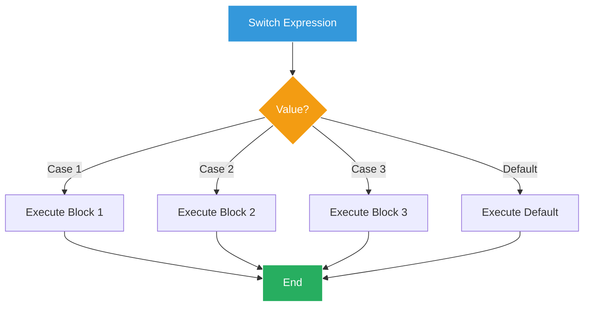
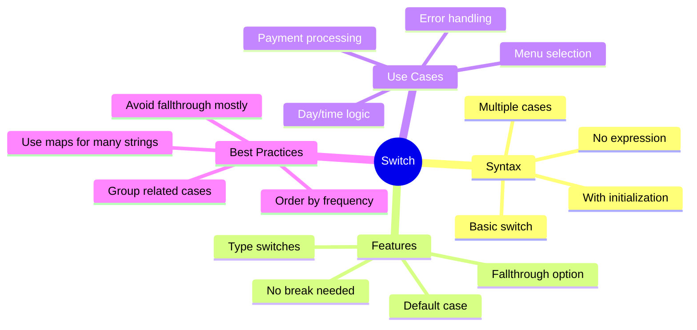

# Switch Statements - Elegant Multiple Choice ☕

## The Menu Madness

Marcus finds Sarah looking at a massive if-else chain on the screen, her coffee getting cold.

"Look at this mess!" she exclaims. "We have 20 different coffee types, each with special preparation instructions. This if-else chain is impossible to maintain!"

```go
if coffee == "Espresso" {
    // prepare espresso
} else if coffee == "Latte" {
    // prepare latte
} else if coffee == "Cappuccino" {
    // prepare cappuccino
} else if coffee == "Americano" {
    // prepare americano
} else if coffee == "Mocha" {
    // prepare mocha
} else if coffee == "Macchiato" {
    // prepare macchiato
// ... 14 more conditions!
```

"There has to be a better way!" Sarah says. "Enter the switch statement!"

## Understanding Switch



## Basic Switch Statements

Create `01_basic_switch.go`:

```go
package main

import (
    "fmt"
    "time"
)

func main() {
    fmt.Println("=== GoCoffee Basic Switch Statements ===\n")
    
    // Simple switch
    coffeeType := "Latte"
    
    switch coffeeType {
    case "Espresso":
        fmt.Println("☕ Preparing Espresso:")
        fmt.Println("  - Grind 18g coffee beans")
        fmt.Println("  - Extract for 25-30 seconds")
        fmt.Println("  - Serve in demitasse cup")
        
    case "Latte":
        fmt.Println("☕ Preparing Latte:")
        fmt.Println("  - Make double espresso")
        fmt.Println("  - Steam 8oz milk to 140-150°F")
        fmt.Println("  - Pour milk with latte art")
        
    case "Cappuccino":
        fmt.Println("☕ Preparing Cappuccino:")
        fmt.Println("  - Make single espresso")
        fmt.Println("  - Steam 4oz milk with more foam")
        fmt.Println("  - Top with cocoa powder")
        
    case "Americano":
        fmt.Println("☕ Preparing Americano:")
        fmt.Println("  - Make double espresso")
        fmt.Println("  - Add 6oz hot water")
        fmt.Println("  - Serve black or with milk")
        
    default:
        fmt.Printf("❌ Unknown coffee type: %s\n", coffeeType)
    }
    
    // Switch with multiple cases
    fmt.Println("\n=== Size Pricing ===")
    
    size := "Medium"
    
    switch size {
    case "Small", "Tall":
        fmt.Println("Base price: $3.00")
        
    case "Medium", "Grande":
        fmt.Println("Base price: $4.00")
        
    case "Large", "Venti":
        fmt.Println("Base price: $5.00")
        
    default:
        fmt.Println("Unknown size")
    }
    
    // Switch without expression (like if-else chain)
    fmt.Println("\n=== Time-based Greeting ===")
    
    hour := time.Now().Hour()
    
    switch {
    case hour < 6:
        fmt.Println("🌙 We're closed (too early)")
        
    case hour < 12:
        fmt.Println("☀️ Good morning! Fresh coffee brewing")
        
    case hour < 17:
        fmt.Println("🌤️ Good afternoon! Need an energy boost?")
        
    case hour < 22:
        fmt.Println("🌆 Good evening! Decaf available")
        
    default:
        fmt.Println("🌙 We're closed (too late)")
    }
    
    // Switch with initialization
    fmt.Println("\n=== Day Special ===")
    
    switch day := time.Now().Weekday(); day {
    case time.Monday:
        fmt.Println("💙 Monday Blues: 20% off all drinks")
        
    case time.Tuesday, time.Thursday:
        fmt.Println("🍰 Pastry Days: Buy coffee, get 50% off pastry")
        
    case time.Wednesday:
        fmt.Println("🥤 Hump Day: All iced drinks $3")
        
    case time.Friday:
        fmt.Println("🎉 TGIF: Happy hour 3-5 PM")
        
    case time.Saturday, time.Sunday:
        fmt.Println("🍳 Weekend Brunch: Special menu available")
    }
    
    // Type switch preview (we'll cover interfaces later)
    fmt.Println("\n=== Payment Type ===")
    
    processPayment("card")
    processPayment(20.50)
    processPayment(true)
}

func processPayment(payment interface{}) {
    switch p := payment.(type) {
    case string:
        fmt.Printf("💳 Processing %s payment\n", p)
        
    case float64:
        fmt.Printf("💵 Processing cash payment: $%.2f\n", p)
        
    case bool:
        if p {
            fmt.Println("🎁 Using store credit")
        } else {
            fmt.Println("❌ Invalid payment")
        }
        
    default:
        fmt.Printf("❓ Unknown payment type: %T\n", p)
    }
}
```

## Coffee Preparation System

Create `02_coffee_preparation.go`:

```go
package main

import (
    "fmt"
    "strings"
)

type CoffeeOrder struct {
    Type        string
    Size        string
    Temperature string
    Milk        string
    Extras      []string
    Decaf       bool
}

func main() {
    fmt.Println("=== GoCoffee Preparation System ===\n")
    
    // Test orders
    orders := []CoffeeOrder{
        {
            Type:        "Latte",
            Size:        "Large",
            Temperature: "Hot",
            Milk:        "Oat",
            Extras:      []string{"Vanilla", "Extra Shot"},
            Decaf:       false,
        },
        {
            Type:        "Cappuccino",
            Size:        "Medium",
            Temperature: "Hot",
            Milk:        "Whole",
            Extras:      []string{},
            Decaf:       true,
        },
        {
            Type:        "Americano",
            Size:        "Small",
            Temperature: "Iced",
            Milk:        "None",
            Extras:      []string{"Sugar-Free Vanilla"},
            Decaf:       false,
        },
        {
            Type:        "Mocha",
            Size:        "Large",
            Temperature: "Hot",
            Milk:        "Almond",
            Extras:      []string{"Whipped Cream", "Extra Chocolate"},
            Decaf:       false,
        },
    }
    
    for i, order := range orders {
        fmt.Printf("=== Order %d ===\n", i+1)
        prepareOrder(order)
        fmt.Println()
    }
}

func prepareOrder(order CoffeeOrder) {
    // Display order details
    fmt.Printf("Preparing: %s %s %s\n", order.Size, order.Temperature, order.Type)
    
    if order.Decaf {
        fmt.Println("⚠️  Using DECAF beans")
    }
    
    // Determine base recipe
    switch order.Type {
    case "Espresso":
        prepareEspresso(order)
        
    case "Americano":
        prepareAmericano(order)
        
    case "Latte":
        prepareLatte(order)
        
    case "Cappuccino":
        prepareCappuccino(order)
        
    case "Mocha":
        prepareMocha(order)
        
    case "Macchiato":
        prepareMacchiato(order)
        
    case "Flat White":
        prepareFlatWhite(order)
        
    default:
        fmt.Printf("❌ Unknown coffee type: %s\n", order.Type)
        return
    }
    
    // Add extras
    if len(order.Extras) > 0 {
        fmt.Printf("\n📝 Adding extras: %s\n", strings.Join(order.Extras, ", "))
    }
    
    // Temperature handling
    switch order.Temperature {
    case "Hot":
        fmt.Println("\n🔥 Serving at 140-150°F")
        
    case "Iced":
        fmt.Println("\n🧊 Adding ice and serving cold")
        
    case "Extra Hot":
        fmt.Println("\n🔥🔥 Serving at 160-170°F")
        
    case "Kid Temp":
        fmt.Println("\n👶 Serving at 120-130°F")
    }
    
    // Cup size
    switch order.Size {
    case "Small":
        fmt.Println("📏 Using 8oz cup")
        
    case "Medium":
        fmt.Println("📏 Using 12oz cup")
        
    case "Large":
        fmt.Println("📏 Using 16oz cup")
        
    case "Extra Large":
        fmt.Println("📏 Using 20oz cup")
    }
}

func prepareEspresso(order CoffeeOrder) {
    shots := getEspressoShots(order.Size)
    fmt.Printf("\nEspresso Recipe:\n")
    fmt.Printf("- Grind %dg coffee beans\n", 9*shots)
    fmt.Printf("- Extract %d shots (%d seconds each)\n", shots, 25)
    fmt.Printf("- Total volume: %doz\n", shots)
}

func prepareAmericano(order CoffeeOrder) {
    shots := getEspressoShots(order.Size)
    waterOz := getWaterAmount(order.Size)
    
    fmt.Printf("\nAmericano Recipe:\n")
    fmt.Printf("- Make %d espresso shots\n", shots)
    fmt.Printf("- Add %doz hot water\n", waterOz)
    
    if order.Temperature == "Iced" {
        fmt.Println("- Pour over ice")
    }
}

func prepareLatte(order CoffeeOrder) {
    shots := getEspressoShots(order.Size)
    milkOz := getMilkAmount(order.Size)
    
    fmt.Printf("\nLatte Recipe:\n")
    fmt.Printf("- Make %d espresso shots\n", shots)
    
    switch order.Milk {
    case "Whole", "2%", "Skim":
        fmt.Printf("- Steam %doz %s milk to 140°F\n", milkOz, order.Milk)
        fmt.Println("- Create microfoam texture")
        
    case "Oat", "Almond", "Soy", "Coconut":
        fmt.Printf("- Steam %doz %s milk to 135°F\n", milkOz, order.Milk)
        fmt.Println("- Be gentle - alternative milks foam differently")
        
    case "None":
        fmt.Println("- No milk (basically an Americano)")
        
    default:
        fmt.Printf("- Steam %doz whole milk (default)\n", milkOz)
    }
    
    if order.Temperature == "Hot" {
        fmt.Println("- Pour with latte art")
    }
}

func prepareCappuccino(order CoffeeOrder) {
    shots := 1
    if order.Size == "Large" {
        shots = 2
    }
    
    fmt.Printf("\nCappuccino Recipe:\n")
    fmt.Printf("- Make %d espresso shots\n", shots)
    fmt.Printf("- Steam %doz milk with extra foam\n", 4)
    fmt.Println("- 1/3 espresso, 1/3 steamed milk, 1/3 foam")
    fmt.Println("- Dust with cocoa powder")
}

func prepareMocha(order CoffeeOrder) {
    shots := getEspressoShots(order.Size)
    milkOz := getMilkAmount(order.Size) - 2 // Less milk for chocolate
    
    fmt.Printf("\nMocha Recipe:\n")
    fmt.Printf("- Add %d pumps chocolate sauce\n", getPumps(order.Size))
    fmt.Printf("- Make %d espresso shots\n", shots)
    fmt.Printf("- Steam %doz milk\n", milkOz)
    fmt.Println("- Mix chocolate with espresso")
    fmt.Println("- Top with whipped cream")
}

func prepareMacchiato(order CoffeeOrder) {
    fmt.Println("\nMacchiato Recipe:")
    fmt.Println("- Make 2 espresso shots")
    fmt.Println("- Add dollop of steamed milk foam")
    fmt.Println("- Serve in small cup")
}

func prepareFlatWhite(order CoffeeOrder) {
    fmt.Println("\nFlat White Recipe:")
    fmt.Println("- Make 2 ristretto shots")
    fmt.Println("- Steam 4oz milk to microfoam")
    fmt.Println("- Pour in smooth, velvety texture")
}

// Helper functions
func getEspressoShots(size string) int {
    switch size {
    case "Small":
        return 1
    case "Medium":
        return 2
    case "Large", "Extra Large":
        return 3
    default:
        return 2
    }
}

func getMilkAmount(size string) int {
    switch size {
    case "Small":
        return 6
    case "Medium":
        return 10
    case "Large":
        return 14
    case "Extra Large":
        return 18
    default:
        return 10
    }
}

func getWaterAmount(size string) int {
    switch size {
    case "Small":
        return 6
    case "Medium":
        return 10
    case "Large":
        return 14
    case "Extra Large":
        return 18
    default:
        return 10
    }
}

func getPumps(size string) int {
    switch size {
    case "Small":
        return 2
    case "Medium":
        return 3
    case "Large":
        return 4
    case "Extra Large":
        return 5
    default:
        return 3
    }
}
```

## Payment Processing System

Create `03_payment_processing.go`:

```go
package main

import (
    "fmt"
    "strings"
    "time"
)

type Payment struct {
    Method string
    Amount float64
    Tip    float64
}

type Card struct {
    Type   string
    Last4  string
    Expiry string
}

type DigitalWallet struct {
    Provider string
    Email    string
}

func main() {
    fmt.Println("=== GoCoffee Payment Processing ===\n")
    
    // Test various payment scenarios
    testPayments := []struct {
        payment Payment
        details interface{}
    }{
        {
            payment: Payment{Method: "cash", Amount: 10.50, Tip: 2.00},
            details: nil,
        },
        {
            payment: Payment{Method: "card", Amount: 25.75, Tip: 4.50},
            details: Card{Type: "Visa", Last4: "1234", Expiry: "12/25"},
        },
        {
            payment: Payment{Method: "card", Amount: 8.00, Tip: 1.50},
            details: Card{Type: "Mastercard", Last4: "5678", Expiry: "06/24"},
        },
        {
            payment: Payment{Method: "digital", Amount: 15.25, Tip: 3.00},
            details: DigitalWallet{Provider: "Apple Pay", Email: "marcus@email.com"},
        },
        {
            payment: Payment{Method: "digital", Amount: 12.00, Tip: 2.25},
            details: DigitalWallet{Provider: "Google Pay", Email: "sarah@email.com"},
        },
        {
            payment: Payment{Method: "gift", Amount: 20.00, Tip: 0},
            details: "GIFT-2024-ABCD",
        },
    }
    
    for i, test := range testPayments {
        fmt.Printf("=== Transaction %d ===\n", i+1)
        processPaymentMethod(test.payment, test.details)
        fmt.Println()
    }
    
    // Daily payment summary
    printPaymentSummary()
}

func processPaymentMethod(payment Payment, details interface{}) {
    total := payment.Amount + payment.Tip
    fmt.Printf("Amount: $%.2f + Tip: $%.2f = Total: $%.2f\n", 
        payment.Amount, payment.Tip, total)
    
    switch payment.Method {
    case "cash":
        processCashPayment(total)
        
    case "card":
        if card, ok := details.(Card); ok {
            processCardPayment(total, card)
        } else {
            fmt.Println("❌ Invalid card details")
        }
        
    case "digital":
        if wallet, ok := details.(DigitalWallet); ok {
            processDigitalPayment(total, wallet)
        } else {
            fmt.Println("❌ Invalid digital wallet details")
        }
        
    case "gift":
        if code, ok := details.(string); ok {
            processGiftCard(total, code)
        } else {
            fmt.Println("❌ Invalid gift card")
        }
        
    default:
        fmt.Printf("❌ Unsupported payment method: %s\n", payment.Method)
    }
}

func processCashPayment(amount float64) {
    fmt.Println("\n💵 CASH PAYMENT")
    
    // Determine bills needed
    fmt.Println("Suggested denominations:")
    
    remaining := amount
    bills := []struct {
        value float64
        name  string
    }{
        {20, "$20"},
        {10, "$10"},
        {5, "$5"},
        {1, "$1"},
    }
    
    for _, bill := range bills {
        count := int(remaining / bill.value)
        if count > 0 {
            fmt.Printf("  %d × %s\n", count, bill.name)
            remaining -= float64(count) * bill.value
        }
    }
    
    if remaining > 0.01 {
        fmt.Printf("  Plus $%.2f in coins\n", remaining)
    }
    
    fmt.Println("✅ Cash accepted - Open register")
}

func processCardPayment(amount float64, card Card) {
    fmt.Printf("\n💳 CARD PAYMENT - %s ****%s\n", card.Type, card.Last4)
    
    // Check expiry
    expiry, _ := time.Parse("01/06", card.Expiry)
    if expiry.Before(time.Now()) {
        fmt.Println("❌ Card expired!")
        return
    }
    
    // Process based on card type
    switch card.Type {
    case "Visa", "Mastercard":
        fmt.Println("Processing through standard gateway...")
        simulateProcessing()
        fmt.Println("✅ Payment approved")
        
    case "Amex":
        fmt.Println("Processing through Amex gateway...")
        fmt.Println("Note: 3.5% processing fee")
        simulateProcessing()
        fmt.Println("✅ Payment approved")
        
    case "Discover":
        fmt.Println("Processing through Discover gateway...")
        simulateProcessing()
        fmt.Println("✅ Payment approved + 2% cashback")
        
    default:
        fmt.Printf("❌ Unsupported card type: %s\n", card.Type)
    }
    
    // Print receipt option
    if amount > 10 {
        fmt.Println("📄 Receipt printed")
    } else {
        fmt.Println("📧 Digital receipt sent")
    }
}

func processDigitalPayment(amount float64, wallet DigitalWallet) {
    fmt.Printf("\n📱 DIGITAL PAYMENT - %s\n", wallet.Provider)
    
    switch wallet.Provider {
    case "Apple Pay":
        fmt.Println("🍎 Authenticating with Touch ID/Face ID...")
        simulateProcessing()
        fmt.Println("✅ Payment authorized")
        fmt.Printf("Receipt sent to: %s\n", maskEmail(wallet.Email))
        
    case "Google Pay":
        fmt.Println("🤖 Authenticating with Google...")
        simulateProcessing()
        fmt.Println("✅ Payment authorized")
        fmt.Printf("Receipt sent to: %s\n", maskEmail(wallet.Email))
        
    case "Samsung Pay":
        fmt.Println("📱 Authenticating with Samsung...")
        simulateProcessing()
        fmt.Println("✅ Payment authorized + Points earned")
        
    case "PayPal":
        fmt.Println("💰 Redirecting to PayPal...")
        simulateProcessing()
        fmt.Println("✅ Payment completed")
        fmt.Println("Note: Funds available in 1-2 days")
        
    default:
        fmt.Printf("❌ Unsupported wallet: %s\n", wallet.Provider)
    }
}

func processGiftCard(amount float64, code string) {
    fmt.Printf("\n🎁 GIFT CARD - %s\n", code)
    
    // Simulate checking gift card balance
    balance := 25.00 // Simulated balance
    
    fmt.Printf("Card balance: $%.2f\n", balance)
    
    if balance >= amount {
        fmt.Printf("✅ Payment successful\n")
        fmt.Printf("Remaining balance: $%.2f\n", balance-amount)
    } else {
        fmt.Printf("❌ Insufficient balance\n")
        fmt.Printf("Need additional: $%.2f\n", amount-balance)
    }
}

func simulateProcessing() {
    fmt.Print("Processing")
    for i := 0; i < 3; i++ {
        time.Sleep(500 * time.Millisecond)
        fmt.Print(".")
    }
    fmt.Println()
}

func maskEmail(email string) string {
    parts := strings.Split(email, "@")
    if len(parts) != 2 {
        return email
    }
    
    name := parts[0]
    if len(name) > 3 {
        name = name[:3] + "***"
    }
    
    return name + "@" + parts[1]
}

func printPaymentSummary() {
    fmt.Println("=== Daily Payment Summary ===")
    
    // Simulated daily totals
    summary := map[string]struct {
        count  int
        amount float64
    }{
        "cash":    {23, 345.50},
        "card":    {67, 1456.75},
        "digital": {34, 567.25},
        "gift":    {8, 145.00},
    }
    
    var totalCount int
    var totalAmount float64
    
    fmt.Println("\nPayment Method   Count    Amount")
    fmt.Println("--------------------------------")
    
    for method, data := range summary {
        fmt.Printf("%-15s  %5d  $%8.2f\n", 
            strings.Title(method), data.count, data.amount)
        totalCount += data.count
        totalAmount += data.amount
    }
    
    fmt.Println("--------------------------------")
    fmt.Printf("%-15s  %5d  $%8.2f\n", "TOTAL", totalCount, totalAmount)
    
    // Most popular method
    fmt.Println("\n📊 Insights:")
    fmt.Println("- Most popular: Card payments (52%)")
    fmt.Println("- Average transaction: $19.05")
    fmt.Println("- Peak hour: 8-9 AM")
}
```

## Error Code Handling

Create `04_error_handling.go`:

```go
package main

import (
    "fmt"
    "time"
)

type ErrorCode int

const (
    // Success
    Success ErrorCode = 0
    
    // Order errors (1000-1999)
    OrderNotFound      ErrorCode = 1001
    OrderAlreadyPaid   ErrorCode = 1002
    OrderCancelled     ErrorCode = 1003
    OrderExpired       ErrorCode = 1004
    
    // Payment errors (2000-2999)
    PaymentDeclined    ErrorCode = 2001
    PaymentInsufficient ErrorCode = 2002
    PaymentTimeout     ErrorCode = 2003
    PaymentDuplicate   ErrorCode = 2004
    
    // Inventory errors (3000-3999)
    ItemOutOfStock     ErrorCode = 3001
    ItemDiscontinued   ErrorCode = 3002
    ItemNotFound       ErrorCode = 3003
    
    // System errors (4000-4999)
    SystemMaintenance  ErrorCode = 4001
    SystemOverloaded   ErrorCode = 4002
    DatabaseError      ErrorCode = 4003
    NetworkError       ErrorCode = 4004
)

type OrderError struct {
    Code      ErrorCode
    OrderID   string
    Timestamp time.Time
    Details   string
}

func main() {
    fmt.Println("=== GoCoffee Error Handling System ===\n")
    
    // Simulate various errors
    errors := []OrderError{
        {PaymentDeclined, "ORD-001", time.Now(), "Card declined by bank"},
        {ItemOutOfStock, "ORD-002", time.Now(), "Oat milk not available"},
        {OrderExpired, "ORD-003", time.Now(), "Order not picked up within 30 minutes"},
        {SystemMaintenance, "ORD-004", time.Now(), "POS system updating"},
        {PaymentInsufficient, "ORD-005", time.Now(), "Gift card balance too low"},
        {Success, "ORD-006", time.Now(), "Order completed successfully"},
        {NetworkError, "ORD-007", time.Now(), "Cannot connect to payment processor"},
    }
    
    for _, err := range errors {
        handleError(err)
        fmt.Println()
    }
    
    // Error statistics
    printErrorStats()
}

func handleError(err OrderError) {
    fmt.Printf("Order: %s at %s\n", err.OrderID, err.Timestamp.Format("3:04 PM"))
    
    // Determine severity and response based on error code
    switch err.Code {
    case Success:
        fmt.Println("✅ Success - No action needed")
        return
        
    // Order errors
    case OrderNotFound:
        fmt.Println("❌ Order Error: Not Found")
        fmt.Println("Action: Check order number and try again")
        notifyStaff("Order lookup failed", err)
        
    case OrderAlreadyPaid:
        fmt.Println("⚠️ Order Error: Already Paid")
        fmt.Println("Action: Verify with customer receipt")
        
    case OrderCancelled:
        fmt.Println("🚫 Order Error: Cancelled")
        fmt.Println("Action: Process refund if paid")
        if shouldRefund(err) {
            processRefund(err.OrderID)
        }
        
    case OrderExpired:
        fmt.Println("⏰ Order Error: Expired")
        fmt.Println("Action: Remake if customer returns")
        logWaste(err.OrderID)
        
    // Payment errors
    case PaymentDeclined:
        fmt.Println("💳 Payment Error: Declined")
        fmt.Println("Action: Try another payment method")
        suggestAlternativePayment()
        
    case PaymentInsufficient:
        fmt.Println("💰 Payment Error: Insufficient Funds")
        fmt.Printf("Details: %s\n", err.Details)
        fmt.Println("Action: Request additional payment")
        
    case PaymentTimeout:
        fmt.Println("⏱️ Payment Error: Timeout")
        fmt.Println("Action: Retry payment or use cash")
        
    case PaymentDuplicate:
        fmt.Println("🔁 Payment Error: Duplicate Transaction")
        fmt.Println("Action: Verify and refund if necessary")
        alertManager("Duplicate payment detected", err)
        
    // Inventory errors
    case ItemOutOfStock:
        fmt.Println("📦 Inventory Error: Out of Stock")
        fmt.Printf("Item: %s\n", err.Details)
        fmt.Println("Action: Offer alternative or refund")
        suggestAlternatives(err.Details)
        
    case ItemDiscontinued:
        fmt.Println("🚫 Inventory Error: Item Discontinued")
        fmt.Println("Action: Update menu and offer alternative")
        updateMenu(err.Details)
        
    case ItemNotFound:
        fmt.Println("❓ Inventory Error: Item Not Found")
        fmt.Println("Action: Check item code or name")
        
    // System errors
    case SystemMaintenance:
        fmt.Println("🔧 System Error: Maintenance Mode")
        fmt.Println("Action: Use backup procedures")
        activateBackupMode()
        
    case SystemOverloaded:
        fmt.Println("🔥 System Error: Overloaded")
        fmt.Println("Action: Queue orders manually")
        enableManualMode()
        
    case DatabaseError:
        fmt.Println("🗄️ System Error: Database Issue")
        fmt.Println("Action: Contact IT support immediately")
        alertIT("Database error", err)
        
    case NetworkError:
        fmt.Println("🌐 System Error: Network Issue")
        fmt.Println("Action: Switch to offline mode")
        enableOfflineMode()
        
    default:
        fmt.Printf("❓ Unknown Error Code: %d\n", err.Code)
        fmt.Println("Action: Contact support")
    }
    
    // Log all errors
    logError(err)
}

func notifyStaff(message string, err OrderError) {
    fmt.Printf("  📢 Staff notified: %s\n", message)
}

func shouldRefund(err OrderError) bool {
    // Business logic for refund decision
    return true // Simplified
}

func processRefund(orderID string) {
    fmt.Printf("  💸 Processing refund for order %s\n", orderID)
}

func logWaste(orderID string) {
    fmt.Printf("  📝 Logged waste for order %s\n", orderID)
}

func suggestAlternativePayment() {
    fmt.Println("  💡 Suggestions: Cash, Different Card, Digital Wallet")
}

func alertManager(message string, err OrderError) {
    fmt.Printf("  🚨 Manager alert: %s for order %s\n", message, err.OrderID)
}

func suggestAlternatives(item string) {
    alternatives := map[string][]string{
        "Oat milk":     {"Almond milk", "Soy milk", "Coconut milk"},
        "Blueberry muffin": {"Chocolate muffin", "Banana bread"},
        "Cold brew":    {"Iced americano", "Iced latte"},
    }
    
    if alts, exists := alternatives[item]; exists {
        fmt.Printf("  💡 Alternatives: %v\n", alts)
    }
}

func updateMenu(item string) {
    fmt.Printf("  📋 Removing %s from menu display\n", item)
}

func activateBackupMode() {
    fmt.Println("  🔄 Backup mode activated - Manual processing enabled")
}

func enableManualMode() {
    fmt.Println("  ✍️ Manual order taking enabled")
}

func alertIT(message string, err OrderError) {
    fmt.Printf("  🔧 IT Support notified: %s (Code: %d)\n", message, err.Code)
}

func enableOfflineMode() {
    fmt.Println("  📴 Offline mode enabled - Orders cached locally")
}

func logError(err OrderError) {
    // In real system, this would write to a log file/database
    if err.Code != Success {
        fmt.Printf("  📊 Error logged: Code %d at %s\n", 
            err.Code, err.Timestamp.Format("15:04:05"))
    }
}

func printErrorStats() {
    fmt.Println("=== Daily Error Statistics ===\n")
    
    // Simulated statistics
    stats := map[string]int{
        "Payment Errors":   12,
        "Inventory Errors": 5,
        "System Errors":    2,
        "Order Errors":     8,
    }
    
    total := 0
    for category, count := range stats {
        fmt.Printf("%-20s: %3d\n", category, count)
        total += count
    }
    
    fmt.Printf("%-20s: %3d\n", "Total Errors", total)
    
    fmt.Println("\nMost Common:")
    fmt.Println("1. Payment Declined (8 times)")
    fmt.Println("2. Item Out of Stock (4 times)")
    fmt.Println("3. Order Expired (3 times)")
}
```

## Day of Week Logic

Create `05_day_schedule.go`:

```go
package main

import (
    "fmt"
    "time"
)

type DaySchedule struct {
    OpenTime    string
    CloseTime   string
    StaffCount  int
    Specials    []string
    Events      []string
    PrepTasks   []string
}

type StaffMember struct {
    Name     string
    Role     string
    Schedule map[time.Weekday]string
}

func main() {
    fmt.Println("=== GoCoffee Weekly Schedule System ===\n")
    
    // Get current day
    today := time.Now().Weekday()
    
    fmt.Printf("Today is %s\n\n", today)
    
    // Display today's schedule
    schedule := getDaySchedule(today)
    displaySchedule(today, schedule)
    
    // Check what's special about today
    checkDaySpecifics(today)
    
    // Staff schedule
    displayStaffSchedule(today)
    
    // Weekly overview
    fmt.Println("\n=== Weekly Overview ===")
    for day := time.Sunday; day <= time.Saturday; day++ {
        fmt.Printf("\n%s:\n", day)
        schedule := getDaySchedule(day)
        fmt.Printf("  Hours: %s - %s\n", schedule.OpenTime, schedule.CloseTime)
        if len(schedule.Specials) > 0 {
            fmt.Printf("  Specials: %v\n", schedule.Specials)
        }
    }
}

func getDaySchedule(day time.Weekday) DaySchedule {
    switch day {
    case time.Monday:
        return DaySchedule{
            OpenTime:   "6:00 AM",
            CloseTime:  "8:00 PM",
            StaffCount: 4,
            Specials:   []string{"Monday Blues: 20% off all drinks"},
            Events:     []string{"Coffee Cupping at 5 PM"},
            PrepTasks: []string{
                "Deep clean espresso machines",
                "Inventory count",
                "Update weekly specials board",
            },
        }
        
    case time.Tuesday:
        return DaySchedule{
            OpenTime:   "6:00 AM",
            CloseTime:  "8:00 PM",
            StaffCount: 3,
            Specials:   []string{"Pastry Tuesday: Buy 2 get 1 free"},
            Events:     []string{},
            PrepTasks: []string{
                "Receive bakery delivery",
                "Staff training 3-4 PM",
            },
        }
        
    case time.Wednesday:
        return DaySchedule{
            OpenTime:   "6:00 AM",
            CloseTime:  "8:00 PM",
            StaffCount: 4,
            Specials:   []string{"Wine Down Wednesday: Wine available after 4 PM"},
            Events:     []string{"Live acoustic music 6-8 PM"},
            PrepTasks: []string{
                "Prepare for music night",
                "Stock wine bar",
            },
        }
        
    case time.Thursday:
        return DaySchedule{
            OpenTime:   "6:00 AM",
            CloseTime:  "9:00 PM",
            StaffCount: 4,
            Specials:   []string{"Student Thursday: 15% off with ID"},
            Events:     []string{"Study Hall: Extended quiet hours"},
            PrepTasks: []string{
                "Set up study areas",
                "Extra WiFi bandwidth check",
            },
        }
        
    case time.Friday:
        return DaySchedule{
            OpenTime:   "6:00 AM",
            CloseTime:  "10:00 PM",
            StaffCount: 5,
            Specials:   []string{"TGIF: Happy Hour 3-6 PM", "Late Night Menu after 8 PM"},
            Events:     []string{"Open Mic Night 7-9 PM"},
            PrepTasks: []string{
                "Set up stage area",
                "Prep late night menu items",
                "Extra staff briefing",
            },
        }
        
    case time.Saturday:
        return DaySchedule{
            OpenTime:   "7:00 AM",
            CloseTime:  "10:00 PM",
            StaffCount: 6,
            Specials:   []string{"Weekend Brunch: 9 AM - 2 PM", "Kids eat free"},
            Events:     []string{"Coffee Workshop 10 AM", "Board Game Night 6 PM"},
            PrepTasks: []string{
                "Prep brunch items",
                "Set up workshop materials",
                "Clean board games",
            },
        }
        
    case time.Sunday:
        return DaySchedule{
            OpenTime:   "7:00 AM",
            CloseTime:  "7:00 PM",
            StaffCount: 4,
            Specials:   []string{"Lazy Sunday: All day breakfast", "Family Discount: 10%"},
            Events:     []string{"Sunday Jazz Brunch 10 AM - 2 PM"},
            PrepTasks: []string{
                "Prep for jazz band",
                "Extra breakfast supplies",
                "Family-friendly setup",
            },
        }
        
    default:
        return DaySchedule{
            OpenTime:   "6:00 AM",
            CloseTime:  "8:00 PM",
            StaffCount: 3,
        }
    }
}

func displaySchedule(day time.Weekday, schedule DaySchedule) {
    fmt.Printf("=== %s Schedule ===\n", day)
    fmt.Printf("Hours: %s - %s\n", schedule.OpenTime, schedule.CloseTime)
    fmt.Printf("Staff needed: %d\n", schedule.StaffCount)
    
    if len(schedule.Specials) > 0 {
        fmt.Println("\n🎉 Today's Specials:")
        for _, special := range schedule.Specials {
            fmt.Printf("  • %s\n", special)
        }
    }
    
    if len(schedule.Events) > 0 {
        fmt.Println("\n📅 Events:")
        for _, event := range schedule.Events {
            fmt.Printf("  • %s\n", event)
        }
    }
    
    if len(schedule.PrepTasks) > 0 {
        fmt.Println("\n📋 Prep Tasks:")
        for _, task := range schedule.PrepTasks {
            fmt.Printf("  □ %s\n", task)
        }
    }
}

func checkDaySpecifics(day time.Weekday) {
    fmt.Println("\n=== Day-Specific Operations ===")
    
    switch day {
    case time.Monday:
        fmt.Println("📊 Monday Tasks:")
        fmt.Println("  • Process weekend sales reports")
        fmt.Println("  • Update inventory after weekend")
        fmt.Println("  • Plan week's staff schedule")
        fmt.Println("  • Order supplies for the week")
        
    case time.Tuesday, time.Thursday:
        fmt.Println("🚚 Delivery Days:")
        fmt.Println("  • Coffee bean delivery expected")
        fmt.Println("  • Check and rotate stock")
        fmt.Println("  • Update inventory system")
        
    case time.Wednesday:
        fmt.Println("🍷 Wine Wednesday:")
        fmt.Println("  • Check wine inventory")
        fmt.Println("  • Prepare wine glasses")
        fmt.Println("  • Brief staff on wine service")
        
    case time.Friday:
        fmt.Println("🎤 Event Night:")
        fmt.Println("  • Test sound equipment")
        fmt.Println("  • Arrange seating for performance")
        fmt.Println("  • Brief security for late hours")
        
    case time.Saturday, time.Sunday:
        fmt.Println("🍳 Weekend Mode:")
        fmt.Println("  • Extended brunch menu active")
        fmt.Println("  • Family seating arrangements")
        fmt.Println("  • Extra staff for busy periods")
        
    default:
        fmt.Println("📋 Standard operations")
    }
}

func displayStaffSchedule(day time.Weekday) {
    fmt.Println("\n=== Staff Schedule ===")
    
    staff := []StaffMember{
        {
            Name: "Sarah",
            Role: "Manager",
            Schedule: map[time.Weekday]string{
                time.Monday:    "6 AM - 2 PM",
                time.Tuesday:   "6 AM - 2 PM",
                time.Wednesday: "OFF",
                time.Thursday:  "12 PM - 8 PM",
                time.Friday:    "2 PM - 10 PM",
                time.Saturday:  "OFF",
                time.Sunday:    "7 AM - 3 PM",
            },
        },
        {
            Name: "Marcus",
            Role: "Barista",
            Schedule: map[time.Weekday]string{
                time.Monday:    "6 AM - 2 PM",
                time.Tuesday:   "OFF",
                time.Wednesday: "12 PM - 8 PM",
                time.Thursday:  "6 AM - 2 PM",
                time.Friday:    "6 AM - 2 PM",
                time.Saturday:  "7 AM - 3 PM",
                time.Sunday:    "OFF",
            },
        },
        {
            Name: "Emma",
            Role: "Barista",
            Schedule: map[time.Weekday]string{
                time.Monday:    "12 PM - 8 PM",
                time.Tuesday:   "6 AM - 2 PM",
                time.Wednesday: "6 AM - 2 PM",
                time.Thursday:  "OFF",
                time.Friday:    "2 PM - 10 PM",
                time.Saturday:  "2 PM - 10 PM",
                time.Sunday:    "OFF",
            },
        },
    }
    
    fmt.Printf("\nToday's Staff (%s):\n", day)
    
    for _, member := range staff {
        if schedule, working := member.Schedule[day]; working && schedule != "OFF" {
            fmt.Printf("  • %s (%s): %s\n", member.Name, member.Role, schedule)
        }
    }
    
    // Check coverage
    switch day {
    case time.Friday, time.Saturday:
        fmt.Println("\n⚠️  Busy day - ensure full coverage!")
    case time.Sunday:
        fmt.Println("\n💤 Slower day - minimum staff needed")
    }
}
```

## Switch with Fallthrough

Create `06_fallthrough_example.go`:

```go
package main

import (
    "fmt"
    "strings"
)

type CustomerTier string

const (
    TierBronze   CustomerTier = "Bronze"
    TierSilver   CustomerTier = "Silver"
    TierGold     CustomerTier = "Gold"
    TierPlatinum CustomerTier = "Platinum"
)

type MenuItem struct {
    Name     string
    Category string
    Price    float64
}

func main() {
    fmt.Println("=== GoCoffee Switch Fallthrough ===\n")
    
    // Customer benefits with fallthrough
    demonstrateCustomerBenefits()
    
    // Menu item categorization
    demonstrateMenuCategorization()
    
    // Order urgency levels
    demonstrateOrderUrgency()
    
    // Access control
    demonstrateAccessControl()
}

func demonstrateCustomerBenefits() {
    fmt.Println("=== Customer Tier Benefits ===\n")
    
    tiers := []CustomerTier{TierBronze, TierSilver, TierGold, TierPlatinum}
    
    for _, tier := range tiers {
        fmt.Printf("%s Member Benefits:\n", tier)
        
        switch tier {
        case TierPlatinum:
            fmt.Println("  ✓ Personal barista service")
            fmt.Println("  ✓ Reserved seating area")
            fallthrough
            
        case TierGold:
            fmt.Println("  ✓ 20% discount on all items")
            fmt.Println("  ✓ Free drink on birthday month")
            fallthrough
            
        case TierSilver:
            fmt.Println("  ✓ 10% discount on drinks")
            fmt.Println("  ✓ Early access to new items")
            fallthrough
            
        case TierBronze:
            fmt.Println("  ✓ Points on every purchase")
            fmt.Println("  ✓ Birthday drink discount")
            fmt.Println("  ✓ Member-only newsletters")
            
        default:
            fmt.Println("  ✗ No benefits - Join today!")
        }
        fmt.Println()
    }
}

func demonstrateMenuCategorization() {
    fmt.Println("=== Menu Item Properties ===\n")
    
    items := []MenuItem{
        {"Espresso", "coffee-hot", 3.00},
        {"Iced Latte", "coffee-cold", 4.50},
        {"Hot Chocolate", "non-coffee-hot", 3.50},
        {"Smoothie", "non-coffee-cold", 5.00},
        {"Croissant", "food", 3.50},
    }
    
    for _, item := range items {
        fmt.Printf("%s ($%.2f):\n", item.Name, item.Price)
        
        switch item.Category {
        case "coffee-hot":
            fmt.Println("  ☕ Contains caffeine")
            fmt.Println("  🔥 Served hot")
            fmt.Println("  ⏱️ Prep time: 2-3 minutes")
            
        case "coffee-cold":
            fmt.Println("  ☕ Contains caffeine")
            fmt.Println("  🧊 Served cold")
            fmt.Println("  ⏱️ Prep time: 3-4 minutes")
            
        case "non-coffee-hot":
            fmt.Println("  🚫 Caffeine-free option")
            fmt.Println("  🔥 Served hot")
            fmt.Println("  👶 Kid-friendly")
            
        case "non-coffee-cold":
            fmt.Println("  🚫 Caffeine-free option")
            fmt.Println("  🧊 Served cold")
            fmt.Println("  👶 Kid-friendly")
            fmt.Println("  🥤 Can be made dairy-free")
            
        case "food":
            fmt.Println("  🍽️ Food item")
            fmt.Println("  📦 Check availability")
            fmt.Println("  🔥 Can be warmed")
            
        default:
            fmt.Println("  ❓ Uncategorized item")
        }
        fmt.Println()
    }
}

func demonstrateOrderUrgency() {
    fmt.Println("=== Order Priority System ===\n")
    
    type Order struct {
        ID       string
        Type     string
        WaitTime int // minutes
    }
    
    orders := []Order{
        {"1001", "mobile-pickup", 5},
        {"1002", "drive-thru", 2},
        {"1003", "in-store", 8},
        {"1004", "delivery", 15},
        {"1005", "catering", 120},
    }
    
    for _, order := range orders {
        fmt.Printf("Order %s (%s, waiting %d min):\n", 
            order.ID, order.Type, order.WaitTime)
        
        // Determine urgency based on type AND wait time
        urgent := false
        
        switch order.Type {
        case "drive-thru":
            if order.WaitTime > 3 {
                urgent = true
            }
            fmt.Println("  🚗 Target: 3 minutes")
            
        case "mobile-pickup":
            if order.WaitTime > 5 {
                urgent = true
            }
            fmt.Println("  📱 Target: 5 minutes")
            
        case "in-store":
            if order.WaitTime > 7 {
                urgent = true
            }
            fmt.Println("  🏪 Target: 7 minutes")
            
        case "delivery":
            if order.WaitTime > 20 {
                urgent = true
            }
            fmt.Println("  🚚 Target: 20 minutes")
            
        case "catering":
            fmt.Println("  🎉 Pre-scheduled - Check time")
            
        default:
            fmt.Println("  ❓ Unknown order type")
        }
        
        if urgent {
            fmt.Println("  🚨 URGENT - Expedite this order!")
        }
        fmt.Println()
    }
}

func demonstrateAccessControl() {
    fmt.Println("=== Staff Access Control ===\n")
    
    type StaffRole struct {
        Name        string
        Level       int
        Permissions []string
    }
    
    roles := []StaffRole{
        {"Trainee", 1, []string{}},
        {"Barista", 2, []string{}},
        {"Shift Lead", 3, []string{}},
        {"Manager", 4, []string{}},
        {"Owner", 5, []string{}},
    }
    
    // Build permissions using level-based system
    for i := range roles {
        role := &roles[i]
        
        switch role.Level {
        case 5: // Owner
            role.Permissions = append(role.Permissions, 
                "Financial reports",
                "Hire/Fire staff")
            fallthrough
            
        case 4: // Manager
            role.Permissions = append(role.Permissions,
                "Edit menu prices",
                "Override transactions")
            fallthrough
            
        case 3: // Shift Lead
            role.Permissions = append(role.Permissions,
                "Void orders",
                "Apply discounts")
            fallthrough
            
        case 2: // Barista
            role.Permissions = append(role.Permissions,
                "Take orders",
                "Process payments")
            fallthrough
            
        case 1: // Trainee
            role.Permissions = append(role.Permissions,
                "View orders",
                "Make drinks")
            
        default:
            role.Permissions = append(role.Permissions,
                "No access")
        }
    }
    
    // Display access matrix
    for _, role := range roles {
        fmt.Printf("%s (Level %d):\n", role.Name, role.Level)
        for _, perm := range role.Permissions {
            fmt.Printf("  ✓ %s\n", perm)
        }
        fmt.Println()
    }
}
```

## Switch Performance Demo

Create `07_switch_performance.go`:

```go
package main

import (
    "fmt"
    "time"
)

func main() {
    fmt.Println("=== GoCoffee Switch Performance ===\n")
    
    // Compare if-else chain vs switch for menu lookup
    menuItems := []string{
        "Espresso", "Latte", "Cappuccino", "Americano", "Mocha",
        "Macchiato", "Flat White", "Cortado", "Gibraltar", "Breve",
        "Con Panna", "Affogato", "Irish Coffee", "Turkish Coffee",
        "French Press", "Pour Over", "Cold Brew", "Nitro Cold Brew",
        "Iced Latte", "Iced Americano",
    }
    
    // Test with different positions
    testItems := []string{
        "Espresso",     // First item
        "Cold Brew",    // Near end
        "Iced Latte",   // Last item
        "Unknown",      // Not found
    }
    
    iterations := 1000000
    
    for _, item := range testItems {
        fmt.Printf("Looking up: %s\n", item)
        
        // Test if-else chain
        start := time.Now()
        for i := 0; i < iterations; i++ {
            _ = getPriceIfElse(item)
        }
        ifElseTime := time.Since(start)
        
        // Test switch
        start = time.Now()
        for i := 0; i < iterations; i++ {
            _ = getPriceSwitch(item)
        }
        switchTime := time.Since(start)
        
        // Test map lookup
        start = time.Now()
        for i := 0; i < iterations; i++ {
            _ = getPriceMap(item)
        }
        mapTime := time.Since(start)
        
        fmt.Printf("  If-else: %v\n", ifElseTime)
        fmt.Printf("  Switch:  %v\n", switchTime)
        fmt.Printf("  Map:     %v\n", mapTime)
        
        // Show which is faster
        if switchTime < ifElseTime {
            improvement := float64(ifElseTime-switchTime) / float64(ifElseTime) * 100
            fmt.Printf("  → Switch is %.1f%% faster\n", improvement)
        }
        
        if mapTime < switchTime {
            improvement := float64(switchTime-mapTime) / float64(switchTime) * 100
            fmt.Printf("  → Map is %.1f%% faster than switch\n", improvement)
        }
        fmt.Println()
    }
    
    // Demonstrate switch optimization
    demonstrateSwitchOptimization()
}

func getPriceIfElse(item string) float64 {
    if item == "Espresso" {
        return 3.00
    } else if item == "Latte" {
        return 4.50
    } else if item == "Cappuccino" {
        return 4.00
    } else if item == "Americano" {
        return 3.50
    } else if item == "Mocha" {
        return 5.00
    } else if item == "Macchiato" {
        return 4.25
    } else if item == "Flat White" {
        return 4.75
    } else if item == "Cortado" {
        return 4.00
    } else if item == "Gibraltar" {
        return 4.00
    } else if item == "Breve" {
        return 5.50
    } else if item == "Con Panna" {
        return 3.50
    } else if item == "Affogato" {
        return 5.00
    } else if item == "Irish Coffee" {
        return 7.00
    } else if item == "Turkish Coffee" {
        return 3.50
    } else if item == "French Press" {
        return 4.00
    } else if item == "Pour Over" {
        return 4.50
    } else if item == "Cold Brew" {
        return 4.00
    } else if item == "Nitro Cold Brew" {
        return 5.00
    } else if item == "Iced Latte" {
        return 5.00
    } else if item == "Iced Americano" {
        return 4.00
    }
    return 0
}

func getPriceSwitch(item string) float64 {
    switch item {
    case "Espresso":
        return 3.00
    case "Latte":
        return 4.50
    case "Cappuccino":
        return 4.00
    case "Americano":
        return 3.50
    case "Mocha":
        return 5.00
    case "Macchiato":
        return 4.25
    case "Flat White":
        return 4.75
    case "Cortado":
        return 4.00
    case "Gibraltar":
        return 4.00
    case "Breve":
        return 5.50
    case "Con Panna":
        return 3.50
    case "Affogato":
        return 5.00
    case "Irish Coffee":
        return 7.00
    case "Turkish Coffee":
        return 3.50
    case "French Press":
        return 4.00
    case "Pour Over":
        return 4.50
    case "Cold Brew":
        return 4.00
    case "Nitro Cold Brew":
        return 5.00
    case "Iced Latte":
        return 5.00
    case "Iced Americano":
        return 4.00
    default:
        return 0
    }
}

var priceMap = map[string]float64{
    "Espresso":        3.00,
    "Latte":           4.50,
    "Cappuccino":      4.00,
    "Americano":       3.50,
    "Mocha":           5.00,
    "Macchiato":       4.25,
    "Flat White":      4.75,
    "Cortado":         4.00,
    "Gibraltar":       4.00,
    "Breve":           5.50,
    "Con Panna":       3.50,
    "Affogato":        5.00,
    "Irish Coffee":    7.00,
    "Turkish Coffee":  3.50,
    "French Press":    4.00,
    "Pour Over":       4.50,
    "Cold Brew":       4.00,
    "Nitro Cold Brew": 5.00,
    "Iced Latte":      5.00,
    "Iced Americano":  4.00,
}

func getPriceMap(item string) float64 {
    if price, exists := priceMap[item]; exists {
        return price
    }
    return 0
}

func demonstrateSwitchOptimization() {
    fmt.Println("=== Switch Optimization Tips ===\n")
    
    fmt.Println("1. Order cases by frequency:")
    fmt.Println("   - Most common cases first")
    fmt.Println("   - Rare cases last")
    fmt.Println("   - Default at the end")
    
    fmt.Println("\n2. Group related cases:")
    fmt.Println("   case \"Small\", \"Tall\":")
    fmt.Println("       return basePrice")
    
    fmt.Println("\n3. Consider alternatives:")
    fmt.Println("   - Map lookup for many string cases")
    fmt.Println("   - Function table for complex logic")
    fmt.Println("   - Binary search for sorted numeric ranges")
    
    fmt.Println("\n4. Compiler optimizations:")
    fmt.Println("   - Go compiler may optimize switch to jump table")
    fmt.Println("   - Works best with consecutive integer cases")
    fmt.Println("   - String switches use map internally for many cases")
}
```

## Menu System with Switch

Create `08_menu_system.go`:

```go
package main

import (
    "fmt"
    "strings"
)

type MenuCategory string

const (
    CategoryHotCoffee  MenuCategory = "hot-coffee"
    CategoryColdCoffee MenuCategory = "cold-coffee"
    CategoryTea        MenuCategory = "tea"
    CategoryPastries   MenuCategory = "pastries"
    CategorySandwiches MenuCategory = "sandwiches"
    CategorySpecial    MenuCategory = "special"
)

type MenuItem struct {
    ID          string
    Name        string
    Category    MenuCategory
    Price       float64
    Available   bool
    Seasonal    bool
    Allergens   []string
    PrepTime    int // minutes
}

type OrderModifier struct {
    Type  string
    Value string
    Price float64
}

func main() {
    fmt.Println("=== GoCoffee Interactive Menu System ===\n")
    
    // Initialize menu
    menu := initializeMenu()
    
    // Display menu by category
    displayMenuByCategory(menu)
    
    // Demonstrate ordering system
    demonstrateOrdering()
    
    // Show dietary filters
    demonstrateDietaryFilters(menu)
}

func initializeMenu() []MenuItem {
    return []MenuItem{
        // Hot Coffee
        {"HC001", "Espresso", CategoryHotCoffee, 3.00, true, false, []string{}, 2},
        {"HC002", "Americano", CategoryHotCoffee, 3.50, true, false, []string{}, 2},
        {"HC003", "Latte", CategoryHotCoffee, 4.50, true, false, []string{"dairy"}, 3},
        {"HC004", "Cappuccino", CategoryHotCoffee, 4.00, true, false, []string{"dairy"}, 3},
        {"HC005", "Mocha", CategoryHotCoffee, 5.00, true, false, []string{"dairy", "chocolate"}, 4},
        {"HC006", "Pumpkin Spice Latte", CategoryHotCoffee, 5.50, true, true, []string{"dairy"}, 4},
        
        // Cold Coffee
        {"CC001", "Iced Americano", CategoryColdCoffee, 4.00, true, false, []string{}, 2},
        {"CC002", "Iced Latte", CategoryColdCoffee, 5.00, true, false, []string{"dairy"}, 3},
        {"CC003", "Cold Brew", CategoryColdCoffee, 4.00, true, false, []string{}, 1},
        {"CC004", "Nitro Cold Brew", CategoryColdCoffee, 5.00, false, false, []string{}, 1},
        
        // Tea
        {"T001", "Earl Grey", CategoryTea, 2.50, true, false, []string{}, 2},
        {"T002", "Green Tea", CategoryTea, 2.50, true, false, []string{}, 2},
        {"T003", "Chai Latte", CategoryTea, 4.00, true, false, []string{"dairy", "spices"}, 3},
        
        // Pastries
        {"P001", "Croissant", CategoryPastries, 3.50, true, false, []string{"gluten", "dairy"}, 1},
        {"P002", "Blueberry Muffin", CategoryPastries, 3.00, true, false, []string{"gluten", "eggs"}, 1},
        {"P003", "Chocolate Brownie", CategoryPastries, 3.50, false, false, []string{"gluten", "dairy", "nuts"}, 1},
        
        // Sandwiches
        {"S001", "Turkey Club", CategorySandwiches, 8.50, true, false, []string{"gluten", "dairy"}, 5},
        {"S002", "Veggie Wrap", CategorySandwiches, 7.50, true, false, []string{"gluten"}, 4},
        {"S003", "Breakfast Sandwich", CategorySandwiches, 6.50, true, false, []string{"gluten", "eggs", "dairy"}, 5},
        
        // Special
        {"SP001", "Soup of the Day", CategorySpecial, 5.50, true, false, []string{}, 2},
        {"SP002", "Quiche", CategorySpecial, 7.00, true, false, []string{"gluten", "eggs", "dairy"}, 8},
    }
}

func displayMenuByCategory(menu []MenuItem) {
    categories := []MenuCategory{
        CategoryHotCoffee,
        CategoryColdCoffee,
        CategoryTea,
        CategoryPastries,
        CategorySandwiches,
        CategorySpecial,
    }
    
    for _, category := range categories {
        fmt.Printf("\n=== %s ===\n", getCategoryName(category))
        
        hasItems := false
        for _, item := range menu {
            if item.Category == category && item.Available {
                hasItems = true
                displayMenuItem(item)
            }
        }
        
        if !hasItems {
            fmt.Println("  No items available")
        }
    }
}

func getCategoryName(category MenuCategory) string {
    switch category {
    case CategoryHotCoffee:
        return "☕ Hot Coffee"
    case CategoryColdCoffee:
        return "🧊 Cold Coffee"
    case CategoryTea:
        return "🍵 Tea"
    case CategoryPastries:
        return "🥐 Pastries"
    case CategorySandwiches:
        return "🥪 Sandwiches"
    case CategorySpecial:
        return "⭐ Today's Special"
    default:
        return "Other"
    }
}

func displayMenuItem(item MenuItem) {
    fmt.Printf("  %-25s $%.2f", item.Name, item.Price)
    
    if item.Seasonal {
        fmt.Print(" 🍂")
    }
    
    if len(item.Allergens) > 0 {
        fmt.Printf(" ⚠️ %s", strings.Join(item.Allergens, ", "))
    }
    
    fmt.Printf(" (⏱️ %d min)", item.PrepTime)
    fmt.Println()
}

func demonstrateOrdering() {
    fmt.Println("\n\n=== Order Customization Demo ===\n")
    
    // Simulate ordering a latte with modifications
    baseItem := "Latte"
    size := "Large"
    modifications := []OrderModifier{
        {"milk", "oat", 0.65},
        {"syrup", "vanilla", 0.50},
        {"extra", "shot", 0.75},
        {"temp", "extra-hot", 0.00},
    }
    
    fmt.Printf("Base Item: %s\n", baseItem)
    fmt.Printf("Size: %s\n", size)
    
    basePrice := 4.50
    sizePrice := getSizePrice(size, basePrice)
    
    fmt.Printf("\nPrice Calculation:\n")
    fmt.Printf("  Base price: $%.2f\n", basePrice)
    fmt.Printf("  %s size: $%.2f\n", size, sizePrice)
    
    modTotal := 0.0
    for _, mod := range modifications {
        fmt.Printf("  + %s %s: $%.2f\n", mod.Type, mod.Value, mod.Price)
        modTotal += mod.Price
    }
    
    total := sizePrice + modTotal
    fmt.Printf("\nTotal: $%.2f\n", total)
    
    // Generate order summary
    fmt.Printf("\nOrder Summary: %s %s", size, baseItem)
    for _, mod := range modifications {
        switch mod.Type {
        case "milk":
            fmt.Printf(", %s milk", mod.Value)
        case "syrup":
            fmt.Printf(", %s syrup", mod.Value)
        case "extra":
            fmt.Printf(", extra %s", mod.Value)
        case "temp":
            fmt.Printf(", %s", mod.Value)
        }
    }
    fmt.Println()
}

func getSizePrice(size string, basePrice float64) float64 {
    switch size {
    case "Small":
        return basePrice * 0.9
    case "Medium":
        return basePrice
    case "Large":
        return basePrice * 1.3
    case "Extra Large":
        return basePrice * 1.5
    default:
        return basePrice
    }
}

func demonstrateDietaryFilters(menu []MenuItem) {
    fmt.Println("\n\n=== Dietary Filter Demo ===\n")
    
    filters := []string{"dairy-free", "gluten-free", "nut-free", "vegan"}
    
    for _, filter := range filters {
        fmt.Printf("\n%s Options:\n", strings.Title(filter))
        
        for _, item := range menu {
            if !item.Available {
                continue
            }
            
            suitable := false
            
            switch filter {
            case "dairy-free":
                suitable = !contains(item.Allergens, "dairy")
            case "gluten-free":
                suitable = !contains(item.Allergens, "gluten")
            case "nut-free":
                suitable = !contains(item.Allergens, "nuts")
            case "vegan":
                suitable = !contains(item.Allergens, "dairy") && 
                          !contains(item.Allergens, "eggs") &&
                          item.Category != CategorySandwiches
            }
            
            if suitable {
                fmt.Printf("  ✓ %s\n", item.Name)
            }
        }
    }
}

func contains(slice []string, item string) bool {
    for _, s := range slice {
        if s == item {
            return true
        }
    }
    return false
}
```

## Switch Challenge

Create `09_switch_challenge.go`:

```go
package main

import (
    "fmt"
    "time"
)

// Challenge: Build a comprehensive coffee shop operations system using switch
// Requirements:
// 1. Route orders to appropriate stations
// 2. Calculate dynamic pricing based on multiple factors  
// 3. Manage staff assignments
// 4. Handle special events and promotions
// 5. Generate appropriate instructions for each order

type Order struct {
    ID         string
    Items      []string
    Customer   CustomerType
    Time       time.Time
    Location   OrderLocation
    Priority   PriorityLevel
}

type CustomerType int
type OrderLocation int
type PriorityLevel int

const (
    RegularCustomer CustomerType = iota
    MemberCustomer
    VIPCustomer
    EmployeeCustomer
)

const (
    InStore OrderLocation = iota
    DriveThru
    Delivery
    Pickup
)

const (
    NormalPriority PriorityLevel = iota
    HighPriority
    UrgentPriority
)

func main() {
    fmt.Println("=== GoCoffee Switch Challenge ===\n")
    fmt.Println("TODO: Implement a comprehensive order routing system")
    fmt.Println("\nRequirements:")
    fmt.Println("1. Route coffee orders to espresso bar")
    fmt.Println("2. Route food orders to kitchen")
    fmt.Println("3. Apply time-based pricing")
    fmt.Println("4. Assign orders to available staff")
    fmt.Println("5. Generate preparation instructions")
    
    // Test data
    testOrders := []Order{
        {
            ID:       "ORD-001",
            Items:    []string{"Latte", "Croissant"},
            Customer: MemberCustomer,
            Time:     time.Now(),
            Location: InStore,
            Priority: NormalPriority,
        },
        {
            ID:       "ORD-002",
            Items:    []string{"Americano", "Breakfast Sandwich"},
            Customer: VIPCustomer,
            Time:     time.Now().Add(-10 * time.Minute),
            Location: DriveThru,
            Priority: HighPriority,
        },
    }
    
    // Your implementation here...
    fmt.Printf("\nTest Orders: %+v\n", testOrders)
    
    fmt.Println("\nImplement the order processing system using switch statements!")
}

// Hints:
// - Use switch to route items to stations (espresso bar, kitchen, etc.)
// - Use switch for time-based pricing (morning rush, happy hour, etc.)
// - Use switch to determine preparation priority
// - Use switch with multiple conditions for complex routing
// - Consider using fallthrough for cumulative benefits
```

## Summary and Best Practices

Marcus reviews what he learned about switch statements:



## Sarah's Switch Tips

"Much cleaner than if-else chains!" Sarah says. "Remember:
- Switch is perfect for multiple discrete values
- Cases are tested in order (optimize common cases first)
- No automatic fallthrough (use explicitly if needed)
- Can switch on types (we'll cover with interfaces)
- Consider maps for very large string switches"

## What's Next?

"Excellent work with decisions and switches!" Sarah says. "Now let's learn about loops - how to process multiple orders efficiently!"

Continue to [For Loops - Repetition](../03-for-loops/For_Loops_Repetition.md) →

---

*"A good switch statement is like a well-organized menu - everything has its place and is easy to find!"*