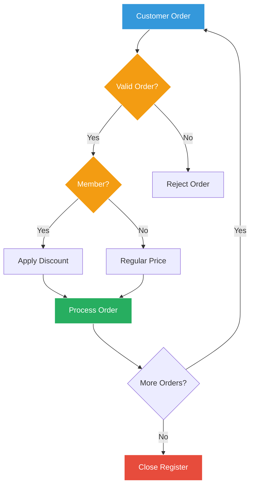

# Chapter 3: Taking Orders - Control Structures 🎯

## The Order Chaos

Marcus arrives Monday morning to find the coffee shop in complete disarray. Orders are mixed up, customers are waiting forever, and Sarah looks stressed.

"Marcus! Thank goodness you're here," Sarah exclaims. "Our order system is a disaster. We need logic to:
- Validate orders before processing
- Handle different customer types
- Process orders in the right sequence
- Repeat tasks efficiently

We need control structures - NOW!"

## The Mission

"This is what we need to build," Sarah explains. "A system that makes decisions and repeats tasks intelligently."

## Chapter Contents

1. **[If-Else Decisions](01-if-else/If_Else_Decisions.md)** - Making smart choices in order processing
2. **[Switch Statements](02-switch/Switch_Statements.md)** - Handling multiple coffee options elegantly
3. **[For Loops](03-for-loops/For_Loops_Repetition.md)** - Processing multiple orders efficiently
4. **[Break and Continue](04-break-continue/Break_Continue_Control.md)** - Fine-tuning loop behavior
5. **[Goto and Labels](05-goto/Goto_Labels_Advanced.md)** - Advanced flow control (use sparingly!)

## Today's Challenges

Sarah lists the problems they need to solve:

1. **Order Validation** - Check if items are available and prices are correct
2. **Customer Categories** - Different rules for members, employees, and regular customers
3. **Time-Based Logic** - Happy hour pricing, opening/closing procedures
4. **Batch Processing** - Handle multiple orders efficiently
5. **Error Recovery** - What to do when things go wrong

## Real-World Scenarios

"Everything we learn today," Sarah emphasizes, "solves real problems:
- **If-Else**: 'IF customer is a member, apply discount'
- **Switch**: Handle different payment methods
- **For Loops**: Process all pending orders
- **Break**: Stop taking orders when we close
- **Continue**: Skip invalid items and keep going"

## Success Criteria

By the end of this chapter, Marcus will build systems that:
- [ ] Validate orders before processing
- [ ] Apply correct pricing based on conditions
- [ ] Handle multiple orders in sequence
- [ ] Recover gracefully from errors
- [ ] Make the coffee shop run smoothly!

## Let's Begin!

"Ready to bring order to chaos?" Sarah asks. "Let's start with if-else decisions!"

Continue to [If-Else Decisions](01-if-else/If_Else_Decisions.md) →

---

*"In programming, as in coffee making, the right decisions at the right time make all the difference!"*