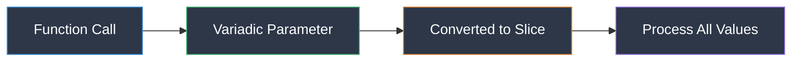

# Variadic Functions: Handling Groups at GoCoffee

[**← Back to Functions Overview**](../Chapter4_Functions_And_Methods.md)

## The Group Order Challenge

It's Friday afternoon at GoCoffee, and a large group of office workers has just walked in. Marcus watches as Emma takes their order - each person wants something different, and the group keeps growing as more coworkers arrive.

"How do we handle orders when we don't know how many items there will be?" Marcus asks.

Emma smiles. "In Go, we use variadic functions - functions that can accept any number of arguments. Let me show you!"

## Understanding Variadic Functions



Variadic functions use `...` before the parameter type to indicate they can accept zero or more values of that type.

## Your Learning Journey

1. **[Basic Variadic Functions](01_basic_variadic.go)** - Understanding the `...` syntax
2. **[Working with Variadic Parameters](02_variadic_parameters.go)** - How variadic parameters become slices
3. **[Mixing Parameters](03_mixed_parameters.go)** - Combining regular and variadic parameters
4. **[Passing Slices](04_passing_slices.go)** - Using existing slices with variadic functions
5. **[Empty Variadic Calls](05_empty_variadic.go)** - Handling zero arguments
6. **[Variadic with Interfaces](06_variadic_interfaces.go)** - Using `interface{}` for mixed types
7. **[Building Useful Functions](07_useful_functions.go)** - Common variadic patterns
8. **[Variadic Best Practices](08_best_practices.go)** - When and how to use variadic functions
9. **[Real World Examples](09_real_world_examples.go)** - Complete order processing system

## Key Concepts

### The Three Dots (`...`)

The `...` operator serves two purposes:
1. In function parameters: declares a variadic parameter
2. In function calls: expands a slice into individual arguments

### Variadic Rules

1. **Only one variadic parameter** per function
2. **Must be the last parameter** in the function signature
3. **Receives values as a slice** inside the function
4. **Can receive zero arguments** (empty slice)

## Common Patterns

### 1. Aggregation Functions
```go
func sum(numbers ...int) int
func concat(strings ...string) string
func max(values ...float64) float64
```

### 2. Logging and Formatting
```go
func log(format string, args ...interface{})
func printf(format string, values ...interface{})
```

### 3. Configuration Options
```go
func newServer(port int, options ...ServerOption)
func connect(host string, configs ...Config)
```

## Practice Exercises

1. **Group Order Calculator**: Create a function that calculates the total for any number of items
2. **Multi-Coffee Mixer**: Build a function that creates custom blends from multiple coffee types
3. **Flexible Logger**: Implement a logging function that accepts various data types
4. **Order Builder**: Design a system that builds orders with optional add-ons

## Emma's Tips 💡

"Variadic functions are perfect for cases where the number of inputs varies naturally - like group orders, logging multiple values, or combining results. But remember: with great flexibility comes the responsibility to handle edge cases!"

## Common Pitfalls to Avoid

1. **Forgetting the slice expansion operator** when passing slices
2. **Type safety issues** with `interface{}` variadics
3. **Performance concerns** with large numbers of arguments
4. **Confusion between** variadic parameters and slice parameters

Ready to handle orders of any size? Let's start with the basics!

[**Start with Basic Variadic Functions →**](01_basic_variadic.go)