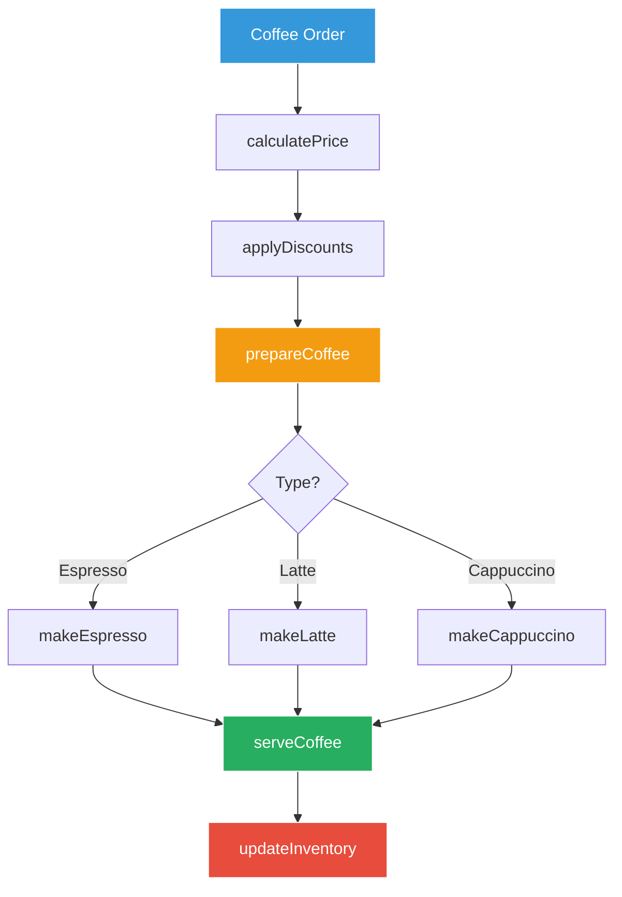

# Chapter 4: The Recipe Book - Functions & Methods 📖

## The Growing Complexity

Marcus walks into GoCoffee on Tuesday morning to find Sarah surrounded by sticky notes, each with different coffee recipes and procedures.

"Marcus! Perfect timing," Sarah says, brushing a strand of hair from her face. "We're growing fast, and I'm drowning in repeated instructions. Look at this mess:
- Every barista does the espresso calculation differently
- I'm explaining the same latte recipe 10 times a day
- Our pricing logic is copied everywhere
- When we change a recipe, I have to update it in 20 places!

We need to organize our recipes and procedures into reusable functions!"

## The Mission



"This is what we need," Sarah explains. "Each recipe becomes a function - write once, use everywhere!"

## Chapter Contents

1. **[Function Basics](01-function-basics/Function_Basics.md)** - Creating your first coffee recipes
2. **[Parameters & Returns](02-parameters-returns/Parameters_Returns.md)** - Input ingredients, output coffee
3. **[Variadic Functions](03-variadic-functions/Variadic_Functions.md)** - Flexible recipes with optional ingredients
4. **[First-Class Functions](04-first-class-functions/First_Class_Functions.md)** - Passing recipes around
5. **[Anonymous Functions & Closures](05-anonymous-closures/Anonymous_Closures.md)** - Quick recipes and capturing context
6. **[Defer Statements](06-defer/Defer_Cleanup.md)** - Always clean up, even when things go wrong
7. **[Error Handling](07-error-handling/Error_Handling.md)** - When the coffee machine breaks
8. **[Recursion](08-recursion/Recursion_Patterns.md)** - Recipes that call themselves
9. **[Best Practices](09-best-practices/Function_Best_Practices.md)** - Writing clean, maintainable recipes

## Today's Challenges

Sarah lists what they need to accomplish:

1. **Recipe Functions** - Convert each coffee recipe into a reusable function
2. **Price Calculations** - One function to rule all pricing logic
3. **Inventory Management** - Functions to track and update supplies
4. **Order Processing** - Composable functions for the entire order flow
5. **Error Recovery** - Handle what happens when things go wrong

## Real-World Scenarios

"Every function we write," Sarah emphasizes, "solves a real problem:
- **makeEspresso()**: Consistent espresso every time
- **calculateTotal(items...)**: Handle orders with any number of items
- **applyDiscount(fn)**: Different discount strategies as functions
- **defer cleanup()**: Always clean the machine, even if we panic
- **processOrder() error**: Tell us when something goes wrong"

## The Coffee Shop Architecture

```go
// What we're building today
type CoffeeShop struct {
    // Recipe functions
    makeEspresso    func(shots int) Coffee
    makeLatte       func(size string) Coffee
    makeCappuccino  func(foam bool) Coffee
    
    // Business logic
    calculatePrice  func(items ...Item) float64
    applyDiscount   func(price float64, discount func(float64) float64) float64
    
    // Operations
    processOrder    func(order Order) error
    updateInventory func(item string, quantity int) error
}
```

## Success Criteria

By the end of this chapter, Marcus will:
- [ ] Write reusable functions for all coffee recipes
- [ ] Handle multiple parameters and return values elegantly
- [ ] Use functions as values to create flexible systems
- [ ] Implement proper error handling throughout
- [ ] Create a maintainable, DRY (Don't Repeat Yourself) codebase

## The Journey Ahead

"Functions are the heart of Go," Sarah explains. "They're how we:
- Organize our code into logical pieces
- Reuse logic without repetition
- Test individual components
- Build larger systems from smaller parts

Think of each function as a perfect recipe card - clear inputs, predictable outputs, and one job done well."

## Let's Begin!

"Ready to turn this chaos into a well-organized recipe book?" Sarah asks with a smile. "Let's start with the basics!"

Continue to [Function Basics](01-function-basics/Function_Basics.md) →

---

*"A function should do one thing, do it well, and do it only. Just like making the perfect espresso!"*